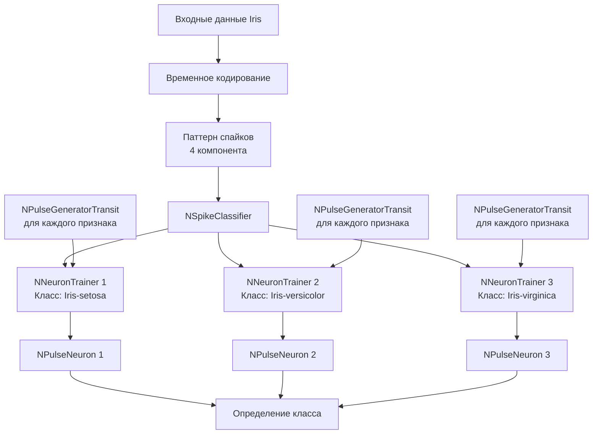

## SpikeIrisClassifier — классификация цветков ириса на основе сегментной спайковой модели нейрона

**Путь:** `Bin/Configs/SpikeSamples/Classifier/SpikeIrisClassifier`
**Статус валидации:** VALID (см. `Reports/SpikeSamples-Validation-Report.md`)

### Назначение конфигурации

Эта конфигурация демонстрирует применение **сегментной спайковой модели нейрона со структурной адаптацией** для решения задачи классификации цветков ириса из набора данных UCI Machine Learning Repository. Конфигурация реализует инкрементальное обучение, где нейрон обучается последовательно на новых классах без необходимости переобучения на всех предыдущих образцах [1], [2].

### Описание задачи

#### Набор данных Iris

- **Источник:** UCI Machine Learning Repository
  URL: https://archive.ics.uci.edu/ml/datasets/iris

- **Характеристики:**
  - 150 образцов цветков ириса
  - 3 класса: Iris-setosa, Iris-versicolor, Iris-virginica
  - 4 признака: длина чашелистика, ширина чашелистика, длина лепестка, ширина лепестка

- **Задача:** Классификация образцов по трём классам на основе четырёх признаков

#### Особенности применения спайковой модели

- **Временное кодирование:** числовые значения признаков преобразуются в паттерны спайков с временным кодированием
- **Структурная адаптация:** каждый нейрон адаптирует свою структуру для распознавания своего класса
- **Инкрементальное обучение:** обучение происходит последовательно на новых классах без переобучения на всех данных

### Структура модели

Конфигурация использует компонент `NSpikeClassifier` из библиотеки `Nmsdk-PulseLib`, который создаёт сеть из нескольких нейронов, каждый из которых обучается распознавать один класс.

#### Компоненты системы

- **NSpikeClassifier** — основной компонент классификатора
  - Управляет процессом обучения и классификации
  - Создаёт и координирует работу нейронов-классификаторов

- **NNeuronTrainer** (по одному на каждый класс) — компонент обучения нейрона
  - Реализует структурную адаптацию для каждого класса
  - Обучает нейрон распознавать паттерны своего класса
  - Использует временное кодирование для представления признаков

- **NPulseNeuron** (по одному на каждый класс) — сегментный спайковый нейрон
  - Структура адаптируется под паттерны своего класса
  - Генерирует спайк при распознавании своего класса

- **NPulseGeneratorTransit** (по одному на каждый признак для каждого нейрона) — генераторы входных спайков
  - Преобразуют числовые значения признаков во временные задержки спайков
  - Реализуют временное кодирование

### Эксперимент и моделируемые реакции

#### Этап 1: Подготовка данных

1. **Нормализация признаков:**
   - Приведение значений признаков к диапазону [0, 1]
   - Обработка выбросов (если необходимо)

2. **Преобразование в паттерны спайков:**
   - Каждое значение признака преобразуется во временную задержку спайка
   - Большее значение → более ранний спайк (или наоборот, в зависимости от схемы кодирования)
   - Формируется вектор из 4 временных задержек для каждого образца

#### Этап 2: Обучение сети

**Режим инкрементального обучения:**

1. **Обучение на первом классе (Iris-setosa):**
   - Создание первого нейрона-классификатора
   - Обучение на образцах класса Iris-setosa
   - Структурная адаптация нейрона под паттерны этого класса
   - Проверка способности распознавать класс

2. **Обучение на втором классе (Iris-versicolor):**
   - Создание второго нейрона-классификатора
   - Обучение на образцах класса Iris-versicolor
   - **Без переобучения на первом классе**
   - Структурная адаптация второго нейрона
   - Проверка, что первый нейрон по-прежнему распознаёт свой класс

3. **Обучение на третьем классе (Iris-virginica):**
   - Создание третьего нейрона-классификатора
   - Обучение на образцах класса Iris-virginica
   - **Без переобучения на предыдущих классах**
   - Структурная адаптация третьего нейрона
   - Проверка, что предыдущие нейроны по-прежнему работают

#### Этап 3: Классификация

1. **Предъявление тестового образца:**
   - Преобразование признаков в паттерн спайков
   - Подача паттерна на все нейроны одновременно

2. **Генерация спайков:**
   - Каждый нейрон анализирует входной паттерн
   - Нейрон, обученный на соответствующем классе, генерирует спайк
   - Время генерации спайка зависит от степени соответствия паттерну

3. **Определение класса:**
   - Класс определяется нейроном, который генерирует спайк
   - При генерации спайков несколькими нейронами выбирается нейрон с наибольшей активностью

#### Ожидаемое поведение

- **Высокая точность классификации:** сопоставимая с классическими методами машинного обучения
- **Успешное инкрементальное обучение:** способность обучаться на новых классах без потери знаний о старых
- **Структурная адаптация:** автоматический подбор оптимальной структуры для каждого класса
- **Временное кодирование:** эффективное использование временной информации для классификации

### Параметры модели

Основные параметры задаются в `Parameters_00.xml` и через свойства компонента `NSpikeClassifier`:

#### Параметры NSpikeClassifier

- `NumNeurons` — количество нейронов (равно количеству классов, обычно 3 для Iris)
- `NumInputDendrite` — количество входных дендритов (равно количеству признаков, 4 для Iris)
- `IsNeedToTrain` — признак необходимости обучения (true во время обучения, false во время классификации)
- `TrainingPatterns` — матрица паттернов обучения (размерность: NumNeurons × NumInputDendrite)
- `InputPattern` — входной паттерн для классификации (размерность: NumInputDendrite × 1)
- `LTZThreshold` — порог активации низкопороговой зоны
- `FixedLTZThreshold` — фиксированный порог активации (используется после обучения)
- `SpikesFrequency` — частота генерации спайков входными генераторами
- `Delay` — задержка начала обучения относительно старта системы
- `StructureBuildMode` — режим сборки структуры (1 — структурная адаптация)

#### Параметры NNeuronTrainer (для каждого нейрона)

- `MaxDendriteLength` — максимальная длина дендритов
- `LTZThreshold` — порог активации во время обучения
- `TrainingLTZThreshold` — порог активации во время обучения (может отличаться от порога классификации)
- `FixedLTZThreshold` — фиксированный порог активации
- `UseFixedLTZThreshold` — использование фиксированного порога
- `InputPattern` — паттерн для обучения данного нейрона
- `IsNeedToTrain` — признак необходимости обучения данного нейрона

#### Параметры временного кодирования

- Значения признаков преобразуются во временные задержки спайков
- Схема кодирования определяется параметрами генераторов и алгоритмом преобразования
- Типичные значения задержек: от 0 до 1 секунды (в зависимости от нормализации данных)

### Результаты экспериментов

Согласно публикациям [1], [2]:

#### Точность классификации

- **Сопоставимость с классическими методами:** результаты сопоставимы с методами k-NN, SVM, традиционными нейронными сетями
- **Высокая точность:** успешная классификация всех трёх классов ириса
- **Стабильность:** стабильные результаты на различных подмножествах данных

#### Инкрементальное обучение

- **Успешное обучение на новых классах:** нейрон способен обучаться на новых классах без переобучения на всех данных
- **Сохранение знаний:** способность распознавать ранее обученные классы сохраняется при обучении на новых
- **Эффективность:** обучение происходит быстрее, чем полное переобучение на всех данных

#### Структурная адаптация

- **Автоматический подбор структуры:** алгоритм автоматически подбирает оптимальную структуру для каждого класса
- **Универсальный порог:** экспериментально определён универсальный порог активации, не зависящий от размера входного паттерна
- **Адаптация параметров:** размер сомы, длина дендритов и количество синапсов адаптируются под каждый класс

### Использование конфигурации

#### Запуск обучения

1. Загрузите конфигурацию в Neuro Modeler
2. Установите параметры обучения в `Parameters_00.xml`:
   - `IsNeedToTrain = true`
   - Задайте паттерны обучения в `TrainingPatterns`
3. Запустите расчёт и дождитесь завершения обучения
4. Проверьте статус обучения каждого нейрона

#### Запуск классификации

1. После завершения обучения установите `IsNeedToTrain = false`
2. Задайте входной паттерн в `InputPattern`
3. Запустите расчёт
4. Определите класс по активности нейронов (нейрон, генерирующий спайк, определяет класс)

#### Работа с файлами данных

Конфигурация поддерживает работу с файлами данных через параметр `DataFromFile`:
- Входные данные читаются из файла `input_data.txt`
- Результаты записываются в файл `output_data.txt`
- Формат данных определяется компонентом `NSpikeClassifier`

### Связанные материалы

- Теория и функциональное описание:
  - [`Bin/Docs/SpikeSamples/Classification.md`](../../Docs/SpikeSamples/Classification.md) — применение для задач классификации
  - [`Bin/Docs/SpikeSamples/IncrementalLearning.md`](../../Docs/SpikeSamples/IncrementalLearning.md) — стратегия инкрементального обучения
  - [`Bin/Docs/SpikeSamples/StructuralAdaptation.md`](../../Docs/SpikeSamples/StructuralAdaptation.md) — метод структурной адаптации
- Компонентная документация:
  - `Libraries/Nmsdk-PulseLib/Docs/Components/NSpikeClassifier.md` — документация компонента NSpikeClassifier
  - `Libraries/Nmsdk-PulseLib/Docs/Components/NNeuronTrainer.md` — документация компонента NNeuronTrainer
- Описание конфигурации:
  - `Description.rtf` — подробное описание конфигурации (в формате RTF)

## Литература

1. Korsakov, A. M., Astapova, L. A., Bakhshiev, A. V. Application of a compartmental spiking neuron model with structural adaptation for solving classification problems // Informatics and Automation, 2022, 21(3), 493-520. [DOI](https://doi.org/10.15622/ia.21.3.2)

2. Korsakov, A. M., Isakov, T. T., Bakhshiev, A. V. Strategy of Incremental Learning on a Compartmental Spiking Neuron Model // Optical Memory and Neural Networks. – 2023. – Vol. 32, No. S2. – P. S237-S243. [DOI](https://doi.org/10.3103/s1060992x23060073)

3. UCI Machine Learning Repository: Iris Data Set. [онлайн](https://archive.ics.uci.edu/ml/datasets/iris)
