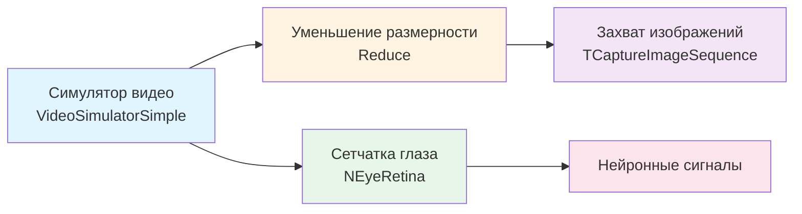

## EyeRetina — модель сетчатки глаза

**Путь:** `Bin/Configs/SpikeSamples/EyeRetina/EyeRetina`
**Статус валидации:** VALID (см. `Reports/SpikeSamples-Validation-Report.md`)

### Назначение конфигурации

Конфигурация демонстрирует **модель сетчатки глаза** для обработки визуальной информации и преобразования изображений в нейронные сигналы. Конфигурация использует компонент `NEyeRetina` для моделирования обработки визуальной информации сетчаткой глаза и преобразования изображений в импульсные потоки.

Согласно `MuscleControlStructures.md` и публикациям [2], [3], модель сетчатки является важной частью зрительно-двигательных контуров. Данная конфигурация позволяет изучать обработку визуальной информации и преобразование изображений в нейронные сигналы.

### Структура конфигурации

Конфигурация содержит:

- **Capture** (`TCaptureImageSequence`) — захват последовательности изображений, сохраняет изображения в файлы
- **Reduce** (`Reduce`) — компонент для уменьшения размерности данных
- **VideoSimulatorSimple** (`VideoSimulatorSimple`) — простой симулятор видео, генерирует видеопоследовательности для обработки
- **EyeRetina** (`NEyeRetina`) — модель сетчатки глаза, обрабатывает визуальную информацию и преобразует её в нейронные сигналы

### Биологическая мотивация

Согласно публикациям [2], [3] и `MuscleControlStructures.md`:

#### Компоненты зрительной системы

- **Сетчатка глаза** — преобразует световые стимулы в нейронные сигналы
- **Обработка визуальной информации** — выделение признаков и паттернов в изображениях
- **Преобразование в импульсные потоки** — кодирование визуальной информации в виде спайковых последовательностей

#### Модель сетчатки

- Компонент `NEyeRetina` реализует модель сетчатки глаза
- Обрабатывает визуальную информацию и преобразует её в нейронные сигналы
- Может использоваться в составе зрительно-двигательных контуров

### Структура модели сетчатки

Обобщённая схема модели сетчатки:

### Эксперимент и моделируемые реакции

#### Цель эксперимента

Изучение обработки визуальной информации сетчаткой глаза:
- Преобразование изображений в нейронные сигналы
- Обработка визуальной информации сетчаткой
- Моделирование обработки визуальных стимулов
- Демонстрация преобразования изображений в нейронные сигналы

#### Сценарии экспериментов

1. **Обработка визуальной информации:**
   - Симулятор видео генерирует видеопоследовательности
   - Сетчатка обрабатывает визуальную информацию
   - Преобразование изображений в нейронные сигналы
   - Наблюдение зависимости нейронных сигналов от визуальных стимулов

2. **Захват и обработка изображений:**
   - Компонент захвата сохраняет изображения в файлы
   - Компонент уменьшения размерности обрабатывает данные
   - Анализ влияния обработки на характеристики нейронных сигналов

3. **Моделирование обработки визуальных стимулов:**
   - Различные типы визуальных стимулов (точки, полосы, движущиеся объекты)
   - Наблюдение реакции сетчатки на различные стимулы
   - Анализ паттернов активности нейронных сигналов

#### Ожидаемые результаты

- **Преобразование сигналов:** изображения должны преобразовываться в нейронные сигналы
- **Обработка информации:** сетчатка должна обрабатывать визуальную информацию и выделять признаки
- **Паттерны активности:** различные визуальные стимулы должны вызывать различные паттерны активности нейронных сигналов

### Параметры модели

Основные параметры задаются в `Model_00.xml` и `Parameters_00.xml`:

#### Параметры симулятора видео

- Параметры генерации видеопоследовательностей
- Параметры визуальных стимулов

#### Параметры уменьшения размерности

- Параметры обработки данных
- Параметры уменьшения размерности

#### Параметры захвата изображений

- Параметры сохранения изображений в файлы
- Параметры формата изображений

#### Параметры сетчатки глаза

- Параметры обработки визуальной информации
- Параметры преобразования изображений в нейронные сигналы
- Параметры модели сетчатки

Точные численные значения можно смотреть в `Parameters_00.xml`.

### Результаты экспериментов

Согласно публикациям [2], [3] и `MuscleControlStructures.md`:

#### Обработка визуальной информации

- Модель сетчатки успешно обрабатывает визуальную информацию
- Изображения преобразуются в нейронные сигналы
- Различные визуальные стимулы вызывают различные паттерны активности

#### Преобразование в нейронные сигналы

- Компонент `NEyeRetina` преобразует изображения в импульсные потоки
- Модель демонстрирует реалистичное поведение сетчатки глаза
- Модель может использоваться в составе зрительно-двигательных контуров

### Связанные материалы

- Теория и функциональное описание:
  - [`Bin/Docs/SpikeSamples/MuscleControlStructures.md`](../../../../Docs/SpikeSamples/MuscleControlStructures.md) — нейронные структуры управления мышечным сокращением
  - [`Bin/Docs/SpikeSamples/NeuronReactions.md`](../../../../Docs/SpikeSamples/NeuronReactions.md) — реакции одиночных нейронов
- Описание конфигурации:
  - `Description.rtf` — подробное описание конфигурации (в формате RTF)
- Связанные конфигурации:
  - `EyeRetina/EyeRetinaMuscle` — зрительно-двигательный контур «ретина → сеть обработки → мышца»
  - `MC-Muscles` — модели управления мышцами глаза
  - `MC1-PCN` — позиционное управление движением

## Литература

1. Korsakov, A. M., Isakov, T. T., Bakhshiev, A. V. Strategy of Incremental Learning on a Compartmental Spiking Neuron Model // Optical Memory and Neural Networks. – 2023. – Vol. 32, No. S2. – P. S237-S243. [DOI](https://doi.org/10.3103/s1060992x23060073)

2. Бахшиев А.В. Перспективы применения моделей биологических нейронных структур в системах управления движением // Информационно-измерительные и управляющие системы: - №9, 2011. с. 71-80. [онлайн](https://www.elibrary.ru/item.asp?id=17257136)

3. Korsakov, A., Bakhshiev, A. The Neuromorphic Model of the Human Visual System // Studies in Computational Intelligence, 2021, 925 SCI, pp. 339–346. [DOI](https://link.springer.com/chapter/10.1007%2F978-3-030-60577-3_40)

4. Бахшиев А.В., Романов С.П. Моделирование нейронных структур управления мышечным сокращением. Схемы нейронных сетей. [онлайн](https://neuromodeler.ru/index.php?option=com_content&view=article&id=29:1&catid=67&lang=ru&Itemid=676)
