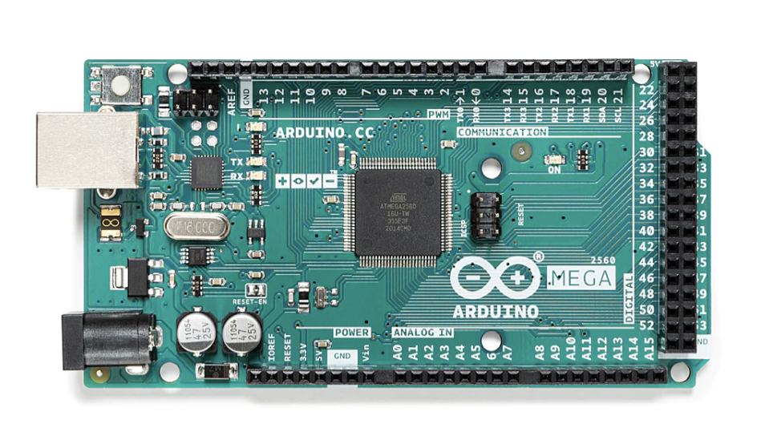

# Hardware test: Motor Shield R3

**Путь:** `Bin/Configs/SpikeSamples/Hardware/12-MotorShield-R3`

Общий HOWTO Firmata: [LAB-Firmata.md](../LAB-Firmata.md).

## Назначение

Firmata + 2× DeviceIO dc_motor_channel A/B.

## BOM

Плата + USB + Arduino Motor Shield R3 + 1–2 DC-мотора + внешнее питание шилда.

## Проводка

Наденьте Arduino Motor Shield R3 на плату, моторы в клеммы A/B. USB не тянет большие токи — внешнее питание шилда. Не оставляйте `ValueIn` > 0 надолго без нагрузки. См. [Motor Shield Rev3](https://docs.arduino.cc/hardware/motor-shield-rev3/) (Arduino docs, CC BY-SA 4.0).

*Arduino, [CC BY-SA 4.0](https://creativecommons.org/licenses/by-sa/4.0/), [Wikimedia Commons](https://commons.wikimedia.org/wiki/File:Arduino_MEGA2560.png). Pinout PDF: [Mega A000067](../_shared/media/A000067-full-pinout.pdf) / [Uno A000066](../_shared/media/A000066-full-pinout.pdf) (Arduino, CC BY-SA 4.0).*

## Перед запуском

1. Подключите плату по USB. По умолчанию генератор пишет `PortName=COM3`, `BoardProfile=1` (Arduino Mega 2560).
2. Откройте `Project.ini` в NeuroModeler.
3. Клик по узлу **Firmata** (или Board) → вкладки **Assembly** / **Pinout** / **Pins** / **Monitor** / **Board**.
4. **Upload** bundled `standard_firmata` (если ещё не прошито) → **Connect** → дождитесь `FirmataReady`.
5. Для DeviceIO: **ApplyConfig**, затем Continuous / Calculate.

## Компоненты

- `Firmata` + `MotorA`/`MotorB`.

## Схема Assembly

Шилд R3 на плате, каналы A/B.

## Критерий успеха

Короткий `MotorA.ValueIn` (например 0.3) крутит канал A. Не оставляйте PWM>0 без мотора.

Тексты BOM/проводки — пересказ открытых Arduino docs ([CC BY-SA 4.0](https://creativecommons.org/licenses/by-sa/4.0/)), не копипаст гайдов. Firmata: [firmata/arduino](https://github.com/firmata/arduino) (LGPL-2.1, в документ не вставляем `.ino`).
