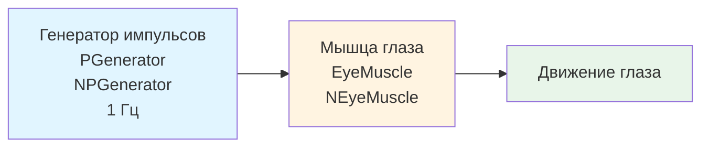

## MC-M-00-EyeMuscle — модель управления мышцей глаза (базовая)

**Путь:** `Bin/Configs/SpikeSamples/MC-Muscles/MC-M-00-EyeMuscle`
**Статус валидации:** VALID (см. `Reports/SpikeSamples-Validation-Report.md`)

### Назначение конфигурации

Эта конфигурация демонстрирует **базовую модель управления мышцей глаза** на основе нейронных команд. Конфигурация использует компонент `NEyeMuscle` для моделирования движения глаз на основе импульсных сигналов от генератора (`NPGenerator`).

Согласно `MuscleControlStructures.md` и публикациям [3], [4], модели мышц являются важной частью нейронных структур управления движением. Данная конфигурация позволяет изучать преобразование нейронных команд в мышечные сокращения и движение глаз.

### Структура конфигурации

Конфигурация содержит:

- **PGenerator** (`NPGenerator`) — генератор импульсных сигналов
  - `Frequency` = 1 Гц — частота генерации импульсов
  - `Amplitude` = 1 — амплитуда импульсов
  - `PulseLength` = 0.001 с — длительность импульса
  - `AvgInterval` = 5 с — средний интервал между импульсами
- **EyeMuscle** (`NEyeMuscle`) — модель мышцы глаза, преобразующая импульсные сигналы в движение глаза

### Биологическая мотивация

Согласно `MuscleControlStructures.md` и публикациям [2], [3], [4]:

#### Компоненты управления мышцами

- **Мотонейроны** — иннервируют мышечные волокна, передавая импульсные команды
- **Мышцы** — преобразуют нейронные команды в механическое движение
- **Обратная связь** — сенсорные сигналы от мышц используются для контроля движения

#### Управление движением глаз

- Движение глаз контролируется системой глазодвигательных мышц
- Нейронные команды преобразуются в сокращения мышц, что приводит к движению глаз
- Модель `NEyeMuscle` реализует преобразование импульсных сигналов в движение глаза

### Структура модели

Обобщённая схема модели управления мышцей глаза:

### Эксперимент и моделируемые реакции

#### Цель эксперимента

Изучение преобразования нейронных команд в движение мышц:
- Преобразование импульсных сигналов в мышечные сокращения
- Влияние частоты импульсов на движение глаза
- Моделирование обработки визуальной информации сетчаткой глаза

#### Сценарии экспериментов

1. **Базовое управление мышцей:**
   - Генератор импульсов создаёт периодические сигналы с частотой 1 Гц
   - Мышца глаза преобразует импульсные сигналы в движение
   - Наблюдение зависимости движения от частоты входных сигналов

2. **Влияние частоты импульсов:**
   - Изменение частоты генератора импульсов
   - Наблюдение влияния на движение глаза
   - Анализ зависимости движения от частоты входных сигналов

3. **Моделирование обработки визуальной информации:**
   - Преобразование изображений в нейронные сигналы
   - Управление движением глаз на основе визуальных стимулов
   - Исследование зрительно-двигательного контура

#### Ожидаемые результаты

- **Преобразование сигналов:** импульсные сигналы должны преобразовываться в движение глаза
- **Зависимость от частоты:** увеличение частоты импульсов должно приводить к изменению характеристик движения
- **Реалистичное поведение:** модель должна демонстрировать реалистичное поведение мышц глаза

### Параметры модели

Основные параметры задаются в `Parameters.xml`:

#### Параметры генератора импульсов

- **Frequency:** 1 Гц (частота генерации импульсов)
- **Amplitude:** 1 (амплитуда импульсов)
- **PulseLength:** 0.001 с (длительность импульса)
- **AvgInterval:** 5 с (средний интервал между импульсами)

#### Параметры мышцы глаза

- Параметры преобразования импульсных сигналов в движение
- Параметры модели мышцы глаза
- Параметры обратной связи

Точные численные значения можно смотреть в `Parameters.xml`.

### Отличия от MC-M-01-EyeMuscle

Данная конфигурация является базовой версией модели управления мышцей глаза. Отличия от `MC-M-01-EyeMuscle`:
- Более низкая частота генератора импульсов (1 Гц вместо 8 Гц)
- Отсутствие компонента статистики (`UStatisticDoubleMatrix`)
- Более простая структура модели

### Результаты экспериментов

Согласно публикациям [2], [3], [4] и `MuscleControlStructures.md`:

#### Преобразование нейронных команд

- Модель `NEyeMuscle` успешно преобразует импульсные сигналы в движение глаза
- Частота входных импульсов влияет на характеристики движения
- Модель демонстрирует реалистичное поведение мышц глаза

#### Управление движением

- Нейронные команды эффективно управляют движением глаз
- Модель может использоваться для изучения зрительно-двигательных контуров
- Преобразование изображений в нейронные сигналы позволяет моделировать обработку визуальной информации

### Связанные материалы

- Теория и функциональное описание:
  - [`Bin/Docs/SpikeSamples/MuscleControlStructures.md`](../../../../Docs/SpikeSamples/MuscleControlStructures.md) — нейронные структуры управления мышечным сокращением
  - [`Bin/Docs/SpikeSamples/NeuronReactions.md`](../../../../Docs/SpikeSamples/NeuronReactions.md) — реакции одиночных нейронов
- Описание конфигурации:
  - `Description.rtf` — подробное описание конфигурации (в формате RTF)
- Связанные конфигурации:
  - `MC-M-01-EyeMuscle` — расширенная модель управления мышцей глаза
  - `EyeRetina/EyeRetinaMuscle` — зрительно-двигательный контур «ретина → сеть обработки → мышца»
  - `MC0-RCN` — рефлекторные контуры управления движением

## Литература

1. Korsakov, A. M., Isakov, T. T., Bakhshiev, A. V. Strategy of Incremental Learning on a Compartmental Spiking Neuron Model // Optical Memory and Neural Networks. – 2023. – Vol. 32, No. S2. – P. S237-S243. [DOI](https://doi.org/10.3103/s1060992x23060073)

2. Бахшиев А.В. Перспективы применения моделей биологических нейронных структур в системах управления движением // Информационно-измерительные и управляющие системы: - №9, 2011. с. 71-80. [онлайн](https://www.elibrary.ru/item.asp?id=17257136)

3. Korsakov, A., Bakhshiev, A. The Neuromorphic Model of the Human Visual System // Studies in Computational Intelligence, 2021, 925 SCI, pp. 339–346. [DOI](https://link.springer.com/chapter/10.1007%2F978-3-030-60577-3_40)

4. Бахшиев А.В., Романов С.П. Моделирование нейронных структур управления мышечным сокращением. Схемы нейронных сетей. [онлайн](https://neuromodeler.ru/index.php?option=com_content&view=article&id=29:1&catid=67&lang=ru&Itemid=676)
