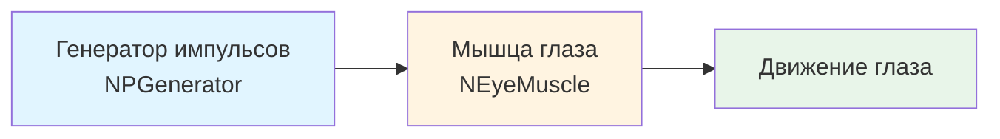
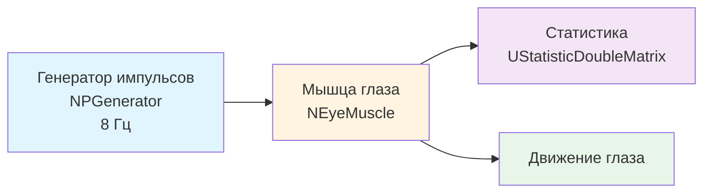

## MC-Muscles — модели управления мышцами глаза

**Путь:** `Bin/Configs/SpikeSamples/MC-Muscles`
**Статус валидации:** VALID (см. `Reports/SpikeSamples-Validation-Report.md`)

### Назначение группы конфигураций

Эта группа конфигураций демонстрирует **модели управления мышцами глаза** на основе нейронных команд. Группа содержит две конфигурации (`MC-M-00-EyeMuscle` и `MC-M-01-EyeMuscle`), которые используют компонент `NEyeMuscle` для моделирования движения глаз на основе импульсных сигналов от генераторов или нейронных сетей.

Согласно `MuscleControlStructures.md` и публикациям [1], [13], [31], модели мышц являются важной частью нейронных структур управления движением. Данная группа конфигураций позволяет изучать преобразование нейронных команд в мышечные сокращения и движение глаз.
  [31]
  ([онлайн-описание](https://neuromodeler.ru/index.php?option=com_content&view=article&id=29:1&catid=67&lang=ru&Itemid=676))

### Структура группы конфигураций

Группа содержит две конфигурации:

1. **MC-M-00-EyeMuscle**
   - Базовая модель управления мышцей глаза
   - Использует генератор импульсов (`NPGenerator`) для создания входных сигналов
   - Компонент `NEyeMuscle` преобразует импульсные сигналы в движение глаза

2. **MC-M-01-EyeMuscle**
   - Расширенная модель управления мышцей глаза
   - Использует генератор импульсов (`NPGenerator`) с частотой 8 Гц
   - Компонент `NEyeMuscle` преобразует импульсные сигналы в движение глаза
   - Включает компонент `UStatisticDoubleMatrix` для сбора статистики

### Биологическая мотивация

Согласно `MuscleControlStructures.md` и публикациям [1], [13], [31]:

#### Компоненты управления мышцами

- **Мотонейроны** — иннервируют мышечные волокна, передавая импульсные команды
- **Мышцы** — преобразуют нейронные команды в механическое движение
- **Обратная связь** — сенсорные сигналы от мышц используются для контроля движения

#### Управление движением глаз

- Движение глаз контролируется системой глазодвигательных мышц
- Нейронные команды преобразуются в сокращения мышц, что приводит к движению глаз
- Модель `NEyeMuscle` реализует преобразование импульсных сигналов в движение глаза

### Структура модели управления мышцей

Обобщённая схема модели управления мышцей глаза:

Для конфигурации MC-M-01-EyeMuscle:

### Эксперимент и моделируемые реакции

#### Цель экспериментов

Изучение преобразования нейронных команд в движение мышц:
- Преобразование импульсных сигналов в мышечные сокращения
- Влияние частоты импульсов на движение глаза
- Моделирование обработки визуальной информации сетчаткой глаза
- Демонстрация преобразования изображений в нейронные сигналы

#### Сценарии экспериментов

1. **Базовое управление мышцей (MC-M-00-EyeMuscle):**
   - Генератор импульсов создаёт периодические сигналы с частотой 1 Гц
   - Мышца глаза преобразует импульсные сигналы в движение
   - Наблюдение зависимости движения от частоты входных сигналов

2. **Расширенное управление с статистикой (MC-M-01-EyeMuscle):**
   - Генератор импульсов создаёт периодические сигналы с частотой 8 Гц
   - Мышца глаза преобразует импульсные сигналы в движение
   - Сбор статистики о работе мышцы с помощью `UStatisticDoubleMatrix`
   - Анализ влияния частоты на характеристики движения

3. **Моделирование обработки визуальной информации:**
   - Преобразование изображений в нейронные сигналы
   - Управление движением глаз на основе визуальных стимулов
   - Исследование зрительно-двигательного контура

#### Ожидаемые результаты

- **Преобразование сигналов:** импульсные сигналы должны преобразовываться в движение глаза
- **Зависимость от частоты:** увеличение частоты импульсов должно приводить к изменению характеристик движения
- **Статистика:** компонент статистики должен собирать данные о работе мышцы для анализа

### Параметры модели

Основные параметры задаются в `Parameters.xml` для каждой конфигурации:

#### Параметры генератора импульсов (NPGenerator)

- **Frequency** — частота генерации импульсов (Гц)
  - MC-M-00-EyeMuscle: 1 Гц
  - MC-M-01-EyeMuscle: 8 Гц
- **Amplitude** — амплитуда импульсов (обычно 1)
- **PulseLength** — длительность импульса (с, обычно 0.001)
- **AvgInterval** — средний интервал между импульсами (с, обычно 5)

#### Параметры мышцы глаза (NEyeMuscle)

- Параметры преобразования импульсных сигналов в движение
- Параметры модели мышцы глаза
- Параметры обратной связи

#### Параметры статистики (MC-M-01-EyeMuscle)

- Параметры сбора статистики о работе мышцы
- Параметры обработки данных

Точные численные значения можно смотреть в `Parameters.xml` для каждой конфигурации.

### Результаты экспериментов

Согласно публикациям [1], [13], [31] и `MuscleControlStructures.md`:

#### Преобразование нейронных команд

- Модель `NEyeMuscle` успешно преобразует импульсные сигналы в движение глаза
- Частота входных импульсов влияет на характеристики движения
- Модель демонстрирует реалистичное поведение мышц глаза

#### Управление движением

- Нейронные команды эффективно управляют движением глаз
- Модель может использоваться для изучения зрительно-двигательных контуров
- Преобразование изображений в нейронные сигналы позволяет моделировать обработку визуальной информации

### Связанные материалы

- Теория и функциональное описание:
  - [`Bin/Docs/SpikeSamples/MuscleControlStructures.md`](../../../Docs/SpikeSamples/MuscleControlStructures.md) — нейронные структуры управления мышечным сокращением
  - [`Bin/Docs/SpikeSamples/NeuronReactions.md`](../../../Docs/SpikeSamples/NeuronReactions.md) — реакции одиночных нейронов
- Описание конфигураций:
  - `MC-M-00-EyeMuscle/Description.rtf` — подробное описание базовой конфигурации (в формате RTF)
  - `MC-M-01-EyeMuscle/Description.rtf` — подробное описание расширенной конфигурации (в формате RTF)
- Связанные группы конфигураций:
  - `MC0-RCN` — рефлекторные контуры управления движением
  - `MC1-PCN` — позиционное управление движением
  - `EyeRetina` — зрительно-двигательный контур «ретина → сеть обработки → мышца»

## Литература

1. Korsakov, A. M., Isakov, T. T., Bakhshiev, A. V. Strategy of Incremental Learning on a Compartmental Spiking Neuron Model // Optical Memory and Neural Networks. – 2023. – Vol. 32, No. S2. – P. S237-S243. [DOI](https://doi.org/10.3103/s1060992x23060073)

2. Бахшиев А.В. Перспективы применения моделей биологических нейронных структур в системах управления движением // Информационно-измерительные и управляющие системы: - №9, 2011. с. 71-80. [онлайн](https://www.elibrary.ru/item.asp?id=17257136)

3. Korsakov, A., Bakhshiev, A. The Neuromorphic Model of the Human Visual System // Studies in Computational Intelligence, 2021, 925 SCI, pp. 339–346. [DOI](https://link.springer.com/chapter/10.1007%2F978-3-030-60577-3_40)

4. Бахшиев А.В., Романов С.П. Моделирование нейронных структур управления мышечным сокращением. Схемы нейронных сетей. [онлайн](https://neuromodeler.ru/index.php?option=com_content&view=article&id=29:1&catid=67&lang=ru&Itemid=676)
