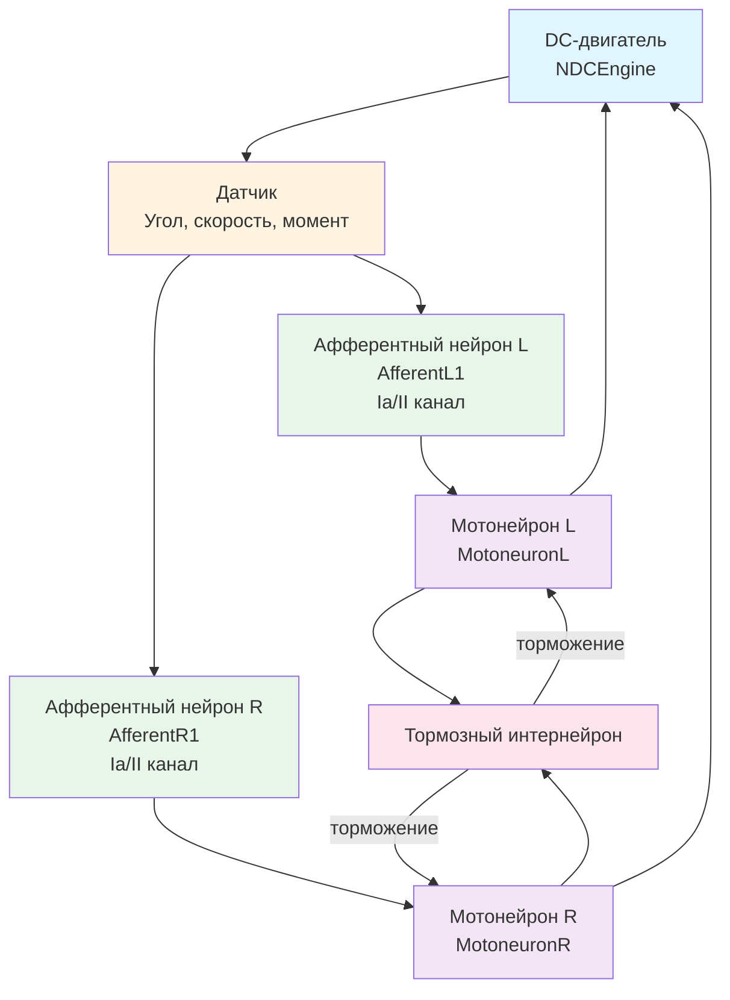

## MC-RCN-00-01-1CL-SimpleME-SimpleA-woBranches-woRenshow-wPA — базовый одноуровневый рефлекторный контур

**Путь:** `Bin/Configs/SpikeSamples/MC0-RCN/MC-RCN-00-1CL-All-DcEngine/MC-RCN-00-01-1CL-SimpleME-SimpleA-woBranches-woRenshow-wPA`
**Статус валидации:** VALID (см. `Reports/SpikeSamples-Validation-Report.md`)

### Назначение конфигурации

Эта конфигурация демонстрирует **базовый одноуровневый рефлекторный контур (RCN)** для управления DC-двигателем с минимальной структурой:
- Простой двигательный элемент (SimpleME)
- Простая афферентация (SimpleA)
- Без ветвления афферентных путей (woBranches)
- Без клеток Реншоу (woRenshow)
- С пресинаптическим торможением (wPA)

Согласно [A] (раздел 3.2) и `MuscleControlStructures.md`, данная конфигурация представляет базовую реализацию спинального уровня управления мышечным сокращением без дополнительных структурных элементов.

### Структура конфигурации

Конфигурация содержит:

- **DCEngine** (`NDCEngine`) — DC-двигатель как объект управления
- **EngineControlRangeAfferent** (`N2AsfSimplestAfferentBranchedEngineControl`) — двигательный элемент с простой афферентацией

### Биологическая мотивация

Согласно [A], спинальный уровень управления мышечным сокращением включает:

#### Компоненты спинального уровня

- **Афферентные нейроны** (каналы Ia, II) — передают информацию от мышечных веретён
- **Мотонейроны** — иннервируют мышечные волокна
- **Тормозные интернейроны** — обеспечивают взаимное торможение антагонистических мышц

#### Базовый рефлекторный контур

- **Моносинаптические рефлекторные дуги** — прямая передача сигнала от афферентов к мотонейронам
- **Взаимное торможение антагонистов** — торможение мотонейронов антагонистических мышц через тормозные интернейроны
- **Пресинаптическое торможение** — торможение на уровне синапсов

### Структура рефлекторного контура

Схема базового одноуровневого рефлекторного контура:

**Особенности данной конфигурации:**
- Без ветвления афферентных путей — простые прямые связи от афферентов к мотонейронам
- Без клеток Реншоу — отсутствует возвратное торможение
- С пресинаптическим торможением — торможение на уровне синапсов

### Эксперимент и моделируемые реакции

#### Цель эксперимента

Изучение базового рефлекторного контура без дополнительных структурных элементов:
- Стабилизация угла поворота вала двигателя
- Взаимное торможение антагонистических мышц
- Влияние пресинаптического торможения на обработку сигналов

#### Сценарии экспериментов

1. **Стабилизация угла поворота:**
   - Поддержание заданного угла поворота вала двигателя под действием внешних сил
   - Наблюдение работы базового рефлекторного контура
   - Анализ стабильности управления

2. **Взаимное торможение:**
   - Наблюдение взаимного торможения антагонистических мышц
   - Анализ влияния тормозных интернейронов на согласованное управление
   - Изучение баланса между активацией и торможением

3. **Влияние пресинаптического торможения:**
   - Наблюдение влияния пресинаптического торможения на обработку сигналов
   - Анализ влияния на характеристики управления
   - Сравнение с конфигурациями без пресинаптического торможения

#### Ожидаемые результаты

- **Стабилизация:** базовый рефлекторный контур должен обеспечивать стабилизацию угла поворота вала двигателя
- **Взаимное торможение:** тормозные интернейроны должны обеспечивать согласованное управление антагонистическими мышцами
- **Пресинаптическое торможение:** должно влиять на обработку сигналов и характеристики управления

### Параметры модели

Основные параметры задаются в `Parameters.xml`:

#### Параметры афферентных нейронов

- Пороги активации и деактивации для AfferentL1 и AfferentR1
- Параметры преобразования сенсорных сигналов в импульсные потоки
- Параметры простой афферентации (SimpleA)

#### Параметры мотонейронов

- Пороги активации и деактивации для MotoneuronL и MotoneuronR
- Параметры мембраны и каналов
- Параметры обратной связи

#### Параметры тормозных интернейронов

- Пороги активации и деактивации
- Параметры тормозного влияния на мотонейроны
- Параметры взаимного торможения

#### Параметры пресинаптического торможения

- Параметры торможения на уровне синапсов
- Параметры влияния на передачу сигналов

#### Параметры DC-двигателя

- Параметры модели двигателя
- Параметры обратной связи по углу, скорости и моменту

Точные численные значения можно смотреть в `Parameters.xml`.

### Отличия от других конфигураций группы

Данная конфигурация является базовой в группе `MC-RCN-00-1CL-All-DcEngine`. Отличия от других конфигураций:

- **От MC-RCN-00-02:** отсутствует ветвление афферентных путей (woBranches vs wBranches)
- **От MC-RCN-00-03:** отсутствуют клетки Реншоу (woRenshow vs wRenshow)
- **От MC-RCN-00-04:** используется простой двигательный элемент (SimpleME vs TS-SimpleME)
- **От MC-RCN-00-07:** используется простая афферентация (SimpleA vs FullA)

### Результаты экспериментов

Согласно [A] и `MuscleControlStructures.md`:

#### Базовый рефлекторный контур

- Базовый рефлекторный контур обеспечивает стабилизацию угла поворота вала двигателя
- Взаимное торможение обеспечивает согласованное управление антагонистическими мышцами
- Пресинаптическое торможение влияет на обработку сигналов и характеристики управления

#### Влияние структурных параметров

- Отсутствие клеток Реншоу означает отсутствие возвратного торможения, что может влиять на стабилизацию частоты разрядов мотонейронов
- Отсутствие ветвления упрощает структуру, но может ограничивать возможности пространственной суммации сигналов
- Простая афферентация обеспечивает базовую обработку сенсорных сигналов

### Связанные материалы

- Теория и функциональное описание:
  - [`Bin/Docs/SpikeSamples/MuscleControlStructures.md`](../../../../../Docs/SpikeSamples/MuscleControlStructures.md) — нейронные структуры управления мышечным сокращением
  - [`Bin/Docs/SpikeSamples/NeuronReactions.md`](../../../../../Docs/SpikeSamples/NeuronReactions.md) — реакции одиночных нейронов
- Описание конфигурации:
  - `Description.rtf` — подробное описание конфигурации (в формате RTF)
- Групповой README:
  - [`README.md`](../README.md) — общее описание группы конфигураций
- Связанные конфигурации в группе:
  - `MC-RCN-00-02-1CL-SimpleME-SimpleA-wBranches-woRenshow-wPA` — с ветвлением
  - `MC-RCN-00-03-1CL-SimpleME-SimpleA-woBranches-wRenshow-wPA` — с клетками Реншоу
  - `MC-RCN-00-04-1CL-TS-SimpleME-SimpleA-woBranches-woRenshow-wPA` — с TS-SimpleME

## Литература

1. [27] Нейроморфные системы управления на основе модели импульсного нейрона со структурной адаптацией: диссертация на соискание ученой степени кандидата технических наук. [онлайн](https://www.elibrary.ru/item.asp?id=54445157)

2. [31] Моделирование процессов преобразования импульсных потоков в нейронных структурах управления мышечным сокращением // Нейрокомпьютеры: разработка, применение, №11, 2009. – с.70-79. [онлайн](https://www.elibrary.ru/item.asp?id=13070251)

3. [31] Моделирование нейронных структур управления мышечным сокращением. Схемы нейронных сетей. [онлайн](https://neuromodeler.ru/index.php?option=com_content&view=article&id=29:1&catid=67&lang=ru&Itemid=676)
