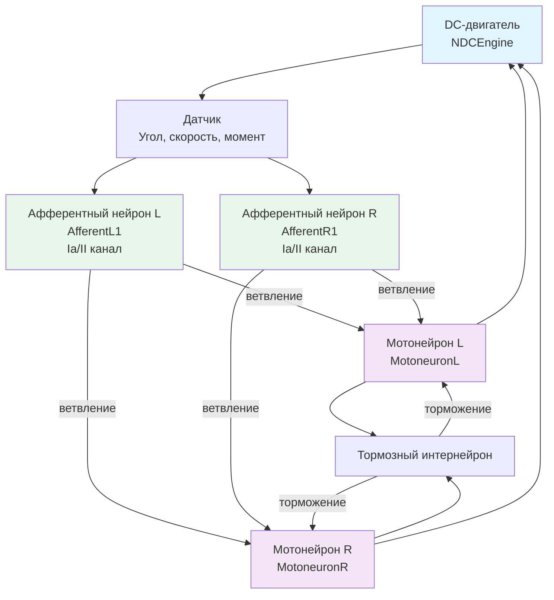

## MC-RCN-00-02-1CL-SimpleME-SimpleA-wBranches-woRenshow-wPA — одноуровневый рефлекторный контур с ветвлением

**Путь:** `Bin/Configs/SpikeSamples/MC0-RCN/MC-RCN-00-1CL-All-DcEngine/MC-RCN-00-02-1CL-SimpleME-SimpleA-wBranches-woRenshow-wPA`
**Статус валидации:** VALID (см. `Reports/SpikeSamples-Validation-Report.md`)

### Назначение конфигурации

Эта конфигурация демонстрирует **одноуровневый рефлекторный контур (RCN)** для управления DC-двигателем с ветвлением афферентных путей:
- Простой двигательный элемент (SimpleME)
- Простая афферентация (SimpleA)
- **С ветвлением афферентных путей (wBranches)** — отличие от базовой конфигурации
- Без клеток Реншоу (woRenshow)
- С пресинаптическим торможением (wPA)

Согласно [A] и `MuscleControlStructures.md`, ветвление афферентных путей влияет на пространственную суммацию сигналов и обработку информации. Данная конфигурация позволяет изучать влияние ветвления на работу рефлекторных контуров.

### Структура рефлекторного контура

Схема одноуровневого рефлекторного контура с ветвлением:

**Особенности данной конфигурации:**
- **С ветвлением афферентных путей** — афферентные нейроны имеют ветвления, что позволяет пространственную суммацию сигналов
- Без клеток Реншоу — отсутствует возвратное торможение
- С пресинаптическим торможением

### Отличия от базовой конфигурации

Данная конфигурация отличается от `MC-RCN-00-01` наличием ветвления афферентных путей (wBranches). Влияние ветвления:
- Улучшает пространственную суммацию сигналов
- Позволяет более сложную обработку афферентной информации
- Может влиять на характеристики управления

### Связанные материалы

- Теория и функциональное описание:
  - [`Bin/Docs/SpikeSamples/MuscleControlStructures.md`](../../../../../Docs/SpikeSamples/MuscleControlStructures.md) — нейронные структуры управления мышечным сокращением
- Описание конфигурации:
  - `Description.rtf` — подробное описание конфигурации (в формате RTF)
- Групповой README:
  - [`README.md`](../README.md) — общее описание группы конфигураций
- Связанные конфигурации:
  - `MC-RCN-00-01-1CL-SimpleME-SimpleA-woBranches-woRenshow-wPA` — базовая конфигурация без ветвления
  - `MC-RCN-00-03-1CL-SimpleME-SimpleA-woBranches-wRenshow-wPA` — с клетками Реншоу

## Литература

1. [27] Нейроморфные системы управления на основе модели импульсного нейрона со структурной адаптацией: диссертация на соискание ученой степени кандидата технических наук. [онлайн](https://www.elibrary.ru/item.asp?id=54445157)

2. [31] Моделирование нейронных структур управления мышечным сокращением. Схемы нейронных сетей. [онлайн](https://neuromodeler.ru/index.php?option=com_content&view=article&id=29:1&catid=67&lang=ru&Itemid=676)
