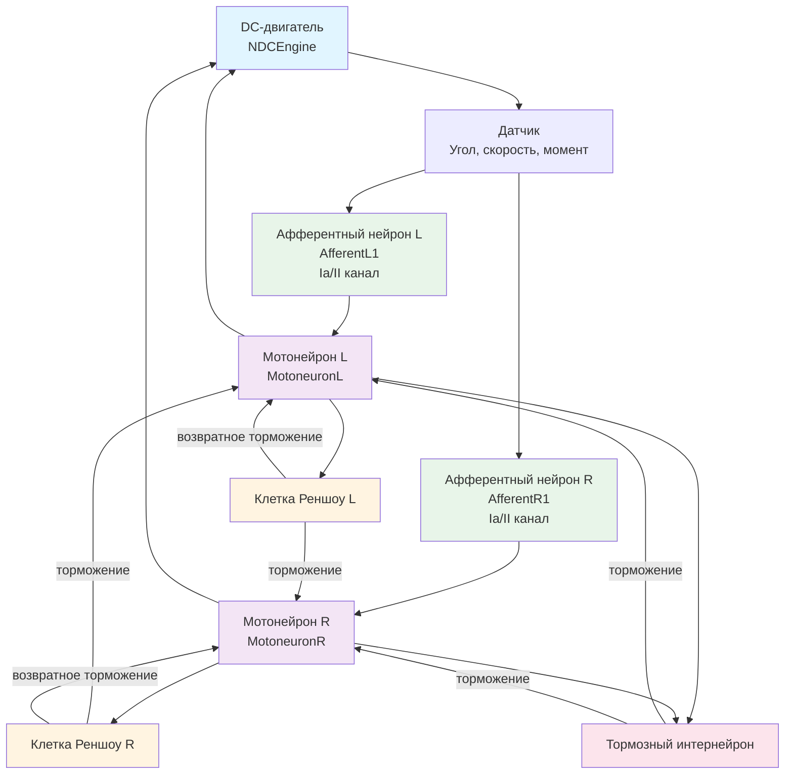

## MC-RCN-00-03-1CL-SimpleME-SimpleA-woBranches-wRenshow-wPA — одноуровневый рефлекторный контур с клетками Реншоу

**Путь:** `Bin/Configs/SpikeSamples/MC0-RCN/MC-RCN-00-1CL-All-DcEngine/MC-RCN-00-03-1CL-SimpleME-SimpleA-woBranches-wRenshow-wPA`
**Статус валидации:** VALID (см. `Reports/SpikeSamples-Validation-Report.md`)

### Назначение конфигурации

Эта конфигурация демонстрирует **одноуровневый рефлекторный контур (RCN)** для управления DC-двигателем с клетками Реншоу:
- Простой двигательный элемент (SimpleME)
- Простая афферентация (SimpleA)
- Без ветвления афферентных путей (woBranches)
- **С клетками Реншоу (wRenshow)** — отличие от базовой конфигурации
- С пресинаптическим торможением (wPA)

Согласно [A] и `MuscleControlStructures.md`, клетки Реншоу обеспечивают возвратное торможение мотонейронов, стабилизируя частоту их разрядов. Данная конфигурация позволяет изучать влияние возвратного торможения на работу рефлекторных контуров.

### Структура рефлекторного контура

Схема одноуровневого рефлекторного контура с клетками Реншоу:

**Особенности данной конфигурации:**
- **С клетками Реншоу** — наличие возвратного торможения мотонейронов
- Без ветвления афферентных путей — простые прямые связи
- С пресинаптическим торможением

### Эксперимент и моделируемые реакции

#### Цель эксперимента

Изучение влияния клеток Реншоу на работу рефлекторного контура:
- Стабилизация частоты разрядов мотонейронов через возвратное торможение
- Влияние возвратного торможения на характеристики управления
- Сравнение с конфигурацией без клеток Реншоу

#### Ожидаемые результаты

- **Возвратное торможение:** клетки Реншоу должны стабилизировать частоту разрядов мотонейронов при возрастании входной частоты
- **Стабилизация:** возвратное торможение должно предотвращать чрезмерную активацию мотонейронов
- **Улучшение характеристик:** наличие клеток Реншоу должно улучшить стабильность управления

### Отличия от базовой конфигурации

Данная конфигурация отличается от `MC-RCN-00-01` наличием клеток Реншоу (wRenshow). Влияние клеток Реншоу:
- Стабилизирует частоту разрядов мотонейронов
- Обеспечивает возвратное торможение
- Улучшает стабильность управления

### Связанные материалы

- Теория и функциональное описание:
  - [`Bin/Docs/SpikeSamples/MuscleControlStructures.md`](../../../../../Docs/SpikeSamples/MuscleControlStructures.md) — нейронные структуры управления мышечным сокращением
- Описание конфигурации:
  - `Description.rtf` — подробное описание конфигурации (в формате RTF)
- Групповой README:
  - [`README.md`](../README.md) — общее описание группы конфигураций
- Связанные конфигурации:
  - `MC-RCN-00-01-1CL-SimpleME-SimpleA-woBranches-woRenshow-wPA` — базовая конфигурация без клеток Реншоу
  - `MC-RCN-00-02-1CL-SimpleME-SimpleA-wBranches-woRenshow-wPA` — с ветвлением, без клеток Реншоу

## Литература

1. [27] Нейроморфные системы управления на основе модели импульсного нейрона со структурной адаптацией: диссертация на соискание ученой степени кандидата технических наук. [онлайн](https://www.elibrary.ru/item.asp?id=54445157)

2. [31] Моделирование нейронных структур управления мышечным сокращением. Схемы нейронных сетей. [онлайн](https://neuromodeler.ru/index.php?option=com_content&view=article&id=29:1&catid=67&lang=ru&Itemid=676)
