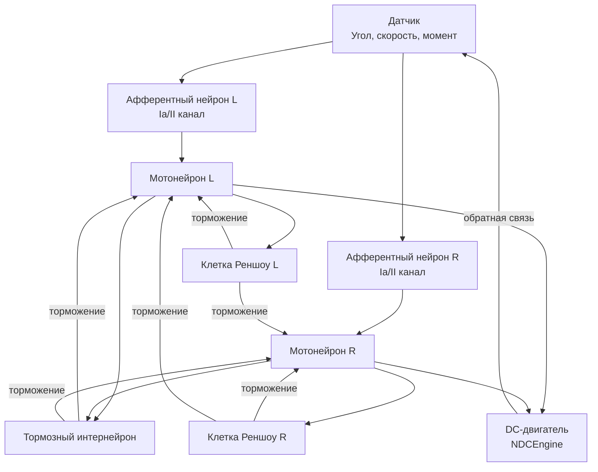

## MC-RCN-00-1CL-All-DcEngine — одноуровневые рефлекторные контуры с DC-двигателем

**Путь:** `Bin/Configs/SpikeSamples/MC0-RCN/MC-RCN-00-1CL-All-DcEngine`
**Статус валидации:** VALID (см. `Reports/SpikeSamples-Validation-Report.md`)

### Назначение группы конфигураций

Эта группа конфигураций демонстрирует **одноуровневые рефлекторные контуры (RCN - Reflex Chain of Neurons)** для управления DC-двигателем. Группа содержит 9 конфигураций, различающихся структурными параметрами: наличием ветвления афферентных путей, наличием клеток Реншоу, типом двигательного элемента и типом афферентной обратной связи.

Согласно [A] и `MuscleControlStructures.md`, RCN реализует спинальный уровень управления мышечным сокращением с использованием мотонейронов, клеток Реншоу, афферентных нейронов и тормозных интернейронов. Данная группа конфигураций позволяет изучать влияние различных структурных параметров на работу рефлекторных контуров.

  [31]
  ([онлайн-описание](https://neuromodeler.ru/index.php?option=com_content&view=article&id=29:1&catid=67&lang=ru&Itemid=676))  Раздел 3.2.1 "Описание сети спинального уровня управления мышечным сокращением"

### Структура группы конфигураций

Группа содержит 9 конфигураций с различными структурными параметрами:

1. **MC-RCN-00-01-1CL-SimpleME-SimpleA-woBranches-woRenshow-wPA**
   - Простой двигательный элемент (SimpleME)
   - Простая афферентация (SimpleA)
   - Без ветвления (woBranches)
   - Без клеток Реншоу (woRenshow)
   - С пресинаптическим торможением (wPA)

2. **MC-RCN-00-02-1CL-SimpleME-SimpleA-wBranches-woRenshow-wPA**
   - С ветвлением афферентных путей (wBranches)

3. **MC-RCN-00-03-1CL-SimpleME-SimpleA-woBranches-wRenshow-wPA**
   - С клетками Реншоу (wRenshow)

4. **MC-RCN-00-04-1CL-TS-SimpleME-SimpleA-woBranches-woRenshow-wPA**
   - Двигательный элемент типа TS (TS-SimpleME)

5. **MC-RCN-00-05-1CL-TS-SimpleME-SimpleA-wBranches-woRenshow-wPA**
   - TS-SimpleME с ветвлением

6. **MC-RCN-00-06-1CL-TS-SimpleME-SimpleA-woBranches-wRenshow-wPA**
   - TS-SimpleME с клетками Реншоу

7. **MC-RCN-00-07-1CL-SimpleME-FullA-woBranches-woRenshow-wPA**
   - Полная афферентация (FullA)

8. **MC-RCN-00-08-1CL-SimpleME-FullA-wBranches-woRenshow-wPA**
   - FullA с ветвлением

9. **MC-RCN-00-09-1CL-SimpleME-FullA-woBranches-wRenshow-wPA**
   - FullA с клетками Реншоу

### Биологическая мотивация

Согласно [A], спинальный уровень управления мышечным сокращением включает:

#### Компоненты спинального уровня

- **Афферентные нейроны** (каналы Ia, II, Ib) — передают информацию от мышечных веретён и органов Гольджи
- **Мотонейроны** — иннервируют мышечные волокна
- **Тормозные интернейроны** — обеспечивают взаимное торможение антагонистических мышц
- **Клетки Реншоу** — обеспечивают возвратное торможение мотонейронов

#### Рефлекторные контуры

- **Моно- и дисинаптические рефлекторные дуги** — прямая передача сигнала от афферентов к мотонейронам или через вставочный нейрон
- **Возвратное торможение** — торможение мотонейронов через клетки Реншоу при их активации
- **Взаимное торможение антагонистов** — торможение мотонейронов антагонистических мышц через тормозные интернейроны

### Структура рефлекторного контура

Обобщённая схема одноуровневого рефлекторного контура:

### Структурные параметры конфигураций

#### Типы двигательных элементов

- **SimpleME** — простой двигательный элемент
- **TS-SimpleME** — двигательный элемент типа TS (Two-Sensor)

#### Типы афферентации

- **SimpleA** — простая афферентация (базовые афферентные каналы)
- **FullA** — полная афферентация (расширенный набор афферентных каналов)

#### Структурные особенности

- **woBranches / wBranches** — без/с ветвлением афферентных путей
- **woRenshow / wRenshow** — без/с клетками Реншоу
- **wPA** — с пресинаптическим торможением

### Эксперимент и моделируемые реакции

#### Цель экспериментов

Изучение влияния структурных параметров на работу рефлекторных контуров:
- Влияние ветвления афферентных путей на обработку сигналов
- Влияние клеток Реншоу на стабилизацию частоты разрядов мотонейронов
- Влияние типа двигательного элемента на динамику управления
- Влияние типа афферентации на характеристики управления

#### Сценарии экспериментов

1. **Стабилизация угла поворота вала двигателя:**
   - Поддержание заданного угла поворота под действием внешних сил
   - Наблюдение работы рефлекторных контуров
   - Анализ влияния структурных параметров на стабильность

2. **Влияние клеток Реншоу:**
   - Сравнение конфигураций с клетками Реншоу и без них
   - Наблюдение стабилизации частоты разрядов мотонейронов
   - Анализ возвратного торможения

3. **Влияние ветвления афферентных путей:**
   - Сравнение конфигураций с ветвлением и без него
   - Наблюдение влияния на обработку сигналов
   - Анализ пространственной суммации сигналов

4. **Влияние типа афферентации:**
   - Сравнение простой и полной афферентации
   - Наблюдение влияния на характеристики управления
   - Анализ обработки различных типов сенсорных сигналов

#### Ожидаемые результаты

- **Возвратное торможение:** клетки Реншоу должны стабилизировать частоту разрядов мотонейронов
- **Взаимное торможение:** тормозные интернейроны должны обеспечивать согласованное управление антагонистическими мышцами
- **Влияние структуры:** различные структурные параметры должны влиять на характеристики управления

### Параметры модели

Основные параметры задаются в `Parameters.xml` для каждой конфигурации:

#### Параметры афферентных нейронов

- Пороги активации и деактивации
- Параметры преобразования сенсорных сигналов в импульсные потоки
- Параметры ветвления афферентных путей (для конфигураций с ветвлением)

#### Параметры мотонейронов

- Пороги активации и деактивации
- Параметры мембраны и каналов
- Параметры обратной связи

#### Параметры клеток Реншоу

- Пороги активации и деактивации
- Параметры тормозного влияния на мотонейроны
- Параметры взаимного торможения

#### Параметры DC-двигателя

- Параметры модели двигателя
- Параметры обратной связи по углу, скорости и моменту

Точные численные значения можно смотреть в `Parameters.xml` для каждой конфигурации.

### Результаты экспериментов

Согласно [A] и `MuscleControlStructures.md`:

#### Возвратное торможение

- Клетки Реншоу стабилизируют частоту разрядов мотонейронов при возрастании входной частоты
- Возвратное торможение предотвращает чрезмерную активацию мотонейронов
- Тормозные постсинаптические потенциалы (ТПСП) обеспечивают стабилизацию активности

#### Взаимное торможение антагонистов

- Тормозные интернейроны обеспечивают согласованное управление антагонистическими мышцами
- Активация мотонейрона одной мышцы приводит к торможению мотонейрона антагониста

#### Влияние структурных параметров

- Ветвление афферентных путей влияет на пространственную суммацию сигналов
- Тип двигательного элемента влияет на динамику управления
- Тип афферентации влияет на характеристики обработки сенсорных сигналов

### Связанные материалы

- Теория и функциональное описание:
  - [`Bin/Docs/SpikeSamples/MuscleControlStructures.md`](../../../Docs/SpikeSamples/MuscleControlStructures.md) — нейронные структуры управления мышечным сокращением
  - [`Bin/Docs/SpikeSamples/NeuronReactions.md`](../../../Docs/SpikeSamples/NeuronReactions.md) — реакции одиночных нейронов
  - [`Bin/Docs/SpikeSamples/ImpulseProcessingModel.md`](../../../Docs/SpikeSamples/ImpulseProcessingModel.md) — модель преобразования импульсных потоков
- Описание конфигураций:
  - `Readme.txt` — список всех регуляторов с одним контуром управления
  - `Description.rtf` в каждой подконфигурации — подробное описание (в формате RTF)
- Связанные группы конфигураций:
  - `MC-RCN-00-1CL-All-Pendulum` — одноуровневые контуры с маятником
  - `MC-RCN-00-2CL-All-DcEngine` — двухуровневые контуры с DcEngine
  - `MC-RCN-00-2CL-All-Pendulum` — двухуровневые контуры с маятником

## Литература

1. [27] Нейроморфные системы управления на основе модели импульсного нейрона со структурной адаптацией: диссертация на соискание ученой степени кандидата технических наук. [онлайн](https://www.elibrary.ru/item.asp?id=54445157)

2. [31] Моделирование нейронных структур управления мышечным сокращением. Схемы нейронных сетей. [онлайн](https://neuromodeler.ru/index.php?option=com_content&view=article&id=29:1&catid=67&lang=ru&Itemid=676)
