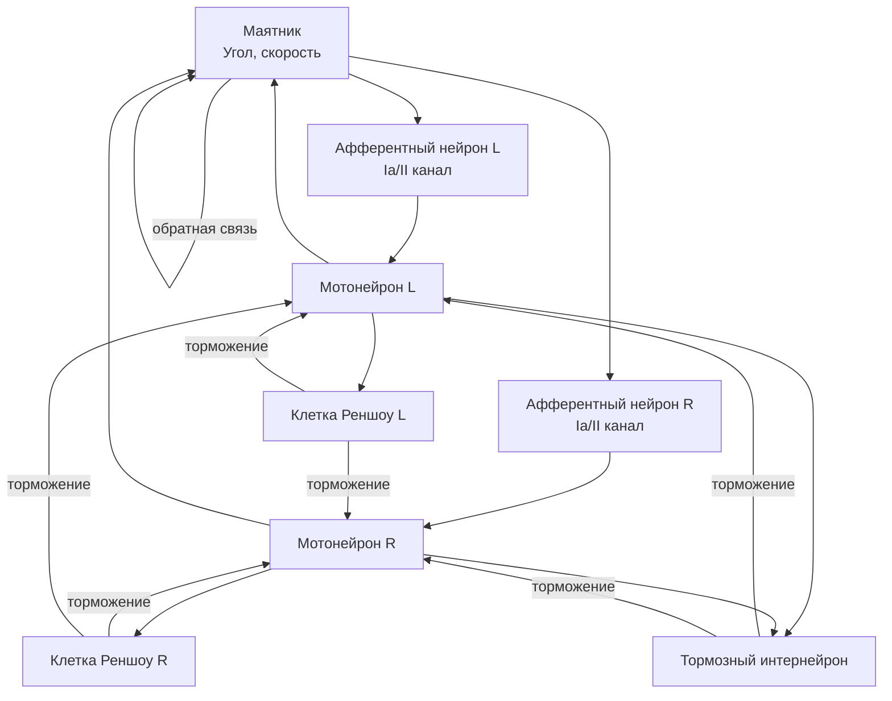

## MC-RCN-00-1CL-All-Pendulum — одноуровневые рефлекторные контуры с маятником

**Путь:** `Bin/Configs/SpikeSamples/MC0-RCN/MC-RCN-00-1CL-All-Pendulum`
**Статус валидации:** VALID (см. `Reports/SpikeSamples-Validation-Report.md`)

### Назначение группы конфигураций

Эта группа конфигураций демонстрирует **одноуровневые рефлекторные контуры (RCN - Reflex Chain of Neurons)** для управления маятником. Группа содержит конфигурации, аналогичные группе `MC-RCN-00-1CL-All-DcEngine`, но использует модель маятника вместо DC-двигателя в качестве объекта управления.

Согласно [A] и `MuscleControlStructures.md`, RCN реализует спинальный уровень управления мышечным сокращением. Использование модели маятника позволяет изучать работу рефлекторных контуров на более простом объекте управления, что упрощает анализ влияния структурных параметров.

  [31]
  ([онлайн-описание](https://neuromodeler.ru/index.php?option=com_content&view=article&id=29:1&catid=67&lang=ru&Itemid=676))  Раздел 3.2.1 "Описание сети спинального уровня управления мышечным сокращением"

### Структура группы конфигураций

Группа содержит конфигурации с различными структурными параметрами, аналогичные группе `MC-RCN-00-1CL-All-DcEngine`, но использующие модель маятника вместо DC-двигателя.

### Биологическая мотивация

Согласно [A], спинальный уровень управления мышечным сокращением включает:

#### Компоненты спинального уровня

- **Афферентные нейроны** (каналы Ia, II, Ib) — передают информацию от мышечных веретён и органов Гольджи
- **Мотонейроны** — иннервируют мышечные волокна
- **Тормозные интернейроны** — обеспечивают взаимное торможение антагонистических мышц
- **Клетки Реншоу** — обеспечивают возвратное торможение мотонейронов

#### Рефлекторные контуры

- **Моно- и дисинаптические рефлекторные дуги** — прямая передача сигнала от афферентов к мотонейронам или через вставочный нейрон
- **Возвратное торможение** — торможение мотонейронов через клетки Реншоу при их активации
- **Взаимное торможение антагонистов** — торможение мотонейронов антагонистических мышц через тормозные интернейроны

### Структура рефлекторного контура

Обобщённая схема одноуровневого рефлекторного контура с маятником:

### Эксперимент и моделируемые реакции

#### Цель экспериментов

Изучение влияния структурных параметров на работу рефлекторных контуров при управлении маятником:
- Стабилизация угла отклонения маятника
- Влияние клеток Реншоу на стабилизацию частоты разрядов мотонейронов
- Влияние ветвления афферентных путей на обработку сигналов
- Влияние типа афферентации на характеристики управления

#### Сценарии экспериментов

1. **Стабилизация маятника:**
   - Поддержание заданного угла отклонения маятника
   - Наблюдение работы рефлекторных контуров
   - Анализ влияния структурных параметров на стабильность

2. **Влияние клеток Реншоу:**
   - Сравнение конфигураций с клетками Реншоу и без них
   - Наблюдение стабилизации частоты разрядов мотонейронов
   - Анализ возвратного торможения

3. **Влияние ветвления афферентных путей:**
   - Сравнение конфигураций с ветвлением и без него
   - Наблюдение влияния на обработку сигналов
   - Анализ пространственной суммации сигналов

#### Ожидаемые результаты

- **Возвратное торможение:** клетки Реншоу должны стабилизировать частоту разрядов мотонейронов
- **Взаимное торможение:** тормозные интернейроны должны обеспечивать согласованное управление
- **Влияние структуры:** различные структурные параметры должны влиять на характеристики управления

### Параметры модели

Основные параметры задаются в `Parameters.xml` для каждой конфигурации:

#### Параметры афферентных нейронов

- Пороги активации и деактивации
- Параметры преобразования сенсорных сигналов в импульсные потоки
- Параметры ветвления афферентных путей (для конфигураций с ветвлением)

#### Параметры мотонейронов

- Пороги активации и деактивации
- Параметры мембраны и каналов
- Параметры обратной связи

#### Параметры клеток Реншоу

- Пороги активации и деактивации
- Параметры тормозного влияния на мотонейроны
- Параметры взаимного торможения

#### Параметры модели маятника

- Параметры модели маятника
- Параметры обратной связи по углу и скорости

Точные численные значения можно смотреть в `Parameters.xml` для каждой конфигурации.

### Результаты экспериментов

Согласно [A] и `MuscleControlStructures.md`:

#### Возвратное торможение

- Клетки Реншоу стабилизируют частоту разрядов мотонейронов при возрастании входной частоты
- Возвратное торможение предотвращает чрезмерную активацию мотонейронов
- Тормозные постсинаптические потенциалы (ТПСП) обеспечивают стабилизацию активности

#### Взаимное торможение антагонистов

- Тормозные интернейроны обеспечивают согласованное управление антагонистическими мышцами
- Активация мотонейрона одной мышцы приводит к торможению мотонейрона антагониста

### Связанные материалы

- Теория и функциональное описание:
  - [`Bin/Docs/SpikeSamples/MuscleControlStructures.md`](../../../../Docs/SpikeSamples/MuscleControlStructures.md) — нейронные структуры управления мышечным сокращением
  - [`Bin/Docs/SpikeSamples/NeuronReactions.md`](../../../../Docs/SpikeSamples/NeuronReactions.md) — реакции одиночных нейронов
- Описание конфигураций:
  - `Description.rtf` в каждой подконфигурации — подробное описание (в формате RTF)
- Связанные группы конфигураций:
  - `MC-RCN-00-1CL-All-DcEngine` — одноуровневые контуры с DcEngine
  - `MC-RCN-00-2CL-All-DcEngine` — двухуровневые контуры с DcEngine
  - `MC-RCN-00-2CL-All-Pendulum` — двухуровневые контуры с маятником

## Литература

1. [27] Нейроморфные системы управления на основе модели импульсного нейрона со структурной адаптацией: диссертация на соискание ученой степени кандидата технических наук. [онлайн](https://www.elibrary.ru/item.asp?id=54445157)

2. [31] Моделирование нейронных структур управления мышечным сокращением. Схемы нейронных сетей. [онлайн](https://neuromodeler.ru/index.php?option=com_content&view=article&id=29:1&catid=67&lang=ru&Itemid=676)
