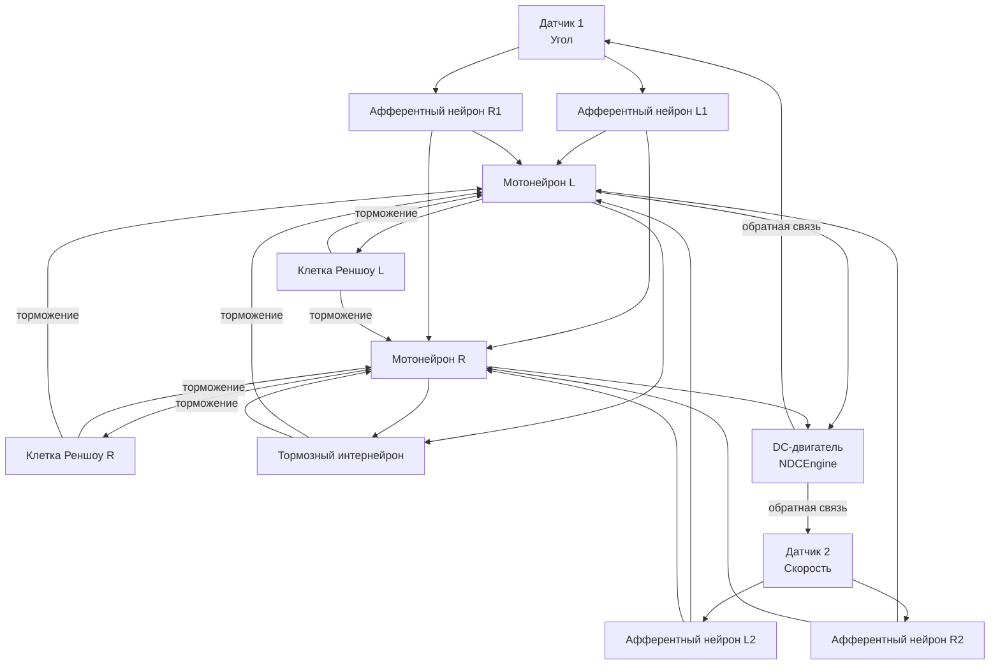

## MC-RCN-00-2CL-All-DcEngine — двухуровневые рефлекторные контуры с DC-двигателем

**Путь:** `Bin/Configs/SpikeSamples/MC0-RCN/MC-RCN-00-2CL-All-DcEngine`
**Статус валидации:** VALID (см. `Reports/SpikeSamples-Validation-Report.md`)

### Назначение группы конфигураций

Эта группа конфигураций демонстрирует **двухуровневые рефлекторные контуры (RCN - Reflex Chain of Neurons)** для управления DC-двигателем. Группа содержит 9 конфигураций с двумя контурами управления (например, по углу и скорости), что позволяет изучать более сложные схемы управления с несколькими сенсорными входами.

Согласно [A] и `MuscleControlStructures.md`, двухуровневые контуры обеспечивают более точное управление за счёт использования нескольких сенсорных сигналов. Данная группа конфигураций позволяет изучать влияние структурных параметров на работу многоуровневых рефлекторных контуров.

  [31]
  ([онлайн-описание](https://neuromodeler.ru/index.php?option=com_content&view=article&id=29:1&catid=67&lang=ru&Itemid=676))  Раздел 3.2.1 "Описание сети спинального уровня управления мышечным сокращением"

### Структура группы конфигураций

Группа содержит 9 конфигураций с двумя контурами управления (2CL - Two Control Loops), различающихся структурными параметрами:

1. **MC-RCN-00-01-2CL-SimpleME-SimpleA-woBranches-woRenshow-wPA**
   - Простой двигательный элемент (SimpleME)
   - Простая афферентация (SimpleA)
   - Без ветвления (woBranches)
   - Без клеток Реншоу (woRenshow)
   - С пресинаптическим торможением (wPA)

2. **MC-RCN-00-02-2CL-SimpleME-SimpleA-wBranches-woRenshow-wPA**
   - С ветвлением афферентных путей (wBranches)

3. **MC-RCN-00-03-2CL-SimpleME-SimpleA-woBranches-wRenshow-wPA**
   - С клетками Реншоу (wRenshow)

4. **MC-RCN-00-04-2CL-TS-SimpleME-SimpleA-woBranches-woRenshow-wPA**
   - Двигательный элемент типа TS (TS-SimpleME)

5. **MC-RCN-00-05-2CL-TS-SimpleME-SimpleA-wBranches-woRenshow-wPA**
   - TS-SimpleME с ветвлением

6. **MC-RCN-00-06-2CL-TS-SimpleME-SimpleA-woBranches-wRenshow-wPA**
   - TS-SimpleME с клетками Реншоу

7. **MC-RCN-00-07-2CL-SimpleME-FullA-woBranches-woRenshow-wPA**
   - Полная афферентация (FullA)

8. **MC-RCN-00-08-2CL-SimpleME-FullA-wBranches-woRenshow-wPA**
   - FullA с ветвлением

9. **MC-RCN-00-09-2CL-SimpleME-FullA-woBranches-wRenshow-wPA**
   - FullA с клетками Реншоу

### Биологическая мотивация

Согласно [A], спинальный уровень управления мышечным сокращением включает:

#### Компоненты спинального уровня

- **Афферентные нейроны** (каналы Ia, II, Ib) — передают информацию от мышечных веретён и органов Гольджи
- **Мотонейроны** — иннервируют мышечные волокна
- **Тормозные интернейроны** — обеспечивают взаимное торможение антагонистических мышц
- **Клетки Реншоу** — обеспечивают возвратное торможение мотонейронов

#### Двухуровневые контуры управления

- **Два контура управления** — использование нескольких сенсорных сигналов (например, угол и скорость) для более точного управления
- **Интеграция сигналов** — объединение сигналов от различных сенсоров для формирования управляющих воздействий
- **Координация контуров** — согласованная работа нескольких контуров управления

### Структура двухуровневого рефлекторного контура

Обобщённая схема двухуровневого рефлекторного контура:

### Эксперимент и моделируемые реакции

#### Цель экспериментов

Изучение влияния структурных параметров на работу двухуровневых рефлекторных контуров:
- Интеграция сигналов от нескольких сенсоров
- Влияние клеток Реншоу на стабилизацию частоты разрядов мотонейронов
- Влияние ветвления афферентных путей на обработку сигналов
- Координация работы нескольких контуров управления

#### Сценарии экспериментов

1. **Стабилизация угла и скорости:**
   - Поддержание заданного угла поворота и скорости под действием внешних сил
   - Наблюдение работы двухуровневых рефлекторных контуров
   - Анализ влияния структурных параметров на стабильность

2. **Интеграция сигналов:**
   - Наблюдение интеграции сигналов от различных сенсоров
   - Анализ влияния на характеристики управления
   - Изучение координации работы контуров

3. **Влияние клеток Реншоу:**
   - Сравнение конфигураций с клетками Реншоу и без них
   - Наблюдение стабилизации частоты разрядов мотонейронов
   - Анализ возвратного торможения в многоуровневых контурах

#### Ожидаемые результаты

- **Интеграция сигналов:** двухуровневые контуры должны обеспечивать более точное управление за счёт интеграции сигналов от нескольких сенсоров
- **Возвратное торможение:** клетки Реншоу должны стабилизировать частоту разрядов мотонейронов
- **Координация контуров:** несколько контуров должны работать согласованно для обеспечения стабильного управления

### Параметры модели

Основные параметры задаются в `Parameters.xml` для каждой конфигурации:

#### Параметры афферентных нейронов

- Пороги активации и деактивации для каждого контура управления
- Параметры преобразования сенсорных сигналов в импульсные потоки
- Параметры ветвления афферентных путей (для конфигураций с ветвлением)

#### Параметры мотонейронов

- Пороги активации и деактивации
- Параметры мембраны и каналов
- Параметры интеграции сигналов от различных контуров

#### Параметры клеток Реншоу

- Пороги активации и деактивации
- Параметры тормозного влияния на мотонейроны
- Параметры взаимного торможения

#### Параметры DC-двигателя

- Параметры модели двигателя
- Параметры обратной связи по углу, скорости и моменту

Точные численные значения можно смотреть в `Parameters.xml` для каждой конфигурации.

### Результаты экспериментов

Согласно [A] и `MuscleControlStructures.md`:

#### Двухуровневые контуры управления

- Использование нескольких сенсорных сигналов обеспечивает более точное управление
- Интеграция сигналов от различных контуров позволяет улучшить характеристики управления
- Координация работы нескольких контуров обеспечивает стабильное управление

#### Возвратное торможение

- Клетки Реншоу стабилизируют частоту разрядов мотонейронов при возрастании входной частоты
- Возвратное торможение предотвращает чрезмерную активацию мотонейронов
- Тормозные постсинаптические потенциалы (ТПСП) обеспечивают стабилизацию активности

### Связанные материалы

- Теория и функциональное описание:
  - [`Bin/Docs/SpikeSamples/MuscleControlStructures.md`](../../../Docs/SpikeSamples/MuscleControlStructures.md) — нейронные структуры управления мышечным сокращением
  - [`Bin/Docs/SpikeSamples/NeuronReactions.md`](../../../Docs/SpikeSamples/NeuronReactions.md) — реакции одиночных нейронов
- Описание конфигураций:
  - `Readme.txt` — список всех регуляторов с двумя контурами управления
  - `Description.rtf` в каждой подконфигурации — подробное описание (в формате RTF)
- Связанные группы конфигураций:
  - `MC-RCN-00-1CL-All-DcEngine` — одноуровневые контуры с DcEngine
  - `MC-RCN-00-1CL-All-Pendulum` — одноуровневые контуры с маятником
  - `MC-RCN-00-2CL-All-Pendulum` — двухуровневые контуры с маятником

## Литература

1. [27] Нейроморфные системы управления на основе модели импульсного нейрона со структурной адаптацией: диссертация на соискание ученой степени кандидата технических наук. [онлайн](https://www.elibrary.ru/item.asp?id=54445157)

2. [31] Моделирование нейронных структур управления мышечным сокращением. Схемы нейронных сетей. [онлайн](https://neuromodeler.ru/index.php?option=com_content&view=article&id=29:1&catid=67&lang=ru&Itemid=676)
