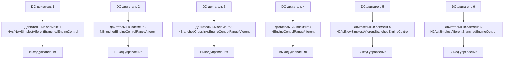

## MC-RCN-00-MotionElementsComparation-DcEngine — сравнение двигательных элементов

**Путь:** `Bin/Configs/SpikeSamples/MC0-RCN/MC-RCN-00-MotionElementsComparation-DcEngine`
**Статус валидации:** VALID (см. `Reports/SpikeSamples-Validation-Report.md`)

### Назначение группы конфигураций

Эта группа конфигураций демонстрирует **сравнение различных типов двигательных элементов** в рефлекторных контурах для управления DC-двигателем. Группа содержит конфигурацию `MultiComparation`, которая включает несколько различных типов двигательных элементов, что позволяет сравнивать их поведение и выявлять особенности каждого типа.

Согласно [A] и `MuscleControlStructures.md`, различные типы двигательных элементов могут иметь различные структурные параметры и характеристики управления. Данная группа конфигураций позволяет изучать влияние типа двигательного элемента на работу рефлекторных контуров.

  [31]
  ([онлайн-описание](https://neuromodeler.ru/index.php?option=com_content&view=article&id=29:1&catid=67&lang=ru&Itemid=676))  Раздел 3.2.1 "Описание сети спинального уровня управления мышечным сокращением"

### Структура группы конфигураций

Группа содержит конфигурацию `MultiComparation` с несколькими различными типами двигательных элементов:

- **EngineControlRangeAfferent** (`NAsfNewSimplestAfferentBranchedEngineControl`)
- **EngineControlRangeAfferent2** (`NBranchedEngineControlRangeAfferent`)
- **EngineControlRangeAfferent3** (`NBranchedCrosslinksEngineControlRangeAfferent`)
- **EngineControlRangeAfferent4** (`NEngineControlRangeAfferent`)
- **EngineControlRangeAfferent5** (`N2AsfNewSimplestAfferentBranchedEngineControl`)
- **EngineControlRangeAfferent6** (`N2AsfSimplestAfferentBranchedEngineControl`)

Каждый двигательный элемент подключён к своему DC-двигателю (`NDCEngine`), что позволяет сравнивать их поведение на одинаковых объектах управления.

### Биологическая мотивация

Согласно [A], спинальный уровень управления мышечным сокращением включает:

#### Компоненты спинального уровня

- **Афферентные нейроны** (каналы Ia, II, Ib) — передают информацию от мышечных веретён и органов Гольджи
- **Мотонейроны** — иннервируют мышечные волокна
- **Тормозные интернейроны** — обеспечивают взаимное торможение антагонистических мышц
- **Клетки Реншоу** — обеспечивают возвратное торможение мотонейронов

#### Различные типы двигательных элементов

- Различные типы двигательных элементов могут иметь различные структурные параметры
- Различия могут проявляться в организации афферентных путей, наличии ветвления, наличии перекрёстных связей
- Различные типы могут демонстрировать различные характеристики управления

### Структура конфигурации сравнения

Обобщённая схема конфигурации сравнения:

### Эксперимент и моделируемые реакции

#### Цель эксперимента

Сравнение различных типов двигательных элементов:
- Влияние типа двигательного элемента на характеристики управления
- Различия в обработке афферентных сигналов
- Влияние структурных особенностей на поведение рефлекторных контуров
- Выявление преимуществ и недостатков различных типов

#### Сценарии экспериментов

1. **Сравнение реакций на одинаковый входной сигнал:**
   - Все двигательные элементы получают одинаковый входной сигнал
   - Наблюдение различий в реакциях
   - Анализ влияния типа на характеристики управления

2. **Влияние структурных особенностей:**
   - Изучение влияния ветвления афферентных путей
   - Изучение влияния перекрёстных связей
   - Анализ влияния организации афферентных каналов

3. **Характеристики управления:**
   - Сравнение стабильности управления
   - Сравнение точности управления
   - Анализ временных характеристик

#### Ожидаемые результаты

- **Различия между типами:** различные типы двигательных элементов должны демонстрировать различные характеристики управления
- **Влияние структуры:** структурные особенности должны влиять на поведение рефлекторных контуров
- **Оптимальный тип:** для различных задач могут быть оптимальны различные типы двигательных элементов

### Параметры модели

Основные параметры задаются в `Parameters.xml`:

#### Параметры двигательных элементов

- Параметры афферентных нейронов для каждого типа
- Параметры мотонейронов
- Параметры клеток Реншоу (если присутствуют)
- Параметры ветвления и перекрёстных связей

#### Параметры DC-двигателей

- Параметры модели двигателя (одинаковые для всех двигателей)
- Параметры обратной связи по углу, скорости и моменту

Точные численные значения можно смотреть в `Parameters.xml`.

### Результаты экспериментов

Согласно [A] и `MuscleControlStructures.md`:

#### Влияние типа двигательного элемента

- Различные типы двигательных элементов демонстрируют различные характеристики управления
- Структурные особенности влияют на обработку афферентных сигналов и формирование управляющих воздействий
- Выбор типа двигательного элемента зависит от требований к характеристикам управления

### Связанные материалы

- Теория и функциональное описание:
  - [`Bin/Docs/SpikeSamples/MuscleControlStructures.md`](../../../../Docs/SpikeSamples/MuscleControlStructures.md) — нейронные структуры управления мышечным сокращением
  - [`Bin/Docs/SpikeSamples/NeuronReactions.md`](../../../../Docs/SpikeSamples/NeuronReactions.md) — реакции одиночных нейронов
- Описание конфигурации:
  - `MultiComparation/Description.rtf` — подробное описание конфигурации (в формате RTF)
- Связанные группы конфигураций:
  - `MC-RCN-00-1CL-All-DcEngine` — одноуровневые контуры с DcEngine
  - `MC-RCN-00-2CL-All-DcEngine` — двухуровневые контуры с DcEngine
  - `MC-RCN-01-NumMotionElements-Pendulum` — влияние количества двигательных элементов

## Литература

1. [27] Нейроморфные системы управления на основе модели импульсного нейрона со структурной адаптацией: диссертация на соискание ученой степени кандидата технических наук. [онлайн](https://www.elibrary.ru/item.asp?id=54445157)

2. [31] Моделирование нейронных структур управления мышечным сокращением. Схемы нейронных сетей. [онлайн](https://neuromodeler.ru/index.php?option=com_content&view=article&id=29:1&catid=67&lang=ru&Itemid=676)
