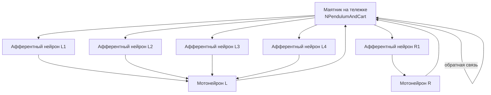

## MC-RCN-01-NumMotionElements-Pendulum — влияние количества двигательных элементов

**Путь:** `Bin/Configs/SpikeSamples/MC0-RCN/MC-RCN-01-NumMotionElements-Pendulum`
**Статус валидации:** VALID (см. `Reports/SpikeSamples-Validation-Report.md`)

### Назначение конфигурации

Эта конфигурация демонстрирует **влияние количества двигательных элементов** на работу рефлекторных контуров для управления маятником. Конфигурация использует модель маятника (`NPendulumAndCart`) и рефлекторный контур с несколькими двигательными элементами, что позволяет изучать влияние количества элементов на характеристики управления.

Согласно [A] и `MuscleControlStructures.md`, использование нескольких двигательных элементов может улучшить характеристики управления за счёт распределения нагрузки и повышения надёжности системы. Данная конфигурация позволяет изучать влияние количества двигательных элементов на работу рефлекторных контуров.

  [31]
  ([онлайн-описание](https://neuromodeler.ru/index.php?option=com_content&view=article&id=29:1&catid=67&lang=ru&Itemid=676))  Раздел 3.2.1 "Описание сети спинального уровня управления мышечным сокращением"

### Структура конфигурации

Конфигурация содержит:
- **PendulumAndCart** (`NPendulumAndCart`) — модель маятника на тележке
- **EngineControlRangeAfferent** (`N2AsfNewSimplestAfferentBranchedEngineControl`) — рефлекторный контур с несколькими двигательными элементами

Конфигурация использует несколько афферентных нейронов (AfferentL1, AfferentL2, AfferentL3, AfferentL4, AfferentR1 и др.), что позволяет изучать влияние количества двигательных элементов на обработку сигналов и формирование управляющих воздействий.

### Биологическая мотивация

Согласно [A], спинальный уровень управления мышечным сокращением включает:

#### Компоненты спинального уровня

- **Афферентные нейроны** (каналы Ia, II, Ib) — передают информацию от мышечных веретён и органов Гольджи
- **Мотонейроны** — иннервируют мышечные волокна
- **Тормозные интернейроны** — обеспечивают взаимное торможение антагонистических мышц
- **Клетки Реншоу** — обеспечивают возвратное торможение мотонейронов

#### Влияние количества двигательных элементов

- Использование нескольких двигательных элементов позволяет распределить нагрузку
- Повышение надёжности системы за счёт избыточности
- Улучшение характеристик управления за счёт интеграции сигналов от нескольких элементов
- Возможность более точного управления за счёт использования большего количества сенсорных сигналов

### Структура рефлекторного контура

Обобщённая схема рефлекторного контура с несколькими двигательными элементами:

### Эксперимент и моделируемые реакции

#### Цель эксперимента

Изучение влияния количества двигательных элементов на работу рефлекторных контуров:
- Влияние количества афферентных нейронов на обработку сигналов
- Влияние на характеристики управления маятником
- Распределение нагрузки между двигательными элементами
- Интеграция сигналов от нескольких элементов

#### Сценарии экспериментов

1. **Управление маятником:**
   - Стабилизация угла отклонения маятника
   - Наблюдение работы рефлекторных контуров с несколькими двигательными элементами
   - Анализ влияния количества элементов на стабильность

2. **Влияние количества элементов:**
   - Сравнение конфигураций с различным количеством двигательных элементов
   - Наблюдение влияния на характеристики управления
   - Анализ интеграции сигналов от нескольких элементов

3. **Распределение нагрузки:**
   - Изучение распределения нагрузки между двигательными элементами
   - Анализ влияния на надёжность системы
   - Изучение избыточности системы

#### Ожидаемые результаты

- **Улучшение характеристик:** использование нескольких двигательных элементов должно улучшить характеристики управления
- **Интеграция сигналов:** интеграция сигналов от нескольких элементов должна обеспечить более точное управление
- **Надёжность:** избыточность системы должна повысить надёжность управления

### Параметры модели

Основные параметры задаются в `Parameters.xml`:

#### Параметры афферентных нейронов

- Пороги активации и деактивации для каждого афферентного нейрона
- Параметры преобразования сенсорных сигналов в импульсные потоки
- Параметры ветвления афферентных путей

#### Параметры мотонейронов

- Пороги активации и деактивации
- Параметры мембраны и каналов
- Параметры интеграции сигналов от нескольких двигательных элементов

#### Параметры модели маятника

- Параметры модели маятника на тележке
- Параметры обратной связи по углу и скорости

Точные численные значения можно смотреть в `Parameters.xml`.

### Результаты экспериментов

Согласно [A] и `MuscleControlStructures.md`:

#### Влияние количества двигательных элементов

- Использование нескольких двигательных элементов улучшает характеристики управления
- Интеграция сигналов от нескольких элементов обеспечивает более точное управление
- Распределение нагрузки между элементами повышает надёжность системы

#### Управление движением

- Рефлекторные контуры обеспечивают эффективное управление движением на основе нейронных команд
- Использование нескольких двигательных элементов позволяет улучшить характеристики управления сложными объектами, такими как маятник на тележке

### Связанные материалы

- Теория и функциональное описание:
  - [`Bin/Docs/SpikeSamples/MuscleControlStructures.md`](../../../Docs/SpikeSamples/MuscleControlStructures.md) — нейронные структуры управления мышечным сокращением
  - [`Bin/Docs/SpikeSamples/NeuronReactions.md`](../../../Docs/SpikeSamples/NeuronReactions.md) — реакции одиночных нейронов
- Описание конфигурации:
  - `Description.rtf` — подробное описание конфигурации (в формате RTF)
- Связанные группы конфигураций:
  - `MC-RCN-00-1CL-All-Pendulum` — одноуровневые контуры с маятником
  - `MC-RCN-00-2CL-All-Pendulum` — двухуровневые контуры с маятником
  - `MC-RCN-00-MotionElementsComparation-DcEngine` — сравнение двигательных элементов

## Литература

1. [27] Нейроморфные системы управления на основе модели импульсного нейрона со структурной адаптацией: диссертация на соискание ученой степени кандидата технических наук. [онлайн](https://www.elibrary.ru/item.asp?id=54445157)

2. [31] Моделирование нейронных структур управления мышечным сокращением. Схемы нейронных сетей. [онлайн](https://neuromodeler.ru/index.php?option=com_content&view=article&id=29:1&catid=67&lang=ru&Itemid=676)
