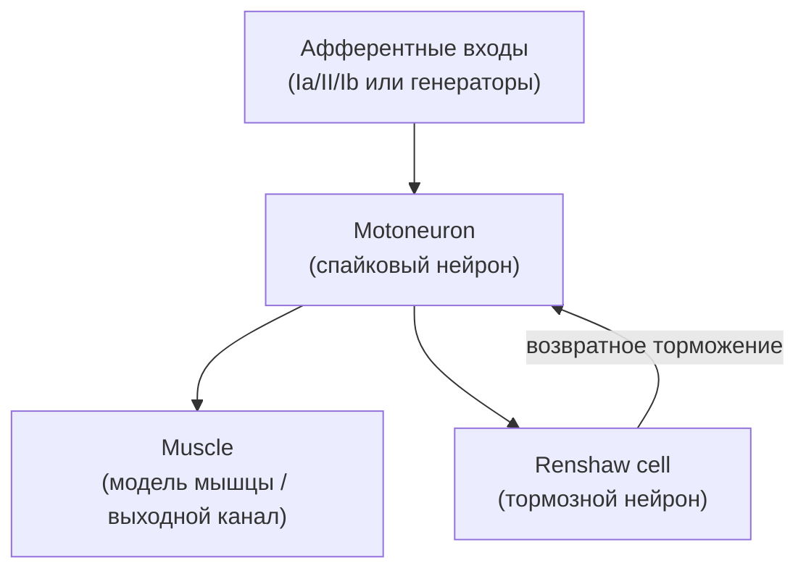

## MotionControl_Test — базовый контур управления мышечным сокращением

**Путь:** `Bin/Configs/SpikeSamples/MC1-PCN/MotionControl_Test`  
**Статус валидации:** VALID (см. `Reports/SpikeSamples-Validation-Report.md`)

### Назначение конфигурации

Конфигурация реализует упрощённую схему управления мышцей через спайковую нейронную структуру, соответствующую базовым схемам из работы  
«Моделирование нейронных структур управления мышечным сокращением. Схемы нейронных сетей.»  
([онлайн](https://neuromodeler.ru/index.php?option=com_content&view=article&id=29:1&catid=67&lang=ru&Itemid=676)).

Модель иллюстрирует:

- преобразование афферентных сигналов в разряды мотонейронов;
- влияние возвратного торможения (через клетки Реншоу, если они присутствуют в модели);
- формирование импульсного сигнала на мышцу.

### Структура модели (концептуально)

На концептуальном уровне сеть можно представить так:

В конкретной конфигурации:

- роль афферентов могут играть либо афферентные нейроны (`SpikeSamples/NM-AfferentNeurons/*`), либо генераторы импульсов;
- мотонейрон реализован на основе `NPulseNeuron` с несколькими участками сомы и дендритов;
- клетка Реншоу (если присутствует) также реализована через `NPulseNeuron`, но с иным набором входов и параметров;
- мышца представлена либо агрегированным выходным каналом, либо отдельной подсистемой в модели.

Точные имена и связи компонентов можно увидеть в `model.xml` и `Parameters.xml`.

### Эксперимент и моделируемые реакции

Типичный сценарий:

- на афферентный вход подаётся последовательность импульсов, отражающих растяжение/сокращение мышцы или команду высшего уровня;
- измеряются:
  - разряды мотонейрона (частота, структура пачек);
  - разряды клетки Реншоу (если есть);
  - выходной сигнал на мышцу.

Ожидается, что:

- при увеличении частоты входной стимуляции частота разрядов мотонейрона сначала растёт, затем ограничивается за счёт возвратного торможения;
- мышца получает устойчивый по частоте сигнал, несмотря на вариации входа.

### Связанные материалы

- Интегральная документация:
  - `Bin/Docs/SpikeSamples/MuscleControlStructures.md`
- Другие конфигурации серии:
  - `SpikeSamples/MC1-PCN/NewPositionControl_Test`
  - `SpikeSamples/MC1-PCN/MultiPositionControl_*`

