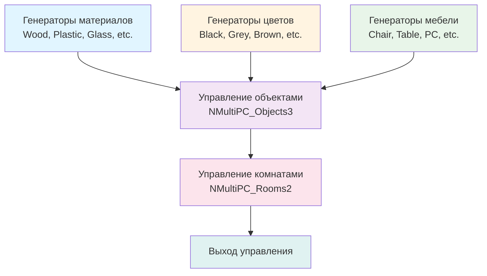

## MultiPC_TwoLevelsTask — двухуровневая задача многопозиционного управления

**Путь:** `Bin/Configs/SpikeSamples/MC1-PCN/MultiPC_TwoLevelsTask`
**Статус валидации:** VALID (см. `Reports/SpikeSamples-Validation-Report.md`)

### Назначение конфигурации

Конфигурация демонстрирует **двухуровневую задачу многопозиционного управления** с использованием иерархической структуры нейронных сетей. Конфигурация использует множество генераторов импульсов (`NPGenerator`) для различных категорий объектов (материалы, цвета, предметы мебели) и компоненты `NMultiPositionControl` для двухуровневого управления.

Согласно `MuscleControlStructures.md` и [A], PCN (Position Control Network) может быть организована в иерархическую структуру с несколькими уровнями. Данная конфигурация демонстрирует двухуровневую организацию PCN для управления сложными задачами.- **[A]**
  Раздел 3.3 "Описание сети позиционного управления (position control network — PCN)"
  Раздел 3.3.2 "Описание структуры сети PCN2"

  [31]
  ([онлайн-описание](https://neuromodeler.ru/index.php?option=com_content&view=article&id=29:1&catid=67&lang=ru&Itemid=676))

### Структура конфигурации

Конфигурация содержит:

- **Множество генераторов импульсов** (`NPGenerator`) для различных категорий:
  - Материалы: Wood, Plastic, Glass, Textile, Paper, Metal
  - Цвета: Black, Grey, Brown, Green, Blue, Red
  - Предметы мебели: Chair, Table, PC, Armchair, Streetlight, Bench, Tree, Grass
- **NMultiPC_Objects3** (`NMultiPositionControl`) — компонент многопозиционного управления для объектов
- **NMultiPC_Rooms2** (`NMultiPositionControl`) — компонент многопозиционного управления для комнат

### Биологическая мотивация

Согласно [A] и `MuscleControlStructures.md`:

#### Двухуровневая организация PCN

- **PCN1** — сеть позиционного управления первого уровня, реализует запоминание и воспроизведение положений для отдельных объектов
- **PCN2** — сеть позиционного управления второго уровня, реализует координацию работы нескольких PCN1 и управление сложными задачами
- **Иерархическая структура** — позволяет управлять сложными задачами через координацию работы нескольких уровней

#### Двухуровневое многопозиционное управление

- Первый уровень управляет отдельными объектами или категориями объектов
- Второй уровень координирует работу первого уровня и управляет сложными задачами
- Использование иерархической структуры для обработки сложных входных сигналов

### Структура модели

Обобщённая схема двухуровневого многопозиционного управления:

### Эксперимент и моделируемые реакции

#### Цель эксперимента

Изучение двухуровневого многопозиционного управления:
- Обработка сложных входных сигналов от различных категорий объектов
- Координация работы первого и второго уровней управления
- Управление сложными задачами через иерархическую структуру

#### Сценарии экспериментов

1. **Обработка категорий объектов:**
   - Генераторы создают сигналы для различных категорий (материалы, цвета, мебель)
   - Компонент управления объектами обрабатывает сигналы от всех категорий
   - Наблюдение распределения активности между категориями

2. **Двухуровневое управление:**
   - Первый уровень управляет отдельными объектами или категориями
   - Второй уровень координирует работу первого уровня
   - Анализ влияния иерархической структуры на характеристики управления

3. **Управление сложными задачами:**
   - Комбинирование сигналов от различных категорий
   - Формирование сложных управляющих воздействий
   - Анализ координации работы уровней

#### Ожидаемые результаты

- **Обработка категорий:** система должна обрабатывать сигналы от различных категорий объектов
- **Координация уровней:** первый и второй уровни должны работать согласованно
- **Управление задачами:** иерархическая структура должна обеспечивать управление сложными задачами

### Параметры модели

Основные параметры задаются в `Model_00.xml` и `Parameters_00.xml`:

#### Параметры генераторов импульсов

Большинство генераторов имеют:
- **Frequency:** 10 Гц (частота генерации импульсов)
- **Amplitude:** 1 (амплитуда импульсов)
- **PulseLength:** 0.001 с (длительность импульса)
- **AvgInterval:** 5 с (средний интервал между импульсами)

Некоторые генераторы (Paper, Chair, Table, PC, Armchair, Streetlight, Bench, Tree, Grass) имеют:
- **Frequency:** 0 Гц (отключены)

#### Параметры многопозиционного управления

- Параметры компонента `NMultiPC_Objects3` для управления объектами
- Параметры компонента `NMultiPC_Rooms2` для управления комнатами
- Параметры координации работы уровней

Точные численные значения можно смотреть в `Parameters_00.xml`.

### Результаты экспериментов

Согласно [A] и `MuscleControlStructures.md`:

#### Двухуровневое многопозиционное управление

- Система успешно обрабатывает сложные входные сигналы от различных категорий объектов
- Первый и второй уровни работают согласованно
- Иерархическая структура обеспечивает управление сложными задачами

#### Иерархическая организация PCN

- PCN1 управляет отдельными объектами или категориями объектов
- PCN2 координирует работу PCN1 и управляет сложными задачами
- Иерархическая структура позволяет эффективно обрабатывать сложные входные сигналы

### Связанные материалы

- Теория и функциональное описание:
  - [`Bin/Docs/SpikeSamples/MuscleControlStructures.md`](../../../../Docs/SpikeSamples/MuscleControlStructures.md) — нейронные структуры управления мышечным сокращением
  - [`Bin/Docs/SpikeSamples/NeuronReactions.md`](../../../../Docs/SpikeSamples/NeuronReactions.md) — реакции одиночных нейронов
- Описание конфигурации:
  - `Description.rtf` — подробное описание конфигурации (в формате RTF)
- Связанные конфигурации:
  - `MultiPositionControl_Test` — базовое многопозиционное управление
  - `MultiPositionControl_SimpleTest` — многопозиционное управление (простой тест)
  - `MultiPositionControl_SoloModeTest` — многопозиционное управление (режим соло)
  - `MultiPositionControl_TaskTest` — многопозиционное управление (тест задач)
  - `MultiPositionControl_RememberStateTest` — многопозиционное управление с запоминанием состояний

## Литература

1. [27] Перспективы применения моделей биологических нейронных структур в системах управления движением // Информационно-измерительные и управляющие системы: - №9, 2011. с. 71-80. [онлайн](https://www.elibrary.ru/item.asp?id=17257136)

2. [13] The Neuromorphic Model of the Human Visual System // Studies in Computational Intelligence, 2021, 925 SCI, pp. 339–346. [DOI](https://link.springer.com/chapter/10.1007%2F978-3-030-60577-3_40)

3. [31] Моделирование нейронных структур управления мышечным сокращением. Схемы нейронных сетей. [онлайн](https://neuromodeler.ru/index.php?option=com_content&view=article&id=29:1&catid=67&lang=ru&Itemid=676)
