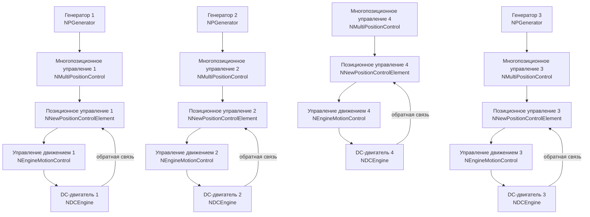

## MultiPositionControl_RememberStateTest — многопозиционное управление с запоминанием состояний

**Путь:** `Bin/Configs/SpikeSamples/MC1-PCN/MultiPositionControl_RememberStateTest`
**Статус валидации:** VALID (см. `Reports/SpikeSamples-Validation-Report.md`)

### Назначение конфигурации

Конфигурация демонстрирует **многопозиционное управление с запоминанием состояний** для управления несколькими DC-двигателями. Конфигурация использует несколько компонентов `NMultiPositionControl` и `NNewPositionControlElement` для управления четырьмя DC-двигателями (`NDCEngine`) через компоненты `NEngineMotionControl`.

Согласно `MuscleControlStructures.md` и [A], PCN (Position Control Network) реализует запоминание и воспроизведение положений. Данная конфигурация расширяет базовое многопозиционное управление возможностью запоминания состояний для нескольких двигателей.- **[A]**
  Раздел 3.3 "Описание сети позиционного управления (position control network — PCN)"
  Раздел 3.3.1 "Описание структуры сети PCN1"

  [31]
  ([онлайн-описание](https://neuromodeler.ru/index.php?option=com_content&view=article&id=29:1&catid=67&lang=ru&Itemid=676))

### Структура конфигурации

Конфигурация содержит:

- **4 DC-двигателя** (`NDCEngine`) — объекты управления
- **4 компонента управления движением** (`NEngineMotionControl`) — управление двигателями
- **4 компонента позиционного управления** (`NNewPositionControlElement`) — элементы позиционного управления
- **4 компонента многопозиционного управления** (`NMultiPositionControl`) — многопозиционное управление
- **3 генератора импульсов** (`NPGenerator`) — генерация входных сигналов

### Биологическая мотивация

Согласно [A] и `MuscleControlStructures.md`:

#### Сеть позиционного управления (PCN)

- **PCN1** — сеть позиционного управления первого уровня, реализует запоминание и воспроизведение положений
- **Запоминание положений** — сеть может запоминать несколько целевых положений для каждого двигателя
- **Воспроизведение положений** — сеть может воспроизводить запомненные положения

#### Многопозиционное управление с запоминанием состояний

- Запоминание состояний для нескольких двигателей одновременно
- Координация работы нескольких двигателей
- Использование обратной связи для стабилизации вокруг выбранных целей

### Структура модели

Обобщённая схема многопозиционного управления с запоминанием состояний:

### Эксперимент и моделируемые реакции

#### Цель эксперимента

Изучение многопозиционного управления с запоминанием состояний для нескольких двигателей:
- Запоминание состояний для каждого двигателя
- Координация работы нескольких двигателей
- Переключение между различными целевыми положениями
- Стабилизация вокруг выбранных целей

#### Сценарии экспериментов

1. **Запоминание состояний:**
   - Задание целевых положений для каждого двигателя
   - Запоминание состояний в компонентах многопозиционного управления
   - Наблюдение работы механизмов запоминания

2. **Координация двигателей:**
   - Одновременное управление несколькими двигателями
   - Координация работы компонентов управления
   - Анализ влияния координации на характеристики управления

3. **Переключение между положениями:**
   - Последовательное задание различных целевых положений
   - Фиксация переходных процессов и устойчивых режимов
   - Анализ скорости перехода между состояниями

#### Ожидаемые результаты

- **Запоминание состояний:** система должна запоминать состояния для каждого двигателя
- **Координация:** несколько двигателей должны работать согласованно
- **Стабилизация:** система должна стабилизироваться вокруг выбранных целей

### Параметры модели

Основные параметры задаются в `Model_00.xml` и `Parameters_00.xml`:

#### Параметры генераторов импульсов

- **PGenerator:** Frequency: 0 Гц, AvgInterval: 1 с
- **PGenerator2:** Frequency: 0 Гц, AvgInterval: 5 с
- **PGenerator3:** Frequency: 0 Гц, AvgInterval: 5 с

#### Параметры многопозиционного управления

- Параметры компонентов `NMultiPositionControl`
- Параметры запоминания и воспроизведения положений
- Параметры обратной связи

#### Параметры позиционного управления

- Параметры компонентов `NNewPositionControlElement`
- Параметры обратной связи от двигателей

#### Параметры управления движением

- Параметры компонентов `NEngineMotionControl`
- Параметры афферентных нейронов и мотонейронов

#### Параметры DC-двигателей

- Параметры модели двигателей
- Параметры обратной связи по углу, скорости и моменту

Точные численные значения можно смотреть в `Parameters_00.xml`.

### Результаты экспериментов

Согласно [A] и `MuscleControlStructures.md`:

#### Многопозиционное управление с запоминанием состояний

- Система успешно запоминает состояния для каждого двигателя
- Несколько двигателей работают согласованно
- Система стабилизируется вокруг выбранных целей

#### Запоминание и воспроизведение положений

- Сеть может запоминать несколько целевых положений для каждого двигателя
- Сеть может воспроизводить запомненные положения
- Механизмы обратной связи обеспечивают стабильность управления

### Связанные материалы

- Теория и функциональное описание:
  - [`Bin/Docs/SpikeSamples/MuscleControlStructures.md`](../../../../Docs/SpikeSamples/MuscleControlStructures.md) — нейронные структуры управления мышечным сокращением
  - [`Bin/Docs/SpikeSamples/NeuronReactions.md`](../../../../Docs/SpikeSamples/NeuronReactions.md) — реакции одиночных нейронов
- Описание конфигурации:
  - `Description.rtf` — подробное описание конфигурации (в формате RTF)
- Связанные конфигурации:
  - `MultiPositionControl_Test` — базовое многопозиционное управление
  - `MultiPositionControl_SimpleTest` — многопозиционное управление (простой тест)
  - `MultiPositionControl_SoloModeTest` — многопозиционное управление (режим соло)
  - `MultiPositionControl_TaskTest` — многопозиционное управление (тест задач)
  - `MultiPC_TwoLevelsTask` — двухуровневая задача многопозиционного управления

## Литература

1. [27] Перспективы применения моделей биологических нейронных структур в системах управления движением // Информационно-измерительные и управляющие системы: - №9, 2011. с. 71-80. [онлайн](https://www.elibrary.ru/item.asp?id=17257136)

2. [13] The Neuromorphic Model of the Human Visual System // Studies in Computational Intelligence, 2021, 925 SCI, pp. 339–346. [DOI](https://link.springer.com/chapter/10.1007%2F978-3-030-60577-3_40)

3. [31] Моделирование нейронных структур управления мышечным сокращением. Схемы нейронных сетей. [онлайн](https://neuromodeler.ru/index.php?option=com_content&view=article&id=29:1&catid=67&lang=ru&Itemid=676)
