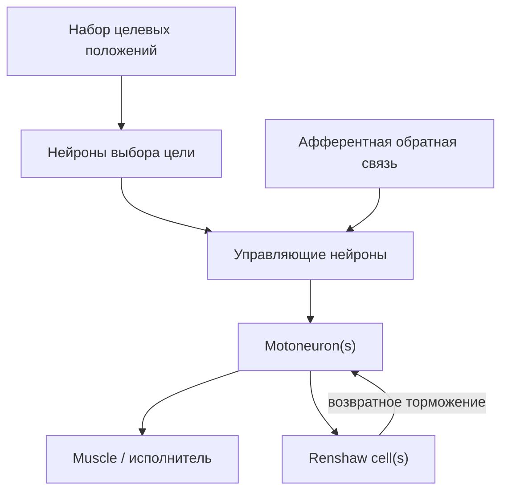

## MultiPositionControl_SimpleTest — многопозиционное управление (простой тест)

**Путь:** `Bin/Configs/SpikeSamples/MC1-PCN/MultiPositionControl_SimpleTest`  
**Статус валидации:** VALID (см. `Reports/SpikeSamples-Validation-Report.md`)

### Назначение конфигурации

Конфигурация демонстрирует **многопозиционное управление** мышцей или исполнительным механизмом с использованием спайковой нейронной сети. В отличие от `MotionControl_Test` и `NewPositionControl_Test`, здесь рассматривается переключение между несколькими целевыми положениями и координация активности нескольких нейронных блоков.

### Структура модели (концептуально)

Основной акцент — на том, как спайковая сеть:

- переключается между несколькими устойчивыми состояниями (целевыми положениями);
- использует обратную связь для стабилизации вокруг выбранной цели.

### Эксперимент и моделируемые реакции

- **Сценарий:**
  - последовательное задание нескольких целевых положений;
  - фиксация переходных процессов и устойчивых режимов.
- **Наблюдается:**
  - распределение активности между «нейронами выбора цели»;
  - изменение активности мотонейронов при переключении целей;
  - устойчивость и скорость перехода между состояниями.

### Связанные материалы

- Другие многопозиционные конфигурации:
  - `SpikeSamples/MC1-PCN/MultiPositionControl_SoloModeTest`
  - `SpikeSamples/MC1-PCN/MultiPositionControl_TaskTest`
  - `SpikeSamples/MC1-PCN/MultiPositionControl_RememberStateTest`
  - `SpikeSamples/MC1-PCN/MultiPC_TwoLevelsTask`
- Интегральная документация:
  - `Bin/Docs/SpikeSamples/MuscleControlStructures.md`

