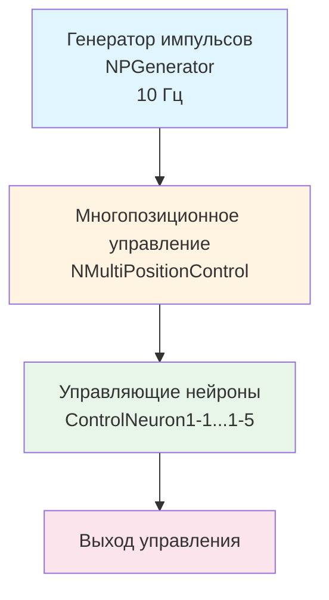

## MultiPositionControl_Test — многопозиционное управление (базовый тест)

**Путь:** `Bin/Configs/SpikeSamples/MC1-PCN/MultiPositionControl_Test`
**Статус валидации:** VALID (см. `Reports/SpikeSamples-Validation-Report.md`)

### Назначение конфигурации

Конфигурация демонстрирует **базовое многопозиционное управление** мышцей или исполнительным механизмом с использованием спайковой нейронной сети. Конфигурация использует компонент `NMultiPositionControl` для управления несколькими целевыми положениями и генератор импульсов (`NPGenerator`) для создания входных сигналов.

Согласно `MuscleControlStructures.md` и [A], PCN (Position Control Network) реализует запоминание и воспроизведение положений. Данная конфигурация позволяет изучать базовые механизмы многопозиционного управления.- **[A]**
  Раздел 3.3 "Описание сети позиционного управления (position control network — PCN)"
  Раздел 3.3.1 "Описание структуры сети PCN1"

  [31]
  ([онлайн-описание](https://neuromodeler.ru/index.php?option=com_content&view=article&id=29:1&catid=67&lang=ru&Itemid=676))

### Структура конфигурации

Конфигурация содержит:

- **PGenerator** (`NPGenerator`) — генератор импульсных сигналов с частотой 10 Гц
- **NMultiPositionControl** (`NMultiPositionControl`) — компонент многопозиционного управления
- **NMultiPositionControl2** (`NMultiPositionControl`) — дополнительный компонент многопозиционного управления

### Биологическая мотивация

Согласно [A] и `MuscleControlStructures.md`:

#### Сеть позиционного управления (PCN)

- **PCN1** — сеть позиционного управления первого уровня, реализует запоминание и воспроизведение положений
- **Запоминание положений** — сеть может запоминать несколько целевых положений
- **Воспроизведение положений** — сеть может воспроизводить запомненные положения

#### Многопозиционное управление

- Переключение между несколькими целевыми положениями
- Использование обратной связи для стабилизации вокруг выбранной цели
- Координация активности нескольких нейронных блоков

### Структура модели

Обобщённая схема многопозиционного управления:

### Эксперимент и моделируемые реакции

#### Цель эксперимента

Изучение базовых механизмов многопозиционного управления:
- Переключение между несколькими целевыми положениями
- Распределение активности между управляющими нейронами
- Стабилизация вокруг выбранной цели

#### Сценарии экспериментов

1. **Базовое многопозиционное управление:**
   - Генератор импульсов создаёт входные сигналы с частотой 10 Гц
   - Компонент многопозиционного управления обрабатывает сигналы
   - Наблюдение распределения активности между управляющими нейронами

2. **Переключение между положениями:**
   - Последовательное задание нескольких целевых положений
   - Фиксация переходных процессов и устойчивых режимов
   - Анализ скорости перехода между состояниями

3. **Стабилизация вокруг цели:**
   - Наблюдение стабилизации вокруг выбранной цели
   - Анализ влияния обратной связи на стабильность
   - Изучение механизмов запоминания и воспроизведения положений

#### Ожидаемые результаты

- **Распределение активности:** различные управляющие нейроны должны активироваться для различных целевых положений
- **Стабилизация:** система должна стабилизироваться вокруг выбранной цели
- **Переключение:** система должна переключаться между различными целевыми положениями

### Параметры модели

Основные параметры задаются в `Model_00.xml` и `Parameters_00.xml`:

#### Параметры генератора импульсов

- **Frequency:** 10 Гц (частота генерации импульсов)
- **Amplitude:** 1 (амплитуда импульсов)
- **PulseLength:** 0.001 с (длительность импульса)
- **AvgInterval:** 5 с (средний интервал между импульсами)

#### Параметры многопозиционного управления

- Параметры управляющих нейронов (ControlNeuron1-1...1-5)
- Параметры запоминания и воспроизведения положений
- Параметры обратной связи

Точные численные значения можно смотреть в `Parameters_00.xml`.

### Результаты экспериментов

Согласно [A] и `MuscleControlStructures.md`:

#### Многопозиционное управление

- Сеть успешно переключается между несколькими целевыми положениями
- Различные управляющие нейроны активируются для различных целевых положений
- Система стабилизируется вокруг выбранной цели

#### Запоминание и воспроизведение положений

- Сеть может запоминать несколько целевых положений
- Сеть может воспроизводить запомненные положения
- Механизмы обратной связи обеспечивают стабильность управления

### Связанные материалы

- Теория и функциональное описание:
  - [`Bin/Docs/SpikeSamples/MuscleControlStructures.md`](../../../Docs/SpikeSamples/MuscleControlStructures.md) — нейронные структуры управления мышечным сокращением
  - [`Bin/Docs/SpikeSamples/NeuronReactions.md`](../../../Docs/SpikeSamples/NeuronReactions.md) — реакции одиночных нейронов
- Описание конфигурации:
  - `Description.rtf` — подробное описание конфигурации (в формате RTF)
- Связанные конфигурации:
  - `MultiPositionControl_SimpleTest` — многопозиционное управление (простой тест)
  - `MultiPositionControl_SoloModeTest` — многопозиционное управление (режим соло)
  - `MultiPositionControl_TaskTest` — многопозиционное управление (тест задач)
  - `MultiPositionControl_RememberStateTest` — многопозиционное управление с запоминанием состояний
  - `MultiPC_TwoLevelsTask` — двухуровневая задача многопозиционного управления

## Литература

1. [27] Перспективы применения моделей биологических нейронных структур в системах управления движением // Информационно-измерительные и управляющие системы: - №9, 2011. с. 71-80. [онлайн](https://www.elibrary.ru/item.asp?id=17257136)

2. [13] The Neuromorphic Model of the Human Visual System // Studies in Computational Intelligence, 2021, 925 SCI, pp. 339–346. [DOI](https://link.springer.com/chapter/10.1007%2F978-3-030-60577-3_40)

3. [31] Моделирование нейронных структур управления мышечным сокращением. Схемы нейронных сетей. [онлайн](https://neuromodeler.ru/index.php?option=com_content&view=article&id=29:1&catid=67&lang=ru&Itemid=676)
