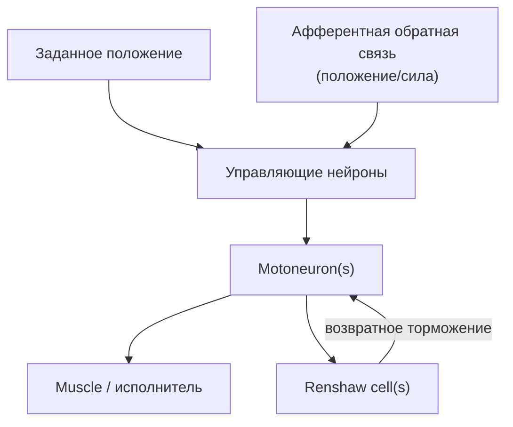

## NewPositionControl_Test — позиционное управление с обратной связью

**Путь:** `Bin/Configs/SpikeSamples/MC1-PCN/NewPositionControl_Test`  
**Статус валидации:** VALID (см. `Reports/SpikeSamples-Validation-Report.md`)

### Назначение конфигурации

Конфигурация демонстрирует **позиционное управление мышцей/исполнителем** с использованием спайковых нейронных структур и обратной связи по положению. Это развитие базового примера `MotionControl_Test`, ближе к схемам из работы  
«Моделирование нейронных структур управления мышечным сокращением. Схемы нейронных сетей.».

### Структура модели (концептуально)

Основные блоки:

- управляющие нейроны (генерируют шаблон активности для достижения цели);
- мотонейроны, иннервирующие мышцу;
- клетки Реншоу, ограничивающие частоту разрядов;
- афферентные каналы, несущие информацию об отклонении текущего положения от заданного.

### Эксперимент и моделируемые реакции

- **Вход:** ступенчатое изменение заданного положения.
- **Наблюдается:**
  - как меняется активность управляющих нейронов и мотонейронов;
  - как система выходит на новое положение и стабилизируется;
  - как возвратное торможение ограничивает максимальную частоту разрядов.

### Связанные материалы

- Базовый пример:
  - `SpikeSamples/MC1-PCN/MotionControl_Test`
- Интегральная документация:
  - `Bin/Docs/SpikeSamples/MuscleControlStructures.md`

