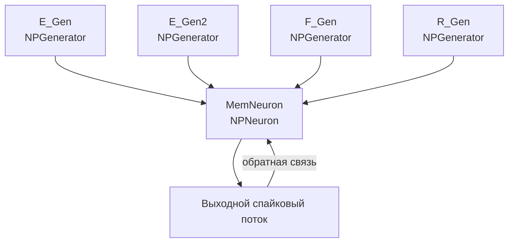

## MEM-OneNeuron3 — память в одном нейроне

**Путь:** `Bin/Configs/SpikeSamples/Memory/MEM-OneNeuron3`
**Статус валидации:** VALID (см. `Reports/SpikeSamples-Validation-Report.md`)

### Назначение конфигурации

Эта конфигурация демонстрирует **механизм памяти в одном нейроне** с несколькими входными каналами. Нейрон (`NPNeuron`) получает входные сигналы от нескольких генераторов (E_Gen, E_Gen2, F_Gen, R_Gen) и способен запоминать и воспроизводить паттерны активности.

Согласно `ImpulseProcessingModel.md`, память в спайковых нейронных сетях реализуется через преобразование импульсных потоков и формирование ассоциативных связей между входными паттернами. Данная конфигурация позволяет изучать базовые механизмы памяти на уровне одиночного нейрона.

### Структура модели

Конфигурация содержит один нейрон с несколькими входными каналами:

#### Компоненты системы

**Входные генераторы:**
- **E_Gen** (`NPGenerator`) — генератор импульсных сигналов E
  - `Frequency` = 0 Гц — частота генерации импульсов (может быть настроена)
  - `Amplitude` = 1 — амплитуда импульсов
  - `PulseLength` = 0.001 с — длительность импульса
  - `AvgInterval` = 5 с — средний интервал между импульсами
- **E_Gen2** (`NPGenerator`) — генератор импульсных сигналов E2
- **F_Gen** (`NPGenerator`) — генератор импульсных сигналов F
- **R_Gen** (`NPGenerator`) — генератор импульсных сигналов R

**Нейрон памяти:**
- **MemNeuron** (`NPNeuron`) — нейрон с памятью
  - Содержит дендритные участки (`Dendrite1_1`, `Dendrite1_2`)
  - Возбуждающие и тормозные каналы и синапсы
  - Низкопороговая зона для генерации спайков
  - Обратная связь для поддержания активности

### Механизм памяти

Согласно `ImpulseProcessingModel.md`, память в спайковых нейронных сетях реализуется через:

#### Преобразование импульсных потоков

- **Входной импульсный поток** преобразуется синапсами в аналоговые величины (концентрация медиатора)
- **Ионные механизмы мембраны** интегрируют сигналы от различных входов
- **Генератор потенциала действия** формирует выходные импульсы при превышении порога

#### Формирование ассоциаций

- При одновременной или последовательной активации различных входов формируются ассоциативные связи
- Обратная связь от выходных спайков поддерживает активность нейрона
- Длительная мембранная память позволяет сохранять информацию о предыдущих входных сигналах

#### Пространственная и временная суммация

- Сигналы от разных входов суммируются пространственно на дендритных участках
- Временная суммация происходит через интеграцию сигналов во времени
- Комбинация пространственной и временной суммации позволяет формировать сложные паттерны памяти

### Эксперимент и моделируемые реакции

#### Цель эксперимента

Изучение механизмов памяти в одиночном нейроне:
- Формирование ассоциативных связей между входными паттернами
- Влияние частоты входной стимуляции на формирование памяти
- Роль обратной связи в поддержании активности
- Влияние структуры нейрона (дендритные участки) на формирование памяти

#### Сценарии экспериментов

1. **Формирование памяти на одиночный паттерн:**
   - Активация одного из входных генераторов (например, E_Gen)
   - Наблюдение реакции нейрона и формирование памяти
   - Анализ влияния частоты стимуляции на формирование памяти

2. **Формирование ассоциативной памяти:**
   - Одновременная активация нескольких входных генераторов
   - Наблюдение формирования ассоциативных связей между паттернами
   - Анализ влияния временной последовательности активации

3. **Влияние обратной связи:**
   - Наблюдение роли обратной связи в поддержании активности
   - Анализ влияния обратной связи на формирование памяти

4. **Влияние структуры нейрона:**
   - Изучение влияния дендритных участков на формирование памяти
   - Анализ пространственной суммации сигналов от разных входов

#### Ожидаемые результаты

- **Формирование памяти:** нейрон должен демонстрировать способность запоминать входные паттерны
- **Ассоциативные связи:** одновременная активация входов должна приводить к формированию ассоциаций
- **Обратная связь:** должна поддерживать активность нейрона после прекращения входной стимуляции
- **Влияние частоты:** частота входной стимуляции должна влиять на эффективность формирования памяти

### Параметры модели

Основные параметры задаются в `Parameters_00.xml`:

#### Параметры синапсов (`NPulseSynapse`)

- `PulseAmplitude` — амплитуда входных импульсов
- `SecretionTC` — постоянная времени выделения медиатора
- `DissociationTC` — постоянная времени распада медиатора
- `InhibitionCoeff`, `Resistance`, `UsePresynapticInhibition` — эффекты пресинаптического торможения

#### Параметры каналов (`NPulseChannel`)

- `Capacity`, `Resistance`, `FBResistance`, `RestingResistance`
- `Type` = −1 для возбуждающих каналов, `Type` = +1 для тормозных каналов

#### Параметры мембраны и LT‑зоны

- `FeedbackGain` — глубина обратной связи
- Порог LT‑зоны `P` и временные константы генератора
- Параметры для дендритных участков

Точные численные значения можно смотреть в `Parameters_00.xml`; они подобраны в соответствии с примерами из статей.

### Связанные материалы

- Теория и функциональное описание:
  - «Математическое моделирование процессов преобразования импульсных потоков в естественном нейроне».
  - [`Bin/Docs/SpikeSamples/ImpulseProcessingModel.md`](../../../Docs/SpikeSamples/ImpulseProcessingModel.md) — модель преобразования импульсных потоков
- Интегральная документация:
  - [`Bin/Docs/SpikeSamples/NeuronReactions.md`](../../../Docs/SpikeSamples/NeuronReactions.md) — реакции одиночных нейронов
- Описание конфигурации:
  - `Description.rtf` — подробное описание конфигурации (в формате RTF)
- Связанные конфигурации:
  - `MEM-SimpleMemory2` — простая память для навигации
  - `SpikeAssociationPlus` — ассоциативная память
  - `SpikeConditionalReflex` — условнорефлекторная память
