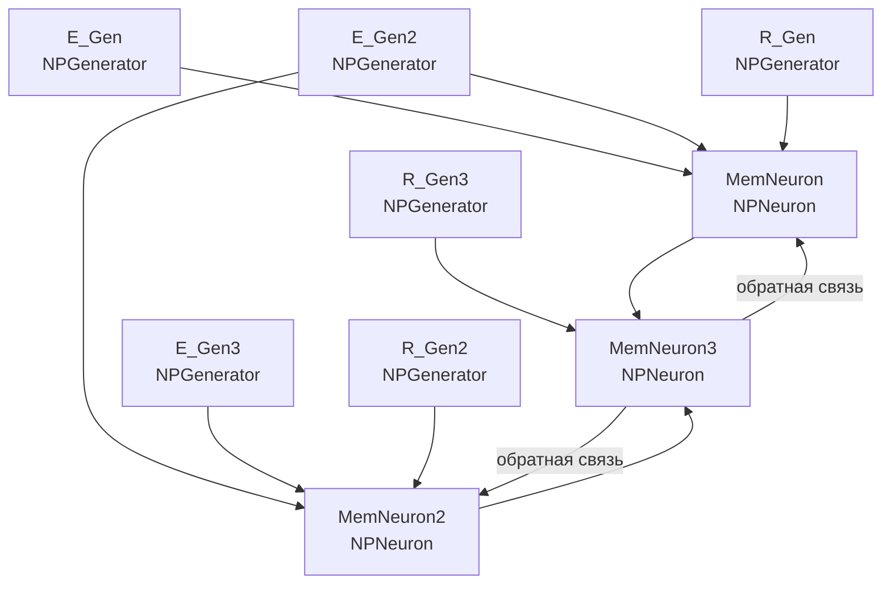

## MEM-SimpleMemory2 — простая память для навигации в лабиринте

**Путь:** `Bin/Configs/SpikeSamples/Memory/MEM-SimpleMemory2`
**Статус валидации:** VALID (см. `Reports/SpikeSamples-Validation-Report.md`)

### Назначение конфигурации

Эта конфигурация демонстрирует **простую память для навигации в лабиринте** с использованием сети из трёх нейронов (`NPNeuron`). Конфигурация содержит нейроны с обратными связями, что позволяет формировать пространственную память для запоминания конфигураций лабиринта.

Согласно [1] и описанию конфигурации, память реализуется через преобразование импульсных потоков и формирование ассоциативных связей между нейронами. Данная конфигурация позволяет изучать механизмы пространственной памяти и обучения запоминанию конфигураций.

### Структура модели

Конфигурация содержит сеть из трёх нейронов с обратными связями:

#### Компоненты системы

**Входные генераторы:**
- **E_Gen** (`NPGenerator`) — генератор импульсных сигналов E (частота 1 Гц)
- **E_Gen2** (`NPGenerator`) — генератор импульсных сигналов E2 (частота 1 Гц)
- **E_Gen3** (`NPGenerator`) — генератор импульсных сигналов E3 (частота 1 Гц)
- **R_Gen** (`NPGenerator`) — генератор импульсных сигналов R (частота 1 Гц)
- **R_Gen2** (`NPGenerator`) — генератор импульсных сигналов R2 (частота 1 Гц)
- **R_Gen3** (`NPGenerator`) — генератор импульсных сигналов R3 (частота 0 Гц)

**Нейроны памяти:**
- **MemNeuron** (`NPNeuron`) — первый нейрон памяти
- **MemNeuron2** (`NPNeuron`) — второй нейрон памяти
- **MemNeuron3** (`NPNeuron`) — третий нейрон памяти с обратными связями к MemNeuron и MemNeuron2

### Механизм памяти

Согласно `ImpulseProcessingModel.md`, память в спайковых нейронных сетях реализуется через:

#### Преобразование импульсных потоков

- **Входные импульсные потоки** преобразуются синапсами в аналоговые величины (концентрация медиатора)
- **Ионные механизмы мембраны** интегрируют сигналы от различных входов
- **Генератор потенциала действия** формирует выходные импульсы при превышении порога

#### Формирование пространственной памяти

- Нейроны формируют ассоциативные связи между пространственными конфигурациями
- Обратные связи между нейронами поддерживают активность и формируют устойчивые паттерны
- Комбинация входных сигналов и обратных связей позволяет запоминать конфигурации лабиринта

#### Обучение запоминанию конфигураций

- При предъявлении различных конфигураций лабиринта формируются соответствующие паттерны активности
- Обратные связи закрепляют эти паттерны, позволяя воспроизводить их при последующих предъявлениях
- Нейронная сеть способна различать различные конфигурации и формировать пространственную память

### Эксперимент и моделируемые реакции

#### Цель эксперимента

Изучение механизмов пространственной памяти:
- Формирование памяти для различных конфигураций лабиринта
- Влияние обратных связей на формирование и поддержание памяти
- Обучение запоминанию пространственных конфигураций
- Воспроизведение запомненных конфигураций

#### Сценарии экспериментов

1. **Формирование памяти на конфигурацию:**
   - Предъявление определённой конфигурации через входные генераторы
   - Наблюдение формирования паттерна активности в сети нейронов
   - Анализ влияния обратных связей на закрепление паттерна

2. **Обучение запоминанию нескольких конфигураций:**
   - Последовательное предъявление различных конфигураций
   - Наблюдение формирования различных паттернов активности
   - Анализ способности сети различать различные конфигурации

3. **Влияние обратных связей:**
   - Наблюдение роли обратных связей в поддержании активности
   - Анализ влияния обратных связей на формирование памяти
   - Изучение устойчивости паттернов активности

4. **Воспроизведение запомненных конфигураций:**
   - Предъявление частичной информации о конфигурации
   - Наблюдение воспроизведения полного паттерна активности
   - Анализ способности сети к восстановлению запомненных конфигураций

#### Ожидаемые результаты

- **Формирование памяти:** сеть должна демонстрировать способность запоминать различные конфигурации лабиринта
- **Обратные связи:** должны поддерживать активность и закреплять паттерны памяти
- **Различение конфигураций:** сеть должна различать различные конфигурации и формировать соответствующие паттерны
- **Воспроизведение:** сеть должна воспроизводить запомненные конфигурации при предъявлении частичной информации

### Параметры модели

Основные параметры задаются в `Parameters_00.xml`:

#### Параметры синапсов (`NPulseSynapse`)

- `PulseAmplitude` — амплитуда входных импульсов
- `SecretionTC` — постоянная времени выделения медиатора
- `DissociationTC` — постоянная времени распада медиатора
- `InhibitionCoeff`, `Resistance`, `UsePresynapticInhibition` — эффекты пресинаптического торможения

#### Параметры каналов (`NPulseChannel`)

- `Capacity`, `Resistance`, `FBResistance`, `RestingResistance`
- `Type` = −1 для возбуждающих каналов, `Type` = +1 для тормозных каналов

#### Параметры мембраны и LT‑зоны

- `FeedbackGain` — глубина обратной связи
- Порог LT‑зоны `P` и временные константы генератора
- Параметры для дендритных участков

Точные численные значения можно смотреть в `Parameters_00.xml`; они подобраны в соответствии с примерами из статей.

### Результаты экспериментов

Согласно публикации [2]:

#### Формирование пространственной памяти

- Реализованная модель демонстрирует способность запоминать пространственные конфигурации
- Обратные связи между нейронами обеспечивают поддержание активности и закрепление паттернов памяти
- Сеть способна различать различные конфигурации и формировать соответствующие паттерны активности

#### Обучение запоминанию конфигураций

- При последовательном предъявлении различных конфигураций формируются различные паттерны активности
- Обратные связи закрепляют эти паттерны, позволяя воспроизводить их при последующих предъявлениях
- Сеть демонстрирует способность к обучению запоминанию пространственных конфигураций

### Связанные материалы

- Теория и функциональное описание:
  - [`Bin/Docs/SpikeSamples/ImpulseProcessingModel.md`](../../../Docs/SpikeSamples/ImpulseProcessingModel.md) — модель преобразования импульсных потоков
- Интегральная документация:
  - [`Bin/Docs/SpikeSamples/NeuronReactions.md`](../../../Docs/SpikeSamples/NeuronReactions.md) — реакции одиночных нейронов
- Описание конфигурации:
  - `Description.rtf` — подробное описание конфигурации (в формате RTF)
- Связанные конфигурации:
  - `MEM-OneNeuron3` — память в одном нейроне
  - `SpikeAssociationPlus` — ассоциативная память
  - `SpikeConditionalReflex` — условнорефлекторная память

## Литература

1. Бахшиев А.В., Романов С.П. Математическое моделирование процессов преобразования импульсных потоков в естественном нейроне // Нейрокомпьютеры: разработка, применение, №3, 2009. – с.71-80. [онлайн](https://neuromodeler.ru/index.php?option=com_content&view=article&id=24:2012-11-07-16-42-21&catid=67&lang=ru&Itemid=676) | [elibrary](https://www.elibrary.ru/item.asp?id=13070281)

2. Бахшиев А.В., Гунделах Ф.В. Исследование метода запоминания пространственных конфигураций робототехнической системы на нейронных сетях со структурной адаптацией // Робототехника и техническая кибернетика. №3(8)/2015. Изд. ЦНИИ РТК, 2015. – С.46-51.

