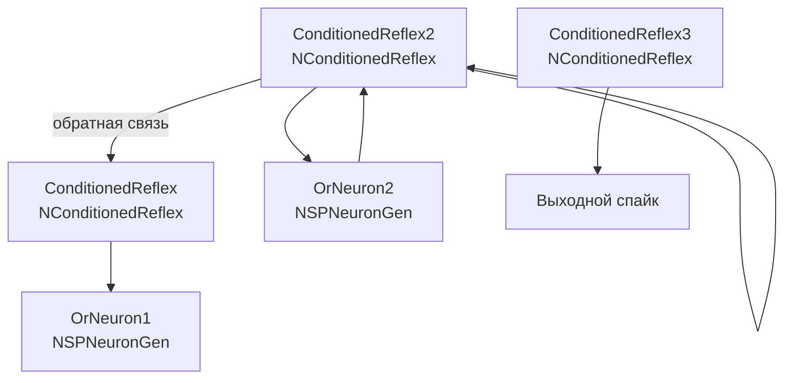

## SpikeAssociationPlus — ассоциативная память с компонентом NConditionedReflex

**Путь:** `Bin/Configs/SpikeSamples/Memory/SpikeAssociationPlus`
**Статус валидации:** VALID (см. `Reports/SpikeSamples-Validation-Report.md`)

### Назначение конфигурации

Эта конфигурация демонстрирует **ассоциативную память** с использованием компонента `NConditionedReflex` (условный рефлекс). Конфигурация содержит несколько компонентов `NConditionedReflex` и нейронов типа `NSPNeuronGen`, что позволяет формировать сложные ассоциативные связи между входными паттернами.

Согласно `ImpulseProcessingModel.md`, ассоциативная память реализуется через формирование связей между различными входными паттернами при их одновременной или последовательной активации. Компонент `NConditionedReflex` обеспечивает реализацию условных рефлексов, которые являются основой ассоциативной памяти.

### Структура модели

Конфигурация содержит несколько компонентов условного рефлекса и нейронов:

#### Компоненты системы

**Компоненты условного рефлекса:**
- **ConditionedReflex** (`NConditionedReflex`) — первый компонент условного рефлекса
- **ConditionedReflex2** (`NConditionedReflex`) — второй компонент условного рефлекса с обратной связью
- **ConditionedReflex3** (`NConditionedReflex`) — третий компонент условного рефлекса

**Нейроны:**
- **OrNeuron1** (`NSPNeuronGen`) — нейрон типа OR
- **OrNeuron2** (`NSPNeuronGen`) — нейрон типа OR

#### Внутренняя структура NConditionedReflex

Каждый компонент `NConditionedReflex` содержит:
- **AndNeuron** — нейрон типа AND для объединения условного и безусловного стимулов
- **ConditionalNeuron** — нейрон для обработки условного стимула
- **ConditionalStimulus** — источник условного стимула
- **Source1**, **Source2** — источники входных сигналов

### Механизм ассоциативной памяти

Согласно `ImpulseProcessingModel.md`, ассоциативная память реализуется через:

#### Формирование условного рефлекса

- При одновременной активации условного и безусловного стимулов формируется ассоциативная связь
- Компонент `NConditionedReflex` реализует механизм формирования условного рефлекса
- После обучения условный стимул может вызывать реакцию, ранее вызываемую только безусловным стимулом

#### Преобразование импульсных потоков

- **Входные импульсные потоки** преобразуются синапсами в аналоговые величины (концентрация медиатора)
- **Ионные механизмы мембраны** интегрируют сигналы от различных входов
- **Генератор потенциала действия** формирует выходные импульсы при превышении порога

#### Формирование ассоциаций

- При одновременной или последовательной активации различных входов формируются ассоциативные связи
- Обратные связи между компонентами закрепляют эти связи
- Комбинация компонентов позволяет формировать сложные ассоциативные структуры

### Эксперимент и моделируемые реакции

#### Цель эксперимента

Изучение механизмов ассоциативной памяти:
- Формирование условных рефлексов через компонент `NConditionedReflex`
- Влияние одновременной активации стимулов на формирование ассоциаций
- Роль обратных связей в закреплении ассоциативных связей
- Формирование сложных ассоциативных структур

#### Сценарии экспериментов

1. **Формирование условного рефлекса:**
   - Одновременная активация условного и безусловного стимулов
   - Наблюдение формирования ассоциативной связи
   - Анализ влияния временной последовательности активации

2. **Влияние обратных связей:**
   - Наблюдение роли обратных связей в закреплении ассоциативных связей
   - Анализ влияния обратных связей на формирование памяти

3. **Формирование сложных ассоциаций:**
   - Использование нескольких компонентов `NConditionedReflex`
   - Наблюдение формирования сложных ассоциативных структур
   - Анализ взаимодействия между компонентами

4. **Воспроизведение ассоциаций:**
   - Предъявление только условного стимула после обучения
   - Наблюдение воспроизведения реакции, ранее вызываемой безусловным стимулом
   - Анализ способности сети к воспроизведению ассоциаций

#### Ожидаемые результаты

- **Формирование условного рефлекса:** компонент `NConditionedReflex` должен демонстрировать способность формировать условные рефлексы
- **Ассоциативные связи:** одновременная активация стимулов должна приводить к формированию ассоциативных связей
- **Обратные связи:** должны закреплять ассоциативные связи и поддерживать память
- **Воспроизведение:** после обучения условный стимул должен вызывать реакцию, ранее вызываемую только безусловным стимулом

### Параметры модели

Основные параметры задаются в `Parameters_00.xml`:

#### Параметры компонента NConditionedReflex

- Параметры `AndNeuron` — нейрон типа AND для объединения стимулов
- Параметры `ConditionalNeuron` — нейрон для обработки условного стимула
- Параметры синапсов, каналов и мембраны внутри компонента

#### Параметры нейронов

- Параметры `OrNeuron1` и `OrNeuron2` — нейроны типа OR
- Параметры синапсов, каналов и мембраны

Точные численные значения можно смотреть в `Parameters_00.xml`; они подобраны в соответствии с примерами из статей.

### Связанные материалы

- Теория и функциональное описание:
  - «Математическое моделирование процессов преобразования импульсных потоков в естественном нейроне».
  - [`Bin/Docs/SpikeSamples/ImpulseProcessingModel.md`](../../../../Docs/SpikeSamples/ImpulseProcessingModel.md) — модель преобразования импульсных потоков
- Интегральная документация:
  - [`Bin/Docs/SpikeSamples/NeuronReactions.md`](../../../../Docs/SpikeSamples/NeuronReactions.md) — реакции одиночных нейронов
- Описание конфигурации:
  - `Description.rtf` — подробное описание конфигурации (в формате RTF)
- Связанные конфигурации:
  - `MEM-OneNeuron3` — память в одном нейроне
  - `MEM-SimpleMemory2` — простая память для навигации
  - `SpikeConditionalReflex` — условнорефлекторная память
