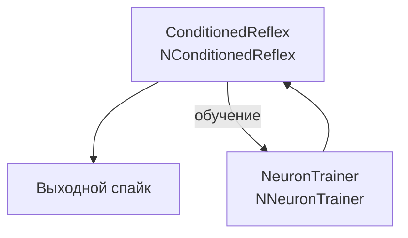

## SpikeConditionalReflex — условнорефлекторная память с обучением

**Путь:** `Bin/Configs/SpikeSamples/Memory/SpikeConditionalReflex`
**Статус валидации:** VALID (см. `Reports/SpikeSamples-Validation-Report.md`)

### Назначение конфигурации

Эта конфигурация демонстрирует **условнорефлекторную память с обучением** с использованием компонента `NConditionedReflex` (условный рефлекс) и компонента `NNeuronTrainer` (обучение нейрона). Конфигурация позволяет изучать механизмы формирования условных рефлексов и обучения запоминанию ассоциаций.

Согласно [1] и публикациям [2], [3], условнорефлекторная память реализуется через формирование связей между условным и безусловным стимулами при их одновременной активации. Компонент `NConditionedReflex` обеспечивает реализацию условных рефлексов, а компонент `NNeuronTrainer` обеспечивает процесс обучения.

  [13], Astapova, L., Stankevich, L.
  DOI: https://doi.org/10.1007/978-3-030-91581-0_25

### Структура модели

Конфигурация содержит компонент условного рефлекса и компонент обучения:

#### Компоненты системы

**Компонент условного рефлекса:**
- **ConditionedReflex** (`NConditionedReflex`) — компонент условного рефлекса
  - Содержит `AndNeuron` — нейрон типа AND для объединения условного и безусловного стимулов
  - Содержит `ConditionalNeuron` — нейрон для обработки условного стимула
  - Содержит `ConditionalStimulus` — источник условного стимула
  - Содержит источники входных сигналов (`Source1`, `Source2`)

**Компонент обучения:**
- **NeuronTrainer** (`NNeuronTrainer`) — компонент обучения нейрона
  - Обеспечивает процесс обучения формированию условных рефлексов
  - Управляет процессом предъявления стимулов и формирования ассоциаций

### Механизм условнорефлекторной памяти

Согласно [1] и публикациям [2], [3], условнорефлекторная память реализуется через:

#### Формирование условного рефлекса

- При одновременной активации условного и безусловного стимулов формируется ассоциативная связь
- Компонент `NConditionedReflex` реализует механизм формирования условного рефлекса
- После обучения условный стимул может вызывать реакцию, ранее вызываемую только безусловным стимулом

#### Процесс обучения

- Компонент `NNeuronTrainer` управляет процессом обучения
- Обеспечивает последовательное предъявление стимулов для формирования ассоциаций
- Контролирует процесс закрепления условных рефлексов

#### Преобразование импульсных потоков

- **Входные импульсные потоки** преобразуются синапсами в аналоговые величины (концентрация медиатора)
- **Ионные механизмы мембраны** интегрируют сигналы от различных входов
- **Генератор потенциала действия** формирует выходные импульсы при превышении порога

### Эксперимент и моделируемые реакции

#### Цель эксперимента

Изучение механизмов условнорефлекторной памяти:
- Формирование условных рефлексов через компонент `NConditionedReflex`
- Процесс обучения через компонент `NNeuronTrainer`
- Влияние одновременной активации стимулов на формирование ассоциаций
- Воспроизведение условных рефлексов после обучения

#### Сценарии экспериментов

1. **Процесс обучения:**
   - Использование компонента `NNeuronTrainer` для управления процессом обучения
   - Последовательное предъявление условного и безусловного стимулов
   - Наблюдение формирования ассоциативной связи в процессе обучения

2. **Формирование условного рефлекса:**
   - Одновременная активация условного и безусловного стимулов
   - Наблюдение формирования ассоциативной связи
   - Анализ влияния временной последовательности активации

3. **Воспроизведение условного рефлекса:**
   - Предъявление только условного стимула после обучения
   - Наблюдение воспроизведения реакции, ранее вызываемой безусловным стимулом
   - Анализ способности сети к воспроизведению условных рефлексов

4. **Влияние параметров обучения:**
   - Изменение параметров процесса обучения
   - Наблюдение влияния на эффективность формирования условных рефлексов
   - Анализ оптимальных параметров обучения

#### Ожидаемые результаты

- **Формирование условного рефлекса:** компонент `NConditionedReflex` должен демонстрировать способность формировать условные рефлексы
- **Процесс обучения:** компонент `NNeuronTrainer` должен обеспечивать эффективный процесс обучения
- **Ассоциативные связи:** одновременная активация стимулов должна приводить к формированию ассоциативных связей
- **Воспроизведение:** после обучения условный стимул должен вызывать реакцию, ранее вызываемую только безусловным стимулом

### Параметры модели

Основные параметры задаются в `Parameters_00.xml`:

#### Параметры компонента NConditionedReflex

- Параметры `AndNeuron` — нейрон типа AND для объединения стимулов
- Параметры `ConditionalNeuron` — нейрон для обработки условного стимула
- Параметры синапсов, каналов и мембраны внутри компонента

#### Параметры компонента NNeuronTrainer

- Параметры процесса обучения
- Параметры управления предъявлением стимулов
- Параметры контроля процесса закрепления условных рефлексов

Точные численные значения можно смотреть в `Parameters_00.xml`; они подобраны в соответствии с примерами из статей.

### Результаты экспериментов

Согласно публикациям [1], [2], [3]:

#### Формирование условных рефлексов

- Реализованная модель демонстрирует способность формировать условные рефлексы
- Компонент `NConditionedReflex` обеспечивает реализацию механизма формирования условных рефлексов
- После обучения условный стимул вызывает реакцию, ранее вызываемую только безусловным стимулом

#### Процесс обучения

- Компонент `NNeuronTrainer` обеспечивает эффективный процесс обучения
- Последовательное предъявление стимулов приводит к формированию ассоциативных связей
- Процесс обучения закрепляет условные рефлексы и обеспечивает их воспроизведение

### Связанные материалы

- Теория и функциональное описание:
  - «Математическое моделирование процессов преобразования импульсных потоков в естественном нейроне».
  - [`Bin/Docs/SpikeSamples/ImpulseProcessingModel.md`](../../../../Docs/SpikeSamples/ImpulseProcessingModel.md) — модель преобразования импульсных потоков
- Интегральная документация:
  - [`Bin/Docs/SpikeSamples/NeuronReactions.md`](../../../../Docs/SpikeSamples/NeuronReactions.md) — реакции одиночных нейронов
- Описание конфигурации:
  - `Description.rtf` — подробное описание конфигурации (в формате RTF)
- Связанные конфигурации:
  - `MEM-OneNeuron3` — память в одном нейроне
  - `MEM-SimpleMemory2` — простая память для навигации
  - `SpikeAssociationPlus` — ассоциативная память

## Литература

1. Бахшиев А.В., Романов С.П. Математическое моделирование процессов преобразования импульсных потоков в естественном нейроне // Нейрокомпьютеры: разработка, применение, №3, 2009. – с.71-80. [онлайн](https://neuromodeler.ru/index.php?option=com_content&view=article&id=24:2012-11-07-16-42-21&catid=67&lang=ru&Itemid=676) | [elibrary](https://www.elibrary.ru/item.asp?id=13070281)

2. Korsakov, A., Bakhshiev, A. The Neuromorphic Model of the Human Visual System // Studies in Computational Intelligence, 2021, 925 SCI, pp. 339–346. [DOI](https://link.springer.com/chapter/10.1007%2F978-3-030-60577-3_40)

3. Бахшиев А.В., Романов С.П. Моделирование нейронных структур управления мышечным сокращением. Схемы нейронных сетей. [онлайн](https://neuromodeler.ru/index.php?option=com_content&view=article&id=29:1&catid=67&lang=ru&Itemid=676)

4. Korsakov, A., Bakhshiev, A., Astapova, L., Stankevich, L. Application of the Compartmental Spiking Neuron Model for the Conditioned Reflex Implementation // Advances in Neural Computation, Machine Learning, and Cognitive Research V. NEUROINFORMATICS 2021. Studies in Computational Intelligence, vol 1008. Springer, Cham, 2022. [DOI](https://doi.org/10.1007/978-3-030-91581-0_25)
