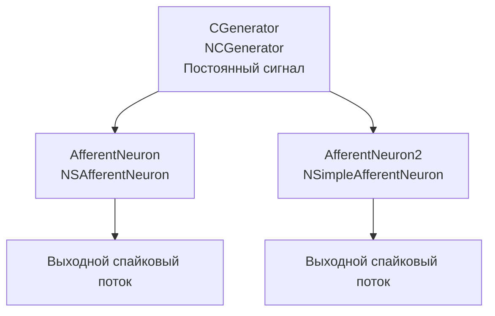

## NM-AN-00-AfferentModelComparation — сравнение моделей афферентных нейронов

**Путь:** `Bin/Configs/SpikeSamples/NM-AfferentNeurons/NM-AN-00-AfferentModelComparation`
**Статус валидации:** VALID (см. `Reports/SpikeSamples-Validation-Report.md`)

### Назначение конфигурации

Эта конфигурация демонстрирует **сравнение различных моделей афферентных нейронов** для преобразования сенсорных сигналов в импульсные потоки. Конфигурация содержит два типа афферентных нейронов (`NSAfferentNeuron` и `NSimpleAfferentNeuron`), которые получают одинаковый входной сигнал от генератора постоянного сигнала (`NCGenerator`), что позволяет сравнивать их реакции и выявлять особенности каждой модели.

Согласно `NeuronReactions.md` и `ImpulseProcessingModel.md`, афферентные нейроны преобразуют сенсорные сигналы в импульсные потоки для передачи информации в центральную нервную систему. Данная конфигурация позволяет изучить различия между различными моделями афферентных нейронов.

### Структура модели

Конфигурация содержит два афферентных нейрона для сравнения:

#### Компоненты системы

**Входной генератор:**
- **CGenerator** (`NCGenerator`) — генератор постоянного сигнала
  - Создаёт постоянное значение на выходе
  - Используется для моделирования сенсорного сигнала

**Афферентные нейроны:**
- **AfferentNeuron** (`NSAfferentNeuron`) — афферентный нейрон с рецептором
  - Содержит компонент `Receptor` для преобразования сенсорного сигнала
  - Содержит мембрану (`PMembrane`) с возбуждающими и тормозными каналами
  - Содержит низкопороговую зону (`LTZone`) для генерации спайков
- **AfferentNeuron2** (`NSimpleAfferentNeuron`) — простой афферентный нейрон
  - Упрощённая модель афферентного нейрона
  - Содержит рецептор (`Receptor`) и низкопороговую зону (`LTZone`)

### Преобразование сенсорных сигналов

Согласно `NeuronReactions.md` и `ImpulseProcessingModel.md`, афферентные нейроны преобразуют сенсорные сигналы в импульсные потоки:

#### Преобразование сигналов

- **Сенсорный сигнал** (постоянный или переменный) преобразуется рецептором в импульсный поток
- **Рецептор** (`NReceptor`) преобразует аналоговый сигнал в последовательность импульсов
- **Частота импульсов** зависит от интенсивности сенсорного сигнала

#### Преобразование импульсных потоков

- **Входной импульсный поток** от рецептора преобразуется синапсами в аналоговые величины (концентрация медиатора)
- **Ионные механизмы мембраны** интегрируют сигналы
- **Генератор потенциала действия** формирует выходные импульсы при превышении порога

#### Различия между моделями

- **NSAfferentNeuron:** более детальная модель с полной структурой мембраны и каналов
- **NSimpleAfferentNeuron:** упрощённая модель с минимальной структурой для базового преобразования сигналов

### Эксперимент и моделируемые реакции

#### Цель эксперимента

Сравнение поведения различных моделей афферентных нейронов:
- Преобразование постоянного сенсорного сигнала в импульсный поток
- Влияние интенсивности сигнала на частоту выходных импульсов
- Различия в реакциях между `NSAfferentNeuron` и `NSimpleAfferentNeuron`
- Анализ особенностей каждой модели

#### Сценарии экспериментов

1. **Преобразование постоянного сигнала:**
   - Предъявление постоянного сигнала от `CGenerator`
   - Наблюдение преобразования в импульсный поток
   - Сравнение частоты выходных импульсов для обеих моделей

2. **Влияние интенсивности сигнала:**
   - Изменение интенсивности постоянного сигнала
   - Наблюдение изменений в частоте выходных импульсов
   - Анализ зависимости частоты от интенсивности для обеих моделей

3. **Сравнение моделей:**
   - Сравнение реакций `NSAfferentNeuron` и `NSimpleAfferentNeuron` на одинаковый входной сигнал
   - Выявление различий в поведении
   - Анализ преимуществ и недостатков каждой модели

4. **Анализ структуры:**
   - Изучение влияния структуры нейрона на преобразование сигналов
   - Анализ роли различных компонентов (рецептор, мембрана, каналы)

#### Ожидаемые результаты

- **Преобразование сигналов:** обе модели должны преобразовывать постоянный сигнал в импульсный поток
- **Зависимость частоты:** частота выходных импульсов должна зависеть от интенсивности входного сигнала
- **Различия между моделями:** могут проявляться в деталях временной динамики и форме потенциала
- **Структурные различия:** более детальная модель может демонстрировать более сложную динамику

### Параметры модели

Основные параметры задаются в `Parameters.xml`:

#### Параметры рецептора (`NReceptor`)

- Параметры преобразования сенсорного сигнала в импульсный поток
- Пороги активации и деактивации
- Временные константы преобразования

#### Параметры синапсов (`NPulseSynapse`)

- `PulseAmplitude` — амплитуда импульсов от рецептора
- `SecretionTC`, `DissociationTC` — постоянные времени выделения и распада медиатора
- `InhibitionCoeff`, `Resistance`, `UsePresynapticInhibition` — эффекты пресинаптического торможения

#### Параметры каналов (`NPulseChannel`)

- `Capacity`, `Resistance`, `FBResistance`, `RestingResistance`
- `Type` = −1 для возбуждающих каналов, `Type` = +1 для тормозных каналов

#### Параметры мембраны и LT‑зоны

- `FeedbackGain` — глубина обратной связи
- Порог LT‑зоны `P` и временные константы генератора

Точные численные значения можно смотреть в `Parameters.xml`; они подобраны в соответствии с примерами из статей.

### Связанные материалы

- Теория и функциональное описание:
  - «Математическое моделирование процессов преобразования импульсных потоков в естественном нейроне».
  - «Воспроизведение реакций естественных нейронов как результат моделирования структурно‑функциональных свойств мембраны...».
  - [`Bin/Docs/SpikeSamples/NeuronReactions.md`](../../../Docs/SpikeSamples/NeuronReactions.md) — реакции одиночных нейронов
  - [`Bin/Docs/SpikeSamples/ImpulseProcessingModel.md`](../../../Docs/SpikeSamples/ImpulseProcessingModel.md) — модель преобразования импульсных потоков
- Описание конфигурации:
  - `Description.rtf` — подробное описание конфигурации (в формате RTF)
- Связанные конфигурации:
  - `NM-AN-01-NSAfferentNeuron` — афферентный нейрон NSAfferentNeuron
  - `NM-AN-02-NSimpleAfferentNeuron` — простой афферентный нейрон
