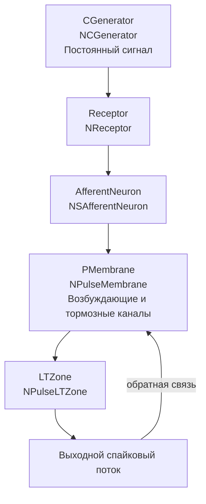

## NM-AN-01-NSAfferentNeuron — афферентный нейрон с рецептором

**Путь:** `Bin/Configs/SpikeSamples/NM-AfferentNeurons/NM-AN-01-NSAfferentNeuron`
**Статус валидации:** VALID (см. `Reports/SpikeSamples-Validation-Report.md`)

### Назначение конфигурации

Эта конфигурация демонстрирует **афферентный нейрон с рецептором** (`NSAfferentNeuron`) для преобразования сенсорных сигналов в импульсные потоки. Нейрон получает входной сигнал от генератора постоянного сигнала (`NCGenerator`) через рецептор (`NReceptor`), который преобразует аналоговый сигнал в импульсный поток для передачи информации в центральную нервную систему.

Согласно `NeuronReactions.md` и `ImpulseProcessingModel.md`, афферентные нейроны преобразуют сенсорные сигналы в импульсные потоки. Компонент `NSAfferentNeuron` обеспечивает детальное моделирование этого процесса с учётом структуры мембраны и каналов.

### Структура модели

Конфигурация содержит афферентный нейрон с рецептором:

#### Компоненты системы

**Входной генератор:**
- **CGenerator** (`NCGenerator`) — генератор постоянного сигнала
  - Создаёт постоянное значение на выходе
  - Используется для моделирования сенсорного сигнала

**Афферентный нейрон:**
- **AfferentNeuron** (`NSAfferentNeuron`) — афферентный нейрон с рецептором
  - **Receptor** (`NReceptor`) — рецептор для преобразования сенсорного сигнала в импульсный поток
  - **PMembrane** (`NPulseMembrane`) — мембрана с возбуждающими и тормозными каналами
  - **LTZone** (`NPulseLTZone`) — низкопороговая зона для генерации спайков
  - Генераторы возбуждающего и тормозного потенциалов (`PosGenerator`, `NegGenerator`)

### Преобразование сенсорных сигналов

Согласно `NeuronReactions.md` и `ImpulseProcessingModel.md`, афферентные нейроны преобразуют сенсорные сигналы в импульсные потоки:

#### Преобразование сигналов рецептором

- **Сенсорный сигнал** (постоянный или переменный) преобразуется рецептором в импульсный поток
- **Рецептор** (`NReceptor`) преобразует аналоговый сигнал в последовательность импульсов
- **Частота импульсов** зависит от интенсивности сенсорного сигнала
- Пороги активации и деактивации определяют характеристики преобразования

#### Преобразование импульсных потоков

- **Входной импульсный поток** от рецептора преобразуется синапсами в аналоговые величины (концентрация медиатора)
- **Ионные механизмы мембраны** интегрируют сигналы от рецептора
- **Генератор потенциала действия** формирует выходные импульсы при превышении порога

#### Структура мембраны

- **Возбуждающие каналы** (`ExcChannel`) обрабатывают сигналы от рецептора
- **Тормозные каналы** (`InhChannel`) могут обеспечивать торможение при необходимости
- **Обратная связь** от выходных спайков поддерживает активность нейрона

### Эксперимент и моделируемые реакции

#### Цель эксперимента

Изучение механизмов преобразования сенсорных сигналов:
- Преобразование постоянного сенсорного сигнала в импульсный поток
- Влияние интенсивности сигнала на частоту выходных импульсов
- Роль рецептора в преобразовании сигналов
- Влияние структуры мембраны на преобразование сигналов

#### Сценарии экспериментов

1. **Преобразование постоянного сигнала:**
   - Предъявление постоянного сигнала от `CGenerator`
   - Наблюдение преобразования рецептором в импульсный поток
   - Наблюдение генерации выходных спайков нейроном

2. **Влияние интенсивности сигнала:**
   - Изменение интенсивности постоянного сигнала
   - Наблюдение изменений в частоте импульсов от рецептора
   - Наблюдение изменений в частоте выходных спайков нейрона
   - Анализ зависимости частоты от интенсивности

3. **Роль рецептора:**
   - Изучение влияния параметров рецептора на преобразование сигналов
   - Анализ порогов активации и деактивации
   - Наблюдение временных характеристик преобразования

4. **Влияние структуры мембраны:**
   - Изучение влияния параметров мембраны на преобразование сигналов
   - Анализ роли возбуждающих и тормозных каналов
   - Наблюдение влияния обратной связи

#### Ожидаемые результаты

- **Преобразование сигналов:** рецептор должен преобразовывать постоянный сигнал в импульсный поток
- **Зависимость частоты:** частота выходных импульсов должна зависеть от интенсивности входного сигнала
- **Роль рецептора:** рецептор должен определять характеристики преобразования сигналов
- **Структура мембраны:** структура мембраны должна влиять на обработку импульсного потока от рецептора

### Параметры модели

Основные параметры задаются в `Parameters.xml`:

#### Параметры рецептора (`NReceptor`)

- Пороги активации и деактивации
- Временные константы преобразования
- Параметры преобразования сенсорного сигнала в импульсный поток

#### Параметры синапсов (`NPulseSynapse`)

- `PulseAmplitude` — амплитуда импульсов от рецептора
- `SecretionTC`, `DissociationTC` — постоянные времени выделения и распада медиатора
- `InhibitionCoeff`, `Resistance`, `UsePresynapticInhibition` — эффекты пресинаптического торможения

#### Параметры каналов (`NPulseChannel`)

- `Capacity`, `Resistance`, `FBResistance`, `RestingResistance`
- `Type` = −1 для возбуждающих каналов, `Type` = +1 для тормозных каналов

#### Параметры мембраны и LT‑зоны

- `FeedbackGain` — глубина обратной связи
- Порог LT‑зоны `P` и временные константы генератора

Точные численные значения можно смотреть в `Parameters.xml`; они подобраны в соответствии с примерами из статей.

### Связанные материалы

- Теория и функциональное описание:
  - «Математическое моделирование процессов преобразования импульсных потоков в естественном нейроне».
  - «Воспроизведение реакций естественных нейронов как результат моделирования структурно‑функциональных свойств мембраны...».
  - [`Bin/Docs/SpikeSamples/NeuronReactions.md`](../../../Docs/SpikeSamples/NeuronReactions.md) — реакции одиночных нейронов
  - [`Bin/Docs/SpikeSamples/ImpulseProcessingModel.md`](../../../Docs/SpikeSamples/ImpulseProcessingModel.md) — модель преобразования импульсных потоков
- Описание конфигурации:
  - `Description.rtf` — подробное описание конфигурации (в формате RTF)
- Связанные конфигурации:
  - `NM-AN-00-AfferentModelComparation` — сравнение моделей афферентных нейронов
  - `NM-AN-02-NSimpleAfferentNeuron` — простой афферентный нейрон
