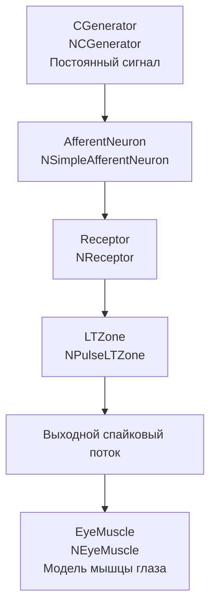

## NM-AN-02-NSimpleAfferentNeuron — простой афферентный нейрон

**Путь:** `Bin/Configs/SpikeSamples/NM-AfferentNeurons/NM-AN-02-NSimpleAfferentNeuron`
**Статус валидации:** VALID (см. `Reports/SpikeSamples-Validation-Report.md`)

### Назначение конфигурации

Эта конфигурация демонстрирует **простой афферентный нейрон** (`NSimpleAfferentNeuron`) для преобразования сенсорных сигналов в импульсные потоки. Нейрон получает входной сигнал от генератора постоянного сигнала (`NCGenerator`) через рецептор (`NReceptor`), который преобразует аналоговый сигнал в импульсный поток. Конфигурация также содержит компонент `NEyeMuscle` (модель мышцы глаза), что демонстрирует применение афферентного нейрона в системе управления движением.

Согласно `NeuronReactions.md` и `ImpulseProcessingModel.md`, афферентные нейроны преобразуют сенсорные сигналы в импульсные потоки. Компонент `NSimpleAfferentNeuron` обеспечивает упрощённое моделирование этого процесса с минимальной структурой для базового преобразования сигналов.

### Структура модели

Конфигурация содержит простой афферентный нейрон и модель мышцы глаза:

#### Компоненты системы

**Входной генератор:**
- **CGenerator** (`NCGenerator`) — генератор постоянного сигнала
  - Создаёт постоянное значение на выходе
  - Используется для моделирования сенсорного сигнала

**Простой афферентный нейрон:**
- **AfferentNeuron** (`NSimpleAfferentNeuron`) — простой афферентный нейрон
  - **Receptor** (`NReceptor`) — рецептор для преобразования сенсорного сигнала в импульсный поток
  - **LTZone** (`NPulseLTZone`) — низкопороговая зона для генерации спайков
  - Генератор возбуждающего потенциала (`PGenerator`)

**Модель мышцы глаза:**
- **EyeMuscle** (`NEyeMuscle`) — модель мышцы глаза
  - Управляет движением глаза на основе нейронных команд
  - Получает сигналы от афферентного нейрона

### Преобразование сенсорных сигналов

Согласно `NeuronReactions.md` и `ImpulseProcessingModel.md`, афферентные нейроны преобразуют сенсорные сигналы в импульсные потоки:

#### Преобразование сигналов рецептором

- **Сенсорный сигнал** (постоянный или переменный) преобразуется рецептором в импульсный поток
- **Рецептор** (`NReceptor`) преобразует аналоговый сигнал в последовательность импульсов
- **Частота импульсов** зависит от интенсивности сенсорного сигнала
- Пороги активации и деактивации определяют характеристики преобразования

#### Упрощённая структура

- **NSimpleAfferentNeuron** использует упрощённую структуру по сравнению с `NSAfferentNeuron`
- Минимальная структура обеспечивает базовое преобразование сигналов
- Упрощение позволяет снизить вычислительную сложность при сохранении основных характеристик преобразования

#### Применение в системе управления

- Выходной импульсный поток от афферентного нейрона используется для управления мышцей глаза
- Демонстрируется применение афферентных нейронов в системах управления движением
- Показывается связь между сенсорной обработкой и моторным управлением

### Эксперимент и моделируемые реакции

#### Цель эксперимента

Изучение механизмов преобразования сенсорных сигналов:
- Преобразование постоянного сенсорного сигнала в импульсный поток
- Влияние интенсивности сигнала на частоту выходных импульсов
- Роль рецептора в преобразовании сигналов
- Применение афферентного нейрона в системе управления движением

#### Сценарии экспериментов

1. **Преобразование постоянного сигнала:**
   - Предъявление постоянного сигнала от `CGenerator`
   - Наблюдение преобразования рецептором в импульсный поток
   - Наблюдение генерации выходных спайков нейроном

2. **Влияние интенсивности сигнала:**
   - Изменение интенсивности постоянного сигнала
   - Наблюдение изменений в частоте импульсов от рецептора
   - Наблюдение изменений в частоте выходных спайков нейрона
   - Анализ зависимости частоты от интенсивности

3. **Роль рецептора:**
   - Изучение влияния параметров рецептора на преобразование сигналов
   - Анализ порогов активации и деактивации
   - Наблюдение временных характеристик преобразования

4. **Применение в системе управления:**
   - Наблюдение влияния выходных спайков афферентного нейрона на управление мышцей глаза
   - Анализ связи между сенсорной обработкой и моторным управлением
   - Изучение преобразования импульсных потоков в команды управления движением

#### Ожидаемые результаты

- **Преобразование сигналов:** рецептор должен преобразовывать постоянный сигнал в импульсный поток
- **Зависимость частоты:** частота выходных импульсов должна зависеть от интенсивности входного сигнала
- **Упрощённая структура:** упрощённая модель должна демонстрировать базовое преобразование сигналов
- **Применение в управлении:** выходные спайки должны влиять на управление мышцей глаза

### Параметры модели

Основные параметры задаются в `Parameters.xml`:

#### Параметры рецептора (`NReceptor`)

- Пороги активации и деактивации
- Временные константы преобразования
- Параметры преобразования сенсорного сигнала в импульсный поток

#### Параметры LT‑зоны (`NPulseLTZone`)

- Порог активации `P` и временные константы генератора
- Параметры генерации спайков

#### Параметры модели мышцы глаза (`NEyeMuscle`)

- Параметры управления движением глаза
- Параметры преобразования импульсных потоков в команды управления

Точные численные значения можно смотреть в `Parameters.xml`; они подобраны в соответствии с примерами из статей.

### Связанные материалы

- Теория и функциональное описание:
  - «Математическое моделирование процессов преобразования импульсных потоков в естественном нейроне».
  - «Воспроизведение реакций естественных нейронов как результат моделирования структурно‑функциональных свойств мембраны...».
  - [`Bin/Docs/SpikeSamples/NeuronReactions.md`](../../../../Docs/SpikeSamples/NeuronReactions.md) — реакции одиночных нейронов
  - [`Bin/Docs/SpikeSamples/ImpulseProcessingModel.md`](../../../../Docs/SpikeSamples/ImpulseProcessingModel.md) — модель преобразования импульсных потоков
- Описание конфигурации:
  - `Description.rtf` — подробное описание конфигурации (в формате RTF)
- Связанные конфигурации:
  - `NM-AN-00-AfferentModelComparation` — сравнение моделей афферентных нейронов
  - `NM-AN-01-NSAfferentNeuron` — афферентный нейрон NSAfferentNeuron
  - `MC-Muscles/MC-M-00-EyeMuscle` — модель мышцы глаза
