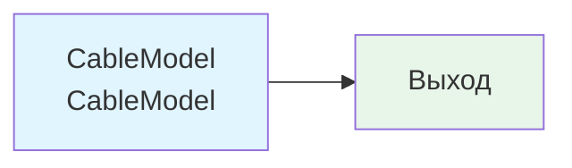

## CableModelTest — тестирование кабельной модели

**Путь:** `Bin/Configs/SpikeSamples/NM-Neurons/CableModel/CableModelTest`
**Статус валидации:** VALID (см. `Reports/SpikeSamples-Validation-Report.md`)

### Назначение конфигурации

Эта конфигурация демонстрирует **тестирование кабельной модели (компартментной модели CSNM - Compartmental Spiking Neuron Model)**. Конфигурация содержит компонент `CableModel` для тестирования различных аспектов кабельной модели.

Согласно [2] и `CSNM-Models.md`, кабельная модель позволяет изучать пространственное распространение потенциала в нейроне. Данная конфигурация предназначена для тестирования различных аспектов реализации кабельной модели.

### Структура модели

Конфигурация содержит компонент кабельной модели:

### Эксперимент и моделируемые реакции

#### Цель эксперимента

Тестирование кабельной модели:
- Проверка корректности реализации кабельного уравнения
- Тестирование различных параметров модели
- Валидация результатов моделирования

#### Сценарии экспериментов

1. **Базовое тестирование:**
   - Проверка работы компонента CableModel
   - Наблюдение основных характеристик модели
   - Анализ корректности реализации

2. **Тестирование параметров:**
   - Изменение различных параметров модели
   - Наблюдение влияния на поведение модели
   - Анализ чувствительности модели к параметрам

#### Ожидаемые результаты

- **Корректность реализации:** модель должна корректно реализовывать кабельное уравнение
- **Валидация:** результаты должны соответствовать теоретическим предсказаниям
- **Стабильность:** модель должна быть стабильной при различных параметрах

### Связанные материалы

- Теория и функциональное описание:
  - [`Bin/Docs/SpikeSamples/CSNM-Models.md`](../../../../../Docs/SpikeSamples/CSNM-Models.md) — модели кабельных нейронов CSNM
- Описание конфигурации:
  - `Description.rtf` — подробное описание конфигурации (в формате RTF)
- Связанные конфигурации:
  - `CableNeuronParametersTest` — тестирование параметров кабельного нейрона
  - `CableNeuronMulti` — базовая кабельная модель

## Литература

1. Bakhshiev A. V., Demcheva A. A. Compartmental spiking neuron model CSNM // Izvestiya VUZ. Applied Nonlinear Dynamics, 2022, vol. 30, iss. 3, pp. 299-310. [DOI](https://doi.org/10.18500/0869-6632-2022-30-3-299-310)

2. Демчева А.А. Разработка сегментной спайковой модели нейрона на основе кабельной теории для нейроморфных систем: выпускная квалификационная работа магистра. 2023. [онлайн](https://doi.org/10.18720/SPBPU/3/2023/vr/vr23-5657)
