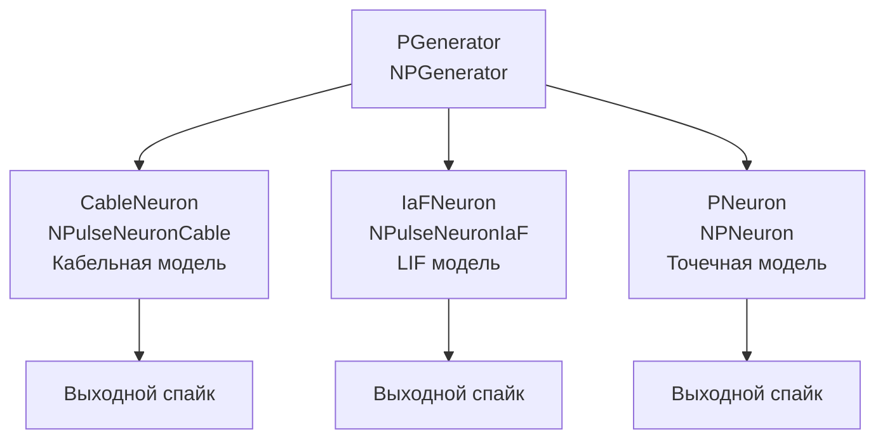

## CableNeuron — сравнение кабельной модели с LIF и точечной моделью

**Путь:** `Bin/Configs/SpikeSamples/NM-Neurons/CableModel/CableNeuron`
**Статус валидации:** VALID (см. `Reports/SpikeSamples-Validation-Report.md`)

### Назначение конфигурации

Эта конфигурация демонстрирует **сравнение кабельной модели нейрона** (`NPulseNeuronCable`) с моделью Leaky Integrate-and-Fire (LIF, `NPulseNeuronIaF`) и точечной моделью (`NPNeuron`). Все три модели получают одинаковый входной сигнал, что позволяет сравнивать их реакции и выявлять особенности кабельной модели.

Согласно [2], кабельная модель учитывает пространственное распространение потенциала по дендритам и соме, что отличает её от точечных моделей. Данная конфигурация позволяет изучить эти различия на практике.

  Bakhshiev A., Demcheva A., Stankevich L. (2022)
  International Conference on Neuroinformatics, pp. 327-333


  [2]
  Выпускная квалификационная работа магистра

### Структура модели

Конфигурация содержит три нейрона для сравнения:



#### Компоненты системы

**Входной генератор:**
- **PGenerator** (`NPGenerator`) — генератор импульсных сигналов
  - `Frequency` = 5 Гц — частота генерации импульсов
  - `Amplitude` = 1 — амплитуда импульсов
  - `PulseLength` = 0.001 с — длительность импульса
  - `AvgInterval` = 5 с — средний интервал между импульсами

**Кабельный нейрон:**
- **CableNeuron** (`NPulseNeuronCable`) — кабельная модель нейрона
  - Использует `NPulseMembraneCable` с кабельными каналами
  - Реализует пространственное распространение потенциала
  - Структура: 1 соматический участок, без дендритов (точечная конфигурация)

**LIF нейрон:**
- **IaFNeuron** (`NPulseNeuronIaF`) — модель Leaky Integrate-and-Fire
  - Простая модель с утечкой потенциала и порогом генерации спайков
  - Структура: 1 соматический участок, без дендритов

**Точечный нейрон:**
- **PNeuron** (`NPNeuron`) — точечная модель нейрона
  - Биологически реалистичная точечная модель
  - Структура: 1 соматический участок, без дендритов

### Кабельная теория

Согласно `CSNM-Models.md`, кабельная теория описывает распространение электрического потенциала вдоль цилиндрического проводника (дендрита или аксона) с учётом:

- Сопротивления аксоплазмы (внутреннего сопротивления)
- Сопротивления и ёмкости мембраны
- Токов через мембрану

#### Уравнение кабеля

Основное уравнение кабеля имеет вид:

```
λ²(∂²V/∂x²) = τ_m(∂V/∂t) + V
```

где:
- **V(x,t)** — мембранный потенциал в точке x в момент времени t
- **λ = √(r_m/r_i)** — постоянная длины (длина, на которой потенциал затухает в e раз)
- **r_m = R_m/(πD)** — сопротивление мембраны на единицу длины
- **r_i = (4R_i)/(πD²)** — сопротивление аксоплазмы на единицу длины
- **τ_m = r_m C_m** — мембранная постоянная времени
- **R_m** — удельное сопротивление мембраны (Ом·м²)
- **R_i** — удельное сопротивление аксоплазмы (Ом·м)
- **C_m** — удельная ёмкость мембраны (Ф/м²)
- **D** — диаметр кабеля (м)

#### Пространственные параметры

Согласно [2], для точечной конфигурации идентифицированы пространственные параметры:
- **Длина сегмента:** ~200 мкм (2·10⁻⁴ м)
- **Диаметр сегмента:** ~20 мкм (2·10⁻⁵ м)

Эти значения сопоставимы с биологическими данными.

### Эксперимент и моделируемые реакции

#### Цель эксперимента

Сравнение поведения трёх различных моделей нейронов:
- Кабельная модель (`NPulseNeuronCable`) — учитывает пространственное распространение потенциала
- LIF модель (`NPulseNeuronIaF`) — простая модель с утечкой потенциала
- Точечная модель (`NPNeuron`) — биологически реалистичная точечная модель

#### Сценарии экспериментов

1. **Сравнение реакций на одинаковый входной сигнал:**
   - Все три модели получают одинаковый входной сигнал от `PGenerator`
   - Наблюдение частоты выходных спайков
   - Анализ формы мембранного потенциала
   - Сравнение времени генерации спайков

2. **Изучение влияния частоты входной стимуляции:**
   - Изменение частоты генератора импульсов
   - Наблюдение изменений в реакциях моделей
   - Выявление различий в поведении

3. **Анализ пространственных эффектов:**
   - Для точечной конфигурации (только сома) кабельная модель должна демонстрировать сходное поведение с точечной моделью
   - Это подтверждает правильность идентификации пространственных параметров

#### Ожидаемые результаты

- **Для точечной конфигурации:** кабельная модель должна демонстрировать качественно сходное поведение с точечной моделью (согласно ВКР Демчевой)
- **Различия между моделями:** могут проявляться в деталях временной динамики и форме потенциала
- **LIF модель:** должна демонстрировать более простую динамику по сравнению с кабельной и точечной моделями

### Параметры модели

Основные параметры задаются в `Parameters_00.xml`:

#### Параметры NPulseChannelCable (для кабельного нейрона)

- `EL` = -70·10⁻³ В — потенциал покоя
- `Ri` = 1·10⁵ Ом·м — удельное сопротивление аксоплазмы
- `Rm` = 1·10³ Ом·м² — удельное сопротивление мембраны
- `Cm` = 2,5·10⁻¹⁰ Ф — ёмкость мембраны
- `D` = 2·10⁻⁵ м — диаметр кабеля (~20 мкм)
- `ModelMaxLength` = 2·10⁻⁴ м — максимальная длина модели (~200 мкм)
- `dx` = 1·10⁻⁵ м — шаг пространственной дискретизации
- `CalcMode` = true — режим расчёта (расчёт CableMembraneResistance из D)

#### Параметры NPulseMembraneCable

- `ExcChannelClassName` = "NPulseChannelCable" — класс возбуждающего канала
- `SynapseClassName` = "NSynapseCable" — класс синапса
- `FeedbackGain` = 0.7 — коэффициент обратной связи

#### Параметры NPulseLTZoneCable

- `Threshold` = -55·10⁻³ В — порог активации
- `ThresholdOff` = -70·10⁻³ В — порог деактивации

#### Структурные параметры

- `NumSomaMembraneParts` = 1 — количество соматических участков
- `NumDendriteMembranePartsVec` = 0 — без дендритов (точечная конфигурация)

Точные численные значения можно смотреть в `Parameters_00.xml`.

### Результаты экспериментов

Согласно [2]:

#### Идентификация пространственных параметров

- Для точечной конфигурации (N_s=1, N_d=0, N_syn=1) достигнуто качественно сходное поведение между кабельной моделью и точечной моделью
- Это позволило идентифицировать пространственные параметры CSNM:
  - **Длина сегмента:** ~200 мкм (2·10⁻⁴ м)
  - **Диаметр сегмента:** ~20 мкм (2·10⁻⁵ м)
- Эти значения сопоставимы с биологическими данными

#### Воспроизведение основных закономерностей

- Реализованная модель воспроизводит основные закономерности распространения сигнала
- Результаты сравнения модели с классической моделью Integrate-and-Fire подтверждают работоспособность реализованной модели

### Связанные материалы

- Теория и функциональное описание:
  - [`Bin/Docs/SpikeSamples/CSNM-Models.md`](../../../../Docs/SpikeSamples/CSNM-Models.md) — детальное описание CSNM моделей и кабельной теории
  - [`Bin/Docs/SpikeSamples/NeuronReactions.md`](../../../../Docs/SpikeSamples/NeuronReactions.md) — реакции одиночных нейронов
- Компонентная документация:
  - `Libraries/Nmsdk-PulseLib/Docs/Components/NPulseNeuronCable.md` — документация компонента NPulseNeuronCable
  - `Libraries/Nmsdk-PulseLib/Docs/Components/NPulseChannelCable.md` — документация компонента NPulseChannelCable
- Описание конфигурации:
  - `Description.rtf` — подробное описание конфигурации (в формате RTF)

## Литература

1. Bakhshiev A. V., Demcheva A. A. Compartmental spiking neuron model CSNM // Izvestiya VUZ. Applied Nonlinear Dynamics, 2022, vol. 30, iss. 3, pp. 299-310. [DOI](https://doi.org/10.18500/0869-6632-2022-30-3-299-310)

2. Демчева А.А. Разработка сегментной спайковой модели нейрона на основе кабельной теории для нейроморфных систем: выпускная квалификационная работа магистра. 2023. [онлайн](https://doi.org/10.18720/SPBPU/3/2023/vr/vr23-5657)
