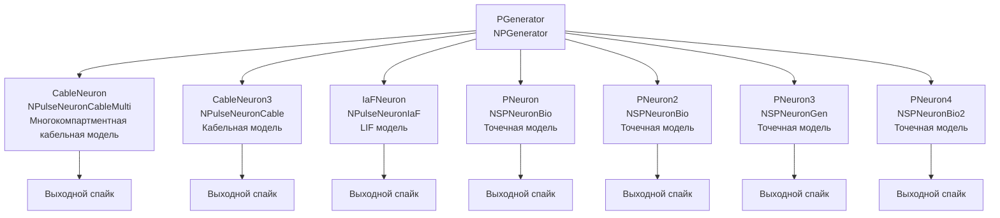

## CableNeuronMulti — многокомпартментная кабельная модель

**Путь:** `Bin/Configs/SpikeSamples/NM-Neurons/CableModel/CableNeuronMulti`
**Статус валидации:** VALID (см. `Reports/SpikeSamples-Validation-Report.md`)

### Назначение конфигурации

Эта конфигурация демонстрирует **многокомпартментную кабельную модель нейрона** (`NPulseNeuronCableMulti`) и сравнивает её с различными точечными моделями (LIF, `NSPNeuronBio`, `NSPNeuronGen`, `NSPNeuronBio2`). Многокомпартментная модель позволяет моделировать нейроны с распределёнными параметрами и учитывать пространственную структуру.

Согласно [2], многокомпартментная кабельная модель CSNM позволяет моделировать нейроны с различным количеством соматических участков и дендритов, учитывая пространственное распространение потенциала. Данная конфигурация позволяет изучить особенности многокомпартментной модели и сравнить её с точечными моделями.

  Bakhshiev A., Demcheva A., Stankevich L. (2022)
  International Conference on Neuroinformatics, pp. 327-333


  [2]
  Выпускная квалификационная работа магистра

### Структура модели

Конфигурация содержит несколько нейронов для сравнения:



#### Компоненты системы

**Входной генератор:**
- **PGenerator** (`NPGenerator`) — генератор импульсных сигналов
  - `Frequency` = 5 Гц — частота генерации импульсов
  - `Amplitude` = 1 — амплитуда импульсов
  - `PulseLength` = 0.001 с — длительность импульса
  - `AvgInterval` = 5 с — средний интервал между импульсами

**Многокомпартментный кабельный нейрон:**
- **CableNeuron** (`NPulseNeuronCableMulti`) — многокомпартментная кабельная модель нейрона
  - Использует `NPulseMembraneCable` с кабельными каналами
  - Реализует пространственное распространение потенциала
  - Поддерживает сложные дендритные структуры
  - Структура: 1 соматический участок

**Кабельный нейрон:**
- **CableNeuron3** (`NPulseNeuronCable`) — базовая кабельная модель нейрона
  - Структура: 1 соматический участок, без дендритов

**Точечные нейроны:**
- **IaFNeuron** (`NPulseNeuronIaF`) — модель Leaky Integrate-and-Fire
- **PNeuron** (`NSPNeuronBio`) — биологически реалистичный точечный нейрон
- **PNeuron2** (`NSPNeuronBio`) — биологически реалистичный точечный нейрон
- **PNeuron3** (`NSPNeuronGen`) — точечный нейрон с генератором
- **PNeuron4** (`NSPNeuronBio2`) — биологически реалистичный точечный нейрон (версия 2)

### Кабельная теория и многокомпартментная модель

Согласно `CSNM-Models.md`, многокомпартментная кабельная модель CSNM позволяет моделировать нейроны с различной структурой:

- **N_s** — количество соматических участков мембраны
- **N_d** — количество дендритов
- **N_syn** — количество синапсов, подключённых к дендритам

Каждый компартмент моделируется как участок кабеля, и распространение потенциала между компартментами описывается кабельным уравнением.

#### Уравнение кабеля

Основное уравнение кабеля имеет вид:

```
λ²(∂²V/∂x²) = τ_m(∂V/∂t) + V
```

где:
- **V(x,t)** — мембранный потенциал в точке x в момент времени t
- **λ = √(r_m/r_i)** — постоянная длины
- **τ_m = r_m C_m** — мембранная постоянная времени

#### Пространственные параметры

Согласно [2], для точечной конфигурации идентифицированы пространственные параметры:
- **Длина сегмента:** ~200 мкм (2·10⁻⁴ м)
- **Диаметр сегмента:** ~20 мкм (2·10⁻⁵ м)

### Эксперимент и моделируемые реакции

#### Цель эксперимента

Сравнение поведения многокомпартментной кабельной модели с различными точечными моделями:
- Многокомпартментная кабельная модель (`NPulseNeuronCableMulti`) — учитывает пространственное распространение потенциала и поддерживает сложные структуры
- Базовая кабельная модель (`NPulseNeuronCable`) — простая кабельная модель
- Различные точечные модели — для сравнения

#### Сценарии экспериментов

1. **Сравнение реакций на одинаковый входной сигнал:**
   - Все модели получают одинаковый входной сигнал от `PGenerator`
   - Наблюдение частоты выходных спайков
   - Анализ формы мембранного потенциала
   - Сравнение времени генерации спайков

2. **Изучение влияния структуры:**
   - Многокомпартментная модель позволяет изучать влияние различных структурных параметров
   - Сравнение с точечными моделями выявляет пространственные эффекты

3. **Анализ многокомпартментной обработки:**
   - Многокомпартментная модель позволяет моделировать пространственную суммацию сигналов
   - Возможность изучения влияния расположения синапсов на реакции нейрона

#### Ожидаемые результаты

- **Многокомпартментная модель:** должна демонстрировать способность моделировать пространственные эффекты
- **Сравнение с точечными моделями:** выявляет различия в поведении, связанные с пространственной структурой
- **Различные точечные модели:** могут демонстрировать различные уровни детализации мембранных процессов

### Параметры модели

Основные параметры задаются в `Parameters_00.xml`:

#### Параметры NPulseChannelCableMulti (для многокомпартментного нейрона)

- `EL` = -70·10⁻³ В — потенциал покоя
- `Ri` = 1·10⁵ Ом·м — удельное сопротивление аксоплазмы
- `Rm` = 1·10³ Ом·м² — удельное сопротивление мембраны
- `Cm` = 2,5·10⁻¹⁰ Ф — ёмкость мембраны
- `D` = 2·10⁻⁵ м — диаметр кабеля (~20 мкм)
- `ModelMaxLength` = 3·10⁻⁵ м — максимальная длина модели (для многокомпартментных конфигураций)
- `dx` = 1·10⁻⁵ м — шаг пространственной дискретизации
- `CalcMode` = true — режим расчёта

#### Параметры NPulseMembraneCable

- `ExcChannelClassName` = "NPulseChannelCable" — класс возбуждающего канала
- `SynapseClassName` = "NSynapseCable" — класс синапса
- `FeedbackGain` = 0.7 — коэффициент обратной связи

#### Параметры NPulseLTZoneCable

- `Threshold` = -55·10⁻³ В — порог активации
- `ThresholdOff` = -70·10⁻³ В — порог деактивации

#### Структурные параметры

- `NumSomaMembraneParts` = 1 — количество соматических участков
- `NumDendriteMembranePartsVec` — вектор длин дендритов (может быть различным для разных нейронов)

Точные численные значения можно смотреть в `Parameters_00.xml`.

### Результаты экспериментов

Согласно [2]:

#### Воспроизведение основных закономерностей

- Реализованная многокомпартментная модель воспроизводит основные закономерности распространения сигнала при различных размерах сомы и длинах дендритов
- Результаты сравнения модели с классической моделью Integrate-and-Fire подтверждают работоспособность реализованной модели

#### Влияние структуры на поведение

- Многокомпартментная модель позволяет изучать влияние различных структурных параметров на поведение нейрона
- Возможность моделирования пространственной суммации сигналов от разных участков нейрона

### Связанные материалы

- Теория и функциональное описание:
  - [`Bin/Docs/SpikeSamples/CSNM-Models.md`](../../../../../Docs/SpikeSamples/CSNM-Models.md) — детальное описание CSNM моделей и кабельной теории
  - [`Bin/Docs/SpikeSamples/NeuronReactions.md`](../../../../../Docs/SpikeSamples/NeuronReactions.md) — реакции одиночных нейронов
- Компонентная документация:
  - `Libraries/Nmsdk-PulseLib/Docs/Components/NPulseNeuronCableMulti.md` — документация компонента NPulseNeuronCableMulti
  - `Libraries/Nmsdk-PulseLib/Docs/Components/NPulseChannelCable.md` — документация компонента NPulseChannelCable
- Описание конфигурации:
  - `Description.rtf` — подробное описание конфигурации (в формате RTF)
- Связанные конфигурации:
  - `CableNeuronMulti_CSNM` — базовая CSNM модель с кабельным уравнением
  - `CableNeuronMulti_Lengths` — влияние длины дендритов
  - `CableNeuronMulti_Diameters` — влияние диаметра дендритов

## Литература

1. Bakhshiev A. V., Demcheva A. A. Compartmental spiking neuron model CSNM // Izvestiya VUZ. Applied Nonlinear Dynamics, 2022, vol. 30, iss. 3, pp. 299-310. [DOI](https://doi.org/10.18500/0869-6632-2022-30-3-299-310)

2. Демчева А.А. Разработка сегментной спайковой модели нейрона на основе кабельной теории для нейроморфных систем: выпускная квалификационная работа магистра. 2023. [онлайн](https://doi.org/10.18720/SPBPU/3/2023/vr/vr23-5657)
