## CableNeuronMulti_CSNM — базовая CSNM модель с кабельным уравнением

**Путь:** `Bin/Configs/SpikeSamples/NM-Neurons/CableModel/CableNeuronMulti_CSNM`
**Статус валидации:** VALID (см. `Reports/SpikeSamples-Validation-Report.md`)

### Назначение конфигурации

Эта конфигурация демонстрирует **базовую компартментную спайковую модель нейрона (CSNM) с интеграцией кабельного уравнения**. Конфигурация содержит несколько нейронов с различной структурой (разное количество дендритов и их длина), что позволяет сравнивать поведение различных CSNM конфигураций и изучать влияние пространственных параметров на распространение сигнала.

  Bakhshiev A., Demcheva A., Stankevich L. (2022)
  International Conference on Neuroinformatics, pp. 327-333

  [2]
  Выпускная квалификационная работа магистра

### Структура модели

Конфигурация содержит несколько нейронов для сравнения:

```mermaid
flowchart TD
    Generator[PGenerator<br/>NPGenerator] --> Cable1[CableNeuron<br/>NPulseNeuronCableMulti<br/>1 дендрит, длина 1]
    Generator --> Cable2[CableNeuron2<br/>NPulseNeuronCableMulti<br/>2 дендрита, длины 1-2]
    Generator --> Cable3[CableNeuron3<br/>NPulseNeuronCableMulti<br/>Сома, без дендритов]
    Generator --> Cable4[CableNeuron4<br/>NPulseNeuronCableMulti<br/>Сома, без дендритов]
    Generator --> Cable5[CableNeuron5<br/>NPulseNeuronCableMulti<br/>1 дендрит, длина 1]
    Generator --> Cable6[CableNeuron6<br/>NPulseNeuronCableMulti<br/>2 дендрита, длина 2]
    Generator --> Cable7[CableNeuron7<br/>NPulseNeuronCableMulti<br/>3 дендрита, длина 3]
    Generator --> Cable8[CableNeuron8<br/>NPulseNeuronCableMulti<br/>4 дендрита, длина 4]
    Generator --> PNeuron[PNeuron<br/>NSPNeuronBio<br/>Точечная модель]
    Generator --> PNeuron2[PNeuron2<br/>NSPNeuronGen<br/>Точечная модель]
```

#### Компоненты системы

**Входной генератор:**
- **PGenerator** (`NPGenerator`) — генератор импульсных сигналов
  - `Frequency` = 15 Гц — частота генерации импульсов
  - `Amplitude` = 1 — амплитуда импульсов
  - `PulseLength` = 0.001 с — длительность импульса
  - `AvgInterval` = 5 с — средний интервал между импульсами

**Кабельные нейроны (CSNM с кабельным уравнением):**
- **CableNeuron** (`NPulseNeuronCableMulti`) — 1 дендрит, длина 1 сегмент
- **CableNeuron2** (`NPulseNeuronCableMulti`) — 2 дендрита, длины 1 и 2 сегмента
- **CableNeuron3** (`NPulseNeuronCableMulti`) — только сома, без дендритов
- **CableNeuron4** (`NPulseNeuronCableMulti`) — только сома, без дендритов
- **CableNeuron5** (`NPulseNeuronCableMulti`) — 1 дендрит, длина 1 сегмент
- **CableNeuron6** (`NPulseNeuronCableMulti`) — 2 дендрита, длина 2 сегмента
- **CableNeuron7** (`NPulseNeuronCableMulti`) — 3 дендрита, длина 3 сегмента
- **CableNeuron8** (`NPulseNeuronCableMulti`) — 4 дендрита, длина 4 сегмента

**Точечные нейроны (для сравнения):**
- **PNeuron** (`NSPNeuronBio`) — биологически реалистичный точечный нейрон
- **PNeuron2** (`NSPNeuronGen`) — точечный нейрон с генератором

#### Внутренняя структура кабельного нейрона

Каждый `NPulseNeuronCableMulti` содержит:

- **Сома** (`NPulseMembraneCable`) — соматическая мембрана
  - Использует `NPulseChannelCable` для пространственного распространения потенциала
  - Поддерживает обратную связь от LT-зоны

- **Дендриты** (`NPulseMembraneCable`) — дендритные мембраны
  - Каждый дендрит состоит из одного или нескольких сегментов
  - Сегменты соединены последовательно через кабельные каналы
  - Сигнал распространяется от дистального конца к соме

- **LT-зона** (`NPulseLTZoneCable`) — низкопороговая зона для генерации спайков
  - Порог активации: -55 мВ
  - Порог деактивации: -70 мВ

- **Синапсы** (`NSynapseCable`) — кабельные синапсы
  - Подключены к дендритам или соме
  - Преобразуют входные импульсы в синаптические токи

### Эксперимент и моделируемые реакции

#### Цель эксперимента

Сравнение поведения различных CSNM конфигураций:
- Влияние количества дендритов на обработку сигнала
- Влияние длины дендритов на задержку и затухание сигнала
- Сравнение кабельной модели с точечными моделями
- Изучение пространственного распространения потенциала

#### Сценарии экспериментов

1. **Распространение сигнала по дендритам:**
   - Наблюдение затухания амплитуды сигнала с расстоянием от синапса
   - Измерение задержки распространения сигнала
   - Анализ влияния длины дендрита на эти параметры

2. **Сравнение нейронов с разным количеством дендритов:**
   - Нейроны с 1, 2, 3, 4 дендритами получают одинаковый входной сигнал
   - Сравнение времени генерации спайка
   - Анализ влияния структуры на порог активации

3. **Сравнение с точечными моделями:**
   - Кабельные нейроны сравниваются с точечными моделями (PNeuron, PNeuron2)
   - Анализ различий в поведении
   - Идентификация пространственных параметров CSNM

4. **Влияние расположения синапсов:**
   - Синапсы на дендритах (CableNeuron, CableNeuron2)
   - Синапсы на соме (CableNeuron3, CableNeuron4)
   - Сравнение эффективности возбуждения

#### Ожидаемые результаты

- **Затухание сигнала:** амплитуда сигнала уменьшается с расстоянием от синапса
- **Задержка распространения:** более длинные дендриты дают большую задержку
- **Порог активации:** зависит от структуры нейрона (количество дендритов, их длина)
- **Сравнение с точечной моделью:** для точечной конфигурации (только сома) поведение должно быть сходным

### Параметры модели

Основные параметры задаются в `Parameters_00.xml`:

#### Параметры NPulseChannelCable

- `EL` = -70·10⁻³ В — потенциал покоя
- `Ri` = 1·10⁵ Ом·м — удельное сопротивление аксоплазмы
- `Rm` = 1·10³ Ом·м² — удельное сопротивление мембраны
- `Cm` = 2,5·10⁻¹⁰ Ф — ёмкость мембраны
- `D` = 2·10⁻⁵ м — диаметр кабеля
- `ModelMaxLength` = 2·10⁻⁴ м — максимальная длина модели
- `dx` = 1·10⁻⁵ м — шаг пространственной дискретизации
- `CalcMode` = true — режим расчёта (расчёт CableMembraneResistance из D)

#### Параметры NPulseMembraneCable

- `ExcChannelClassName` = "NPulseChannelCable" — класс возбуждающего канала
- `SynapseClassName` = "NSynapseCable" — класс синапса
- `FeedbackGain` = 0.7 — коэффициент обратной связи

#### Параметры NPulseLTZoneCable

- `Threshold` = -55·10⁻³ В — порог активации
- `ThresholdOff` = -70·10⁻³ В — порог деактивации

#### Структурные параметры нейронов

- `NumSomaMembraneParts` = 1 — количество соматических участков (для всех нейронов)
- `NumDendriteMembranePartsVec` — вектор длин дендритов (различается для разных нейронов)

### Результаты экспериментов

Согласно [2]:

#### Идентификация пространственных параметров

- Для точечной конфигурации (N_s=1, N_d=0, N_syn=1) достигнуто качественно сходное поведение между кабельной моделью и классической CSNM
- Это позволило идентифицировать пространственные параметры CSNM:
  - **Длина сегмента:** ~200 мкм (2·10⁻⁴ м)
  - **Диаметр сегмента:** ~20 мкм (2·10⁻⁵ м)
- Эти значения сопоставимы с биологическими данными

#### Воспроизведение основных закономерностей

- Реализованная модель воспроизводит основные закономерности распространения сигнала при различных размерах сомы и длинах дендритов
- Результаты сравнения модели с классической моделью Integrate-and-Fire подтверждают работоспособность реализованной модели

#### Влияние структуры на поведение

- Увеличение длины дендритов увеличивает задержку распространения сигнала
- Увеличение количества дендритов влияет на способность интегрировать множественные входы
- Расположение синапсов (на дендритах или на соме) влияет на эффективность возбуждения

### Связанные материалы

- Теория и функциональное описание:
  - [`Bin/Docs/SpikeSamples/CSNM-Models.md`](../../../../../Docs/SpikeSamples/CSNM-Models.md) — детальное описание CSNM моделей и кабельной теории
  - [`Bin/Docs/SpikeSamples/NeuronReactions.md`](../../../../../Docs/SpikeSamples/NeuronReactions.md) — реакции одиночных нейронов
  - [`Bin/Docs/SpikeSamples/ImpulseProcessingModel.md`](../../../../../Docs/SpikeSamples/ImpulseProcessingModel.md) — модель преобразования импульсных потоков
- Компонентная документация:
  - `Libraries/Nmsdk-PulseLib/Docs/Components/NPulseNeuronCableMulti.md` — документация компонента NPulseNeuronCableMulti
  - `Libraries/Nmsdk-PulseLib/Docs/Components/NPulseChannelCable.md` — документация компонента NPulseChannelCable
  - `Libraries/Nmsdk-PulseLib/Docs/Components/NPulseMembraneCable.md` — документация компонента NPulseMembraneCable
- Описание конфигурации:
  - `Description.rtf` — подробное описание конфигурации (в формате RTF)

## Литература

1. Bakhshiev A. V., Demcheva A. A. Compartmental spiking neuron model CSNM // Izvestiya VUZ. Applied Nonlinear Dynamics, 2022, vol. 30, iss. 3, pp. 299-310. [DOI](https://doi.org/10.18500/0869-6632-2022-30-3-299-310)

2. Демчева А.А. Разработка сегментной спайковой модели нейрона на основе кабельной теории для нейроморфных систем: выпускная квалификационная работа магистра. 2023. [онлайн](https://doi.org/10.18720/SPBPU/3/2023/vr/vr23-5657)
