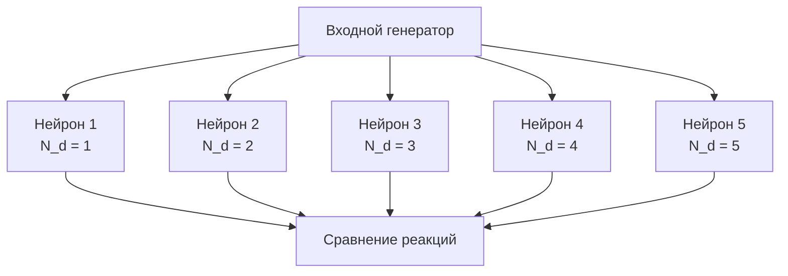

## CableNeuronMulti_CSNM_Nd — CSNM модель с различным количеством дендритов

**Путь:** `Bin/Configs/SpikeSamples/NM-Neurons/CableModel/CableNeuronMulti_CSNM_Nd`
**Статус валидации:** VALID (см. `Reports/SpikeSamples-Validation-Report.md`)

### Назначение конфигурации

Эта конфигурация демонстрирует влияние **количества дендритов** на поведение компартментной спайковой модели нейрона с кабельным уравнением. Конфигурация содержит нейроны с различным количеством дендритов при одинаковых остальных параметрах, что позволяет изучить, как количество входных каналов влияет на интеграцию сигналов и порог активации нейрона.

  Bakhshiev A., Demcheva A., Stankevich L. (2022)
  International Conference on Neuroinformatics, pp. 327-333

  [2]
  Выпускная квалификационная работа магистра

### Структура модели

Конфигурация содержит несколько нейронов с различным количеством дендритов:

#### Компоненты системы

Каждый нейрон (`NPulseNeuronCableMulti`) имеет:
- **Одинаковое количество соматических участков** (N_s = 1)
- **Разное количество дендритов** (N_d варьируется от 1 до 5)
- **Одинаковую длину дендритов** (для каждого нейрона все дендриты имеют одинаковую длину)
- **Одинаковые параметры мембраны и каналов**

### Эксперимент и моделируемые реакции

#### Цель эксперимента

Изучение влияния количества дендритов (N_d) на:
- Способность нейрона интегрировать множественные входные сигналы
- Порог активации нейрона
- Время генерации спайка
- Амплитуду мембранного потенциала

#### Сценарии экспериментов

1. **Одинаковый входной сигнал на все дендриты:**
   - Все дендриты каждого нейрона получают одинаковый входной сигнал
   - Сравнение реакции нейронов с разным количеством дендритов
   - Анализ влияния количества входных каналов на интеграцию

2. **Разные входные сигналы на разные дендриты:**
   - Каждый дендрит получает свой входной сигнал
   - Изучение способности нейрона обрабатывать множественные входы
   - Анализ пространственной интеграции сигналов

3. **Временные паттерны:**
   - Подача временных паттернов на дендриты
   - Изучение влияния количества дендритов на обработку временных паттернов
   - Анализ синхронизации сигналов от разных дендритов

#### Ожидаемые результаты

- **Увеличение количества дендритов:**
  - Улучшает способность интегрировать множественные входы
  - Может снижать порог активации (при одинаковой силе входного сигнала)
  - Увеличивает сложность пространственной интеграции

- **Зависимость от структуры:**
  - Нейроны с большим количеством дендритов могут быть более чувствительными к входным сигналам
  - Влияние на порог активации зависит от параметров мембраны и обратной связи

### Параметры модели

Основные параметры аналогичны конфигурации `CableNeuronMulti_CSNM`:

- **Параметры кабельного канала:** те же, что в базовой CSNM модели
- **Структурные параметры:**
  - `NumSomaMembraneParts` = 1 (одинаково для всех нейронов)
  - `NumDendriteMembranePartsVec` — вектор, определяющий количество и длину дендритов (различается для разных нейронов)

### Результаты экспериментов

Согласно [2]:

#### Влияние количества дендритов

- Увеличение количества дендритов влияет на способность нейрона обрабатывать множественные входные сигналы
- Нейроны с большим количеством дендритов могут иметь более низкий эффективный порог активации при одинаковой силе входного сигнала
- Пространственная интеграция сигналов от разных дендритов происходит в соме

#### Сравнение с точечной моделью

- Для точечной конфигурации (N_d=0) поведение сходно с точечными моделями
- При добавлении дендритов появляются пространственные эффекты, не учитываемые точечными моделями

### Связанные материалы

- [`Bin/Docs/SpikeSamples/CSNM-Models.md`](../../../../../Docs/SpikeSamples/CSNM-Models.md) — детальное описание CSNM моделей
- [`CableNeuronMulti_CSNM/README.md`](../CableNeuronMulti_CSNM/README.md) — базовая CSNM модель
- [`CableNeuronMulti_CSNM_Nsyn/README.md`](../CableNeuronMulti_CSNM_Nsyn/README.md) — CSNM с различным количеством синапсов

## Литература

1. Bakhshiev A. V., Demcheva A. A. Compartmental spiking neuron model CSNM // Izvestiya VUZ. Applied Nonlinear Dynamics, 2022, vol. 30, iss. 3, pp. 299-310. [DOI](https://doi.org/10.18500/0869-6632-2022-30-3-299-310)

2. Демчева А.А. Разработка сегментной спайковой модели нейрона на основе кабельной теории для нейроморфных систем: выпускная квалификационная работа магистра. 2023. [онлайн](https://doi.org/10.18720/SPBPU/3/2023/vr/vr23-5657)
