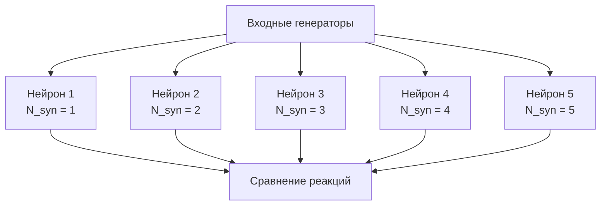

## CableNeuronMulti_CSNM_Nsyn — CSNM модель с различным количеством синапсов

**Путь:** `Bin/Configs/SpikeSamples/NM-Neurons/CableModel/CableNeuronMulti_CSNM_Nsyn`
**Статус валидации:** VALID (см. `Reports/SpikeSamples-Validation-Report.md`)

### Назначение конфигурации

Эта конфигурация демонстрирует влияние **количества синапсов** на поведение компартментной спайковой модели нейрона с кабельным уравнением. Конфигурация содержит нейроны с различным количеством синапсов при одинаковых остальных параметрах, что позволяет изучить, как количество входных соединений влияет на интеграцию сигналов и порог активации нейрона.

  Bakhshiev A., Demcheva A., Stankevich L. (2022)
  International Conference on Neuroinformatics, pp. 327-333

  [2]
  Выпускная квалификационная работа магистра

### Структура модели

Конфигурация содержит несколько нейронов с различным количеством синапсов:

#### Компоненты системы

Каждый нейрон (`NPulseNeuronCableMulti`) имеет:
- **Одинаковое количество соматических участков** (N_s = 1)
- **Одинаковое количество дендритов** (N_d одинаково для всех нейронов)
- **Одинаковую длину дендритов**
- **Разное количество синапсов** (N_syn варьируется от 1 до 5)

Синапсы могут быть расположены:
- На дендритах (по одному или несколько на дендрит)
- На соме
- Комбинация дендритных и соматических синапсов

### Эксперимент и моделируемые реакции

#### Цель эксперимента

Изучение влияния количества синапсов (N_syn) на:
- Способность нейрона интегрировать входные сигналы
- Порог активации нейрона
- Амплитуду мембранного потенциала
- Время генерации спайка

#### Сценарии экспериментов

1. **Одинаковый входной сигнал на все синапсы:**
   - Все синапсы каждого нейрона получают одинаковый входной сигнал
   - Сравнение реакции нейронов с разным количеством синапсов
   - Анализ влияния количества входных соединений на интеграцию

2. **Разные входные сигналы на разные синапсы:**
   - Каждый синапс получает свой входной сигнал
   - Изучение способности нейрона обрабатывать множественные входы
   - Анализ пространственной и временной интеграции сигналов

3. **Временные паттерны:**
   - Подача временных паттернов на синапсы
   - Изучение влияния количества синапсов на обработку временных паттернов
   - Анализ синхронизации сигналов от разных синапсов

#### Ожидаемые результаты

- **Увеличение количества синапсов:**
  - Улучшает способность интегрировать входные сигналы
  - Снижает эффективный порог активации (при одинаковой силе входного сигнала на каждый синапс)
  - Увеличивает амплитуду мембранного потенциала
  - Может ускорить генерацию спайка

- **Зависимость от расположения синапсов:**
  - Соматические синапсы более эффективны, чем дендритные
  - Дендритные синапсы дают большую задержку из-за распространения сигнала по дендриту
  - Комбинация синапсов на разных участках влияет на пространственную интеграцию

### Параметры модели

Основные параметры аналогичны конфигурации `CableNeuronMulti_CSNM`:

- **Параметры кабельного канала:** те же, что в базовой CSNM модели
- **Параметры синапсов:**
  - `SecretionTC` = 1·10⁻³ с — постоянная времени выделения медиатора
  - `DissociationTC` = 5·10⁻³ с — постоянная времени распада медиатора
  - `Resistance` = 86·10⁶ Ом — сопротивление синапса
- **Структурные параметры:**
  - `NumSomaMembraneParts` = 1 (одинаково для всех нейронов)
  - `NumDendriteMembranePartsVec` — одинаково для всех нейронов
  - `NumExcitatorySynapses` — количество возбуждающих синапсов (различается для разных нейронов)

### Результаты экспериментов

Согласно [2]:

#### Влияние количества синапсов

- Увеличение количества синапсов увеличивает суммарный входной ток к нейрону
- Это приводит к снижению эффективного порога активации
- Увеличивается амплитуда мембранного потенциала
- Может ускоряться генерация спайка

#### Пространственное распределение синапсов

- Синапсы на соме более эффективны, чем на дендритах
- Дендритные синапсы дают задержку из-за распространения сигнала
- Комбинация синапсов на разных участках позволяет реализовать сложные паттерны интеграции

#### Сравнение с точечной моделью

- Для точечной конфигурации (N_syn=1, только сома) поведение сходно с точечными моделями
- При увеличении количества синапсов появляются эффекты пространственного распределения, не учитываемые точечными моделями

### Связанные материалы

- [`Bin/Docs/SpikeSamples/CSNM-Models.md`](../../../../../Docs/SpikeSamples/CSNM-Models.md) — детальное описание CSNM моделей
- [`CableNeuronMulti_CSNM/README.md`](../CableNeuronMulti_CSNM/README.md) — базовая CSNM модель
- [`CableNeuronMulti_CSNM_Nd/README.md`](../CableNeuronMulti_CSNM_Nd/README.md) — CSNM с различным количеством дендритов

## Литература

1. Bakhshiev A. V., Demcheva A. A. Compartmental spiking neuron model CSNM // Izvestiya VUZ. Applied Nonlinear Dynamics, 2022, vol. 30, iss. 3, pp. 299-310. [DOI](https://doi.org/10.18500/0869-6632-2022-30-3-299-310)

2. Демчева А.А. Разработка сегментной спайковой модели нейрона на основе кабельной теории для нейроморфных систем: выпускная квалификационная работа магистра. 2023. [онлайн](https://doi.org/10.18720/SPBPU/3/2023/vr/vr23-5657)
