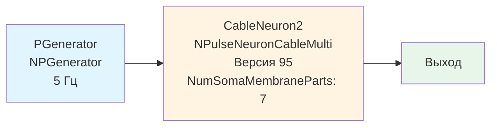

## CableNeuronMulti_CSNM_ver95 — базовая CSNM модель (версия 95)

**Путь:** `Bin/Configs/SpikeSamples/NM-Neurons/CableModel/CableNeuronMulti_CSNM_ver95`
**Статус валидации:** VALID (см. `Reports/SpikeSamples-Validation-Report.md`)

### Назначение конфигурации

Эта конфигурация демонстрирует **базовую компартментную спайковую модель нейрона (CSNM) с интеграцией кабельного уравнения** (версия 95). Конфигурация является вариантом `CableNeuronMulti_CSNM` с параметрами версии 95 библиотеки NMSDK и увеличенным количеством частей сомы (`NumSomaMembraneParts` = 7).

Согласно [2] и `CSNM-Models.md`, CSNM модель позволяет изучать влияние пространственных параметров на распространение сигнала. Данная конфигурация позволяет количественно изучить эти эффекты с параметрами версии 95.

### Структура модели

Конфигурация содержит кабельный нейрон с параметрами версии 95:

#### Компоненты системы

**Входной генератор:**
- **PGenerator** (`NPGenerator`) — генератор импульсных сигналов (5 Гц)

**Кабельный нейрон:**
- **CableNeuron2** (`NPulseNeuronCableMulti`) — многокомпартментный кабельный нейрон
  - `NumSomaMembraneParts` = 7 — количество частей сомы (увеличенное по сравнению с базовой версией)
  - Версия 95 библиотеки NMSDK

### Отличия от базовой версии

Данная конфигурация использует параметры версии 95 библиотеки NMSDK. Отличия от базовой версии `CableNeuronMulti_CSNM`:
- Увеличенное количество частей сомы (`NumSomaMembraneParts` = 7 вместо меньшего значения)
- Изменения в реализации кабельного уравнения для версии 95
- Изменения в параметрах по умолчанию

### Связанные материалы

- Теория и функциональное описание:
  - [`Bin/Docs/SpikeSamples/CSNM-Models.md`](../../../../../Docs/SpikeSamples/CSNM-Models.md) — модели кабельных нейронов CSNM
- Описание конфигурации:
  - `Description.rtf` — подробное описание конфигурации (в формате RTF)
- Связанные конфигурации:
  - `CableNeuronMulti_CSNM` — базовая версия
  - `CableNeuronMulti_CSNM_Nd` — версия с параметром Nd
  - `CableNeuronMulti_CSNM_Nsyn` — версия с параметром Nsyn

## Литература

1. Bakhshiev A. V., Demcheva A. A. Compartmental spiking neuron model CSNM // Izvestiya VUZ. Applied Nonlinear Dynamics, 2022, vol. 30, iss. 3, pp. 299-310. [DOI](https://doi.org/10.18500/0869-6632-2022-30-3-299-310)

2. Демчева А.А. Разработка сегментной спайковой модели нейрона на основе кабельной теории для нейроморфных систем: выпускная квалификационная работа магистра. 2023. [онлайн](https://doi.org/10.18720/SPBPU/3/2023/vr/vr23-5657)
