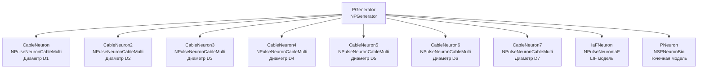

## CableNeuronMulti_Diameters — влияние диаметра дендритов на распространение сигнала

**Путь:** `Bin/Configs/SpikeSamples/NM-Neurons/CableModel/CableNeuronMulti_Diameters`
**Статус валидации:** VALID (см. `Reports/SpikeSamples-Validation-Report.md`)

### Назначение конфигурации

Эта конфигурация демонстрирует **влияние диаметра дендритов на распространение сигнала** в многокомпартментной кабельной модели CSNM. Конфигурация содержит несколько нейронов (`NPulseNeuronCableMulti`) с различным диаметром дендритов, что позволяет сравнивать их поведение и изучать влияние диаметра на постоянную длины, сопротивление и скорость распространения сигнала.

Согласно [2] и `CSNM-Models.md`, диаметр дендритов влияет на:
- Сопротивление аксоплазмы (r_i ∝ 1/D²)
- Сопротивление мембраны (r_m ∝ 1/D)
- Постоянную длины (λ = √(r_m/r_i) ∝ √D)
- Скорость распространения сигнала

Данная конфигурация позволяет количественно изучить эти эффекты.

  Bakhshiev A., Demcheva A., Stankevich L. (2022)
  International Conference on Neuroinformatics, pp. 327-333


  [2]
  Выпускная квалификационная работа магистра

### Структура модели

Конфигурация содержит несколько нейронов с различным диаметром дендритов:



#### Компоненты системы

**Входной генератор:**
- **PGenerator** (`NPGenerator`) — генератор импульсных сигналов
  - `Frequency` = 5 Гц — частота генерации импульсов
  - `Amplitude` = 1 — амплитуда импульсов
  - `PulseLength` = 0.001 с — длительность импульса
  - `AvgInterval` = 5 с — средний интервал между импульсами

**Кабельные нейроны с различным диаметром дендритов:**
- **CableNeuron** (`NPulseNeuronCableMulti`) — диаметр D1
- **CableNeuron2** (`NPulseNeuronCableMulti`) — диаметр D2
- **CableNeuron3** (`NPulseNeuronCableMulti`) — диаметр D3
- **CableNeuron4** (`NPulseNeuronCableMulti`) — диаметр D4
- **CableNeuron5** (`NPulseNeuronCableMulti`) — диаметр D5
- **CableNeuron6** (`NPulseNeuronCableMulti`) — диаметр D6
- **CableNeuron7** (`NPulseNeuronCableMulti`) — диаметр D7

**Точечные нейроны (для сравнения):**
- **IaFNeuron** (`NPulseNeuronIaF`) — модель Leaky Integrate-and-Fire
- **PNeuron** (`NSPNeuronBio`) — биологически реалистичный точечный нейрон

### Кабельная теория и влияние диаметра дендритов

Согласно `CSNM-Models.md`, диаметр дендритов влияет на распространение сигнала следующим образом:

#### Зависимость сопротивлений от диаметра

- **Сопротивление аксоплазмы:** r_i = (4R_i)/(πD²) ∝ 1/D²
  - Увеличение диаметра уменьшает сопротивление аксоплазмы
- **Сопротивление мембраны:** r_m = R_m/(πD) ∝ 1/D
  - Увеличение диаметра уменьшает сопротивление мембраны

#### Постоянная длины

Постоянная длины кабеля зависит от диаметра:

```
λ = √(r_m/r_i) = √((R_m/(πD)) / ((4R_i)/(πD²))) = √(R_m·D/(4R_i)) ∝ √D
```

Таким образом, **увеличение диаметра увеличивает постоянную длины**, что означает, что сигнал распространяется на большее расстояние с меньшим затуханием.

#### Пространственные параметры

Согласно [2]:
- **Диаметр сегмента:** ~20 мкм (2·10⁻⁵ м) для базовой конфигурации
- **Длина сегмента:** ~200 мкм (2·10⁻⁴ м)

В данной конфигурации диаметр варьируется для изучения его влияния на распространение сигнала.

### Эксперимент и моделируемые реакции

#### Цель эксперимента

Изучение влияния диаметра дендритов на:
- Постоянную длины кабеля (λ)
- Затухание амплитуды сигнала с расстоянием
- Скорость распространения сигнала
- Порог активации нейрона

#### Сценарии экспериментов

1. **Распространение сигнала по дендритам различного диаметра:**
   - Наблюдение затухания амплитуды сигнала с расстоянием от синапса
   - Измерение постоянной длины для разных диаметров
   - Анализ влияния диаметра на затухание сигнала

2. **Сравнение нейронов с разным диаметром дендритов:**
   - Нейроны с различным диаметром дендритов получают одинаковый входной сигнал
   - Сравнение времени генерации спайка
   - Анализ влияния диаметра на порог активации

3. **Сравнение с точечными моделями:**
   - Кабельные нейроны сравниваются с точечными моделями (IaFNeuron, PNeuron)
   - Анализ различий в поведении
   - Идентификация пространственных эффектов, связанных с диаметром дендритов

4. **Влияние диаметра на постоянную длины:**
   - Изучение зависимости постоянной длины от диаметра
   - Проверка соответствия теоретической зависимости λ ∝ √D

#### Ожидаемые результаты

- **Постоянная длины:** увеличивается с увеличением диаметра (λ ∝ √D)
- **Затухание сигнала:** для большего диаметра затухание происходит медленнее (большая постоянная длины)
- **Скорость распространения:** может зависеть от диаметра через влияние на постоянную длины
- **Порог активации:** может изменяться в зависимости от диаметра из-за различного затухания сигнала

### Параметры модели

Основные параметры задаются в `Parameters_00.xml`:

#### Параметры NPulseChannelCableMulti

Для каждого нейрона параметр `D` (диаметр) может различаться:

- `EL` = -70·10⁻³ В — потенциал покоя
- `Ri` = 1·10⁵ Ом·м — удельное сопротивление аксоплазмы
- `Rm` = 1·10³ Ом·м² — удельное сопротивление мембраны
- `Cm` = 2,5·10⁻¹⁰ Ф — ёмкость мембраны
- `D` — диаметр кабеля (различается для разных нейронов, базовое значение ~20 мкм = 2·10⁻⁵ м)
- `ModelMaxLength` = 3·10⁻⁵ м — максимальная длина модели
- `dx` = 1·10⁻⁵ м — шаг пространственной дискретизации
- `CalcMode` = true — режим расчёта

#### Параметры NPulseMembraneCable

- `ExcChannelClassName` = "NPulseChannelCable" — класс возбуждающего канала
- `SynapseClassName` = "NSynapseCable" — класс синапса
- `FeedbackGain` = 0.7 — коэффициент обратной связи

#### Параметры NPulseLTZoneCable

- `Threshold` = -55·10⁻³ В — порог активации
- `ThresholdOff` = -70·10⁻³ В — порог деактивации

#### Структурные параметры нейронов

- `NumSomaMembraneParts` = 1 — количество соматических участков (для всех нейронов)
- `NumDendriteMembranePartsVec` — вектор длин дендритов (может быть одинаковым для всех нейронов)

Точные численные значения диаметров для каждого нейрона можно смотреть в `Parameters_00.xml`.

### Результаты экспериментов

Согласно [2] и `CSNM-Models.md`:

#### Влияние диаметра дендритов

- **Увеличение диаметра** увеличивает постоянную длины кабеля (λ ∝ √D)
- **Затухание амплитуды** сигнала происходит медленнее для большего диаметра
- **Сопротивление аксоплазмы** уменьшается с увеличением диаметра (r_i ∝ 1/D²)
- **Сопротивление мембраны** уменьшается с увеличением диаметра (r_m ∝ 1/D)

#### Пространственные эффекты

- Базовый диаметр сегмента составляет ~20 мкм (2·10⁻⁵ м)
- Изменение диаметра влияет на все параметры кабеля, связанные с распространением сигнала
- Для точечной конфигурации (без дендритов) поведение должно быть сходным с точечными моделями

### Связанные материалы

- Теория и функциональное описание:
  - [`Bin/Docs/SpikeSamples/CSNM-Models.md`](../../../../Docs/SpikeSamples/CSNM-Models.md) — детальное описание CSNM моделей и кабельной теории
  - [`Bin/Docs/SpikeSamples/NeuronReactions.md`](../../../../Docs/SpikeSamples/NeuronReactions.md) — реакции одиночных нейронов
- Компонентная документация:
  - `Libraries/Nmsdk-PulseLib/Docs/Components/NPulseNeuronCableMulti.md` — документация компонента NPulseNeuronCableMulti
  - `Libraries/Nmsdk-PulseLib/Docs/Components/NPulseChannelCable.md` — документация компонента NPulseChannelCable
- Описание конфигурации:
  - `Description.rtf` — подробное описание конфигурации (в формате RTF)
- Связанные конфигурации:
  - `CableNeuronMulti_CSNM` — базовая CSNM модель с кабельным уравнением
  - `CableNeuronMulti_Lengths` — влияние длины дендритов
  - `CableNeuronMulti` — многокомпартментная кабельная модель

## Литература

1. Bakhshiev A. V., Demcheva A. A. Compartmental spiking neuron model CSNM // Izvestiya VUZ. Applied Nonlinear Dynamics, 2022, vol. 30, iss. 3, pp. 299-310. [DOI](https://doi.org/10.18500/0869-6632-2022-30-3-299-310)

2. Демчева А.А. Разработка сегментной спайковой модели нейрона на основе кабельной теории для нейроморфных систем: выпускная квалификационная работа магистра. 2023. [онлайн](https://doi.org/10.18720/SPBPU/3/2023/vr/vr23-5657)
