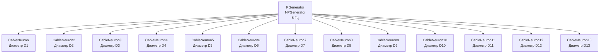

## CableNeuronMulti_Diameters_ver95 — влияние диаметра дендритов (версия 95)

**Путь:** `Bin/Configs/SpikeSamples/NM-Neurons/CableModel/CableNeuronMulti_Diameters_ver95`
**Статус валидации:** VALID (см. `Reports/SpikeSamples-Validation-Report.md`)

### Назначение конфигурации

Эта конфигурация демонстрирует **влияние диаметра дендритов на распространение сигнала** в многокомпартментной кабельной модели CSNM (версия 95). Конфигурация содержит несколько нейронов (`NPulseNeuronCableMulti`) с различным диаметром дендритов для сравнения их поведения.

Согласно [2] и `CSNM-Models.md`, диаметр дендритов влияет на:
- Сопротивление аксоплазмы (r_i ∝ 1/D²)
- Сопротивление мембраны (r_m ∝ 1/D)
- Постоянную длины (λ = √(r_m/r_i) ∝ √D)
- Скорость распространения сигнала

### Структура модели

Конфигурация содержит несколько кабельных нейронов с различным диаметром дендритов (версия 95):

### Отличия от других версий

Данная конфигурация использует параметры версии 95 библиотеки NMSDK. Для сравнения с другими версиями см.:
- `CableNeuronMulti_Diameters` — базовая версия
- `CableNeuronMulti_Diameters_ver93` — версия 93
- `CableNeuronMulti_Diameters_ver94` — версия 94
- `CableNeuronMulti_Diameters_ver101` — версия 101

### Связанные материалы

- Теория и функциональное описание:
  - [`Bin/Docs/SpikeSamples/CSNM-Models.md`](../../../../../Docs/SpikeSamples/CSNM-Models.md) — модели кабельных нейронов CSNM
- Описание конфигурации:
  - `Description.rtf` — подробное описание конфигурации (в формате RTF)

## Литература

1. Bakhshiev A. V., Demcheva A. A. Compartmental spiking neuron model CSNM // Izvestiya VUZ. Applied Nonlinear Dynamics, 2022, vol. 30, iss. 3, pp. 299-310. [DOI](https://doi.org/10.18500/0869-6632-2022-30-3-299-310)

2. Демчева А.А. Разработка сегментной спайковой модели нейрона на основе кабельной теории для нейроморфных систем: выпускная квалификационная работа магистра. 2023. [онлайн](https://doi.org/10.18720/SPBPU/3/2023/vr/vr23-5657)
