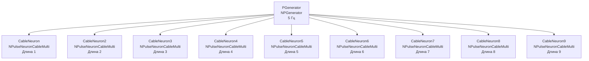

## CableNeuronMulti_II_Lengths — влияние длины дендритов (вариант II)

**Путь:** `Bin/Configs/SpikeSamples/NM-Neurons/CableModel/CableNeuronMulti_II_Lengths`
**Статус валидации:** VALID (см. `Reports/SpikeSamples-Validation-Report.md`)

### Назначение конфигурации

Эта конфигурация демонстрирует **влияние длины дендритов на распространение сигнала** в многокомпартментной кабельной модели CSNM (вариант II). Конфигурация является альтернативным вариантом `CableNeuronMulti_Lengths` с различными параметрами или структурой нейронов.

Согласно [2] и `CSNM-Models.md`, длина дендритов влияет на задержку и затухание сигнала при распространении от синапса к соме. Данная конфигурация позволяет количественно изучить эти эффекты с параметрами варианта II.

### Структура модели

Конфигурация содержит несколько кабельных нейронов с различной длиной дендритов (вариант II):

### Отличия от базовой версии

Данная конфигурация является вариантом II базовой конфигурации `CableNeuronMulti_Lengths`. Отличия могут включать:
- Различные параметры длины дендритов
- Различные параметры кабельного уравнения
- Различную структуру нейронов

### Связанные материалы

- Теория и функциональное описание:
  - [`Bin/Docs/SpikeSamples/CSNM-Models.md`](../../../../Docs/SpikeSamples/CSNM-Models.md) — модели кабельных нейронов CSNM
- Описание конфигурации:
  - `Description.rtf` — подробное описание конфигурации (в формате RTF)
- Связанные конфигурации:
  - `CableNeuronMulti_Lengths` — базовая версия
  - `CableNeuronMulti_II_Diameters` — влияние диаметра (вариант II)

## Литература

1. Bakhshiev A. V., Demcheva A. A. Compartmental spiking neuron model CSNM // Izvestiya VUZ. Applied Nonlinear Dynamics, 2022, vol. 30, iss. 3, pp. 299-310. [DOI](https://doi.org/10.18500/0869-6632-2022-30-3-299-310)

2. Демчева А.А. Разработка сегментной спайковой модели нейрона на основе кабельной теории для нейроморфных систем: выпускная квалификационная работа магистра. 2023. [онлайн](https://doi.org/10.18720/SPBPU/3/2023/vr/vr23-5657)
