## CableNeuronMulti_Lengths — влияние длины дендритов на распространение сигнала

**Путь:** `Bin/Configs/SpikeSamples/NM-Neurons/CableModel/CableNeuronMulti_Lengths`
**Статус валидации:** VALID (см. `Reports/SpikeSamples-Validation-Report.md`)

### Назначение конфигурации

Эта конфигурация демонстрирует **влияние длины дендритов на распространение сигнала** в многокомпартментной кабельной модели CSNM. Конфигурация содержит несколько нейронов (`NPulseNeuronCableMulti`) с различной длиной дендритов, что позволяет сравнивать их поведение и изучать влияние длины на задержку и затухание сигнала.

Согласно [2] и `CSNM-Models.md`, длина дендритов влияет на:
- Задержку распространения сигнала от синапса к соме
- Затухание амплитуды сигнала
- Временную обработку паттернов

Данная конфигурация позволяет количественно изучить эти эффекты.

  Bakhshiev A., Demcheva A., Stankevich L. (2022)
  International Conference on Neuroinformatics, pp. 327-333


  [2]
  Выпускная квалификационная работа магистра

### Структура модели

Конфигурация содержит несколько нейронов с различной длиной дендритов:

```mermaid
flowchart TD
    Generator[PGenerator<br/>NPGenerator] --> CableNeuron[CableNeuron<br/>NPulseNeuronCableMulti<br/>Длина дендрита 1]
    Generator --> CableNeuron2[CableNeuron2<br/>NPulseNeuronCableMulti<br/>Длина дендрита 2]
    Generator --> CableNeuron3[CableNeuron3<br/>NPulseNeuronCable<br/>Без дендритов]
    Generator --> CableNeuron4[CableNeuron4<br/>NPulseNeuronCableMulti<br/>Длина дендрита 3]
    Generator --> CableNeuron5[CableNeuron5<br/>NPulseNeuronCableMulti<br/>Длина дендрита 4]
    Generator --> CableNeuron6[CableNeuron6<br/>NPulseNeuronCableMulti<br/>Длина дендрита 5]
    Generator --> CableNeuron7[CableNeuron7<br/>NPulseNeuronCableMulti<br/>Длина дендрита 6]
    Generator --> CableNeuron8[CableNeuron8<br/>NPulseNeuronCableMulti<br/>Длина дендрита 7]
    Generator --> CableNeuron9[CableNeuron9<br/>NPulseNeuronCableMulti<br/>Длина дендрита 8]
    Generator --> CableNeuron10[CableNeuron10<br/>NPulseNeuronCableMulti<br/>Длина дендрита 9]
    Generator --> IaFNeuron[IaFNeuron<br/>NPulseNeuronIaF<br/>LIF модель]
    Generator --> PNeuron[PNeuron<br/>NSPNeuronBio<br/>Точечная модель]
```



#### Компоненты системы

**Входной генератор:**
- **PGenerator** (`NPGenerator`) — генератор импульсных сигналов
  - `Frequency` = 5 Гц — частота генерации импульсов
  - `Amplitude` = 1 — амплитуда импульсов
  - `PulseLength` = 0.001 с — длительность импульса
  - `AvgInterval` = 5 с — средний интервал между импульсами

**Кабельные нейроны с различной длиной дендритов:**
- **CableNeuron** (`NPulseNeuronCableMulti`) — длина дендрита 1 сегмент
- **CableNeuron2** (`NPulseNeuronCableMulti`) — длина дендрита 2 сегмента
- **CableNeuron3** (`NPulseNeuronCable`) — без дендритов (точечная конфигурация)
- **CableNeuron4** (`NPulseNeuronCableMulti`) — длина дендрита 3 сегмента
- **CableNeuron5** (`NPulseNeuronCableMulti`) — длина дендрита 4 сегмента
- **CableNeuron6** (`NPulseNeuronCableMulti`) — длина дендрита 5 сегментов
- **CableNeuron7** (`NPulseNeuronCableMulti`) — длина дендрита 6 сегментов
- **CableNeuron8** (`NPulseNeuronCableMulti`) — длина дендрита 7 сегментов
- **CableNeuron9** (`NPulseNeuronCableMulti`) — длина дендрита 8 сегментов
- **CableNeuron10** (`NPulseNeuronCableMulti`) — длина дендрита 9 сегментов

**Точечные нейроны (для сравнения):**
- **IaFNeuron** (`NPulseNeuronIaF`) — модель Leaky Integrate-and-Fire
- **PNeuron** (`NSPNeuronBio`) — биологически реалистичный точечный нейрон

### Кабельная теория и влияние длины дендритов

Согласно `CSNM-Models.md`, длина дендритов влияет на распространение сигнала следующим образом:

#### Затухание сигнала

Амплитуда сигнала затухает с расстоянием от синапса согласно экспоненциальному закону:

```
V(x) = V(0) · exp(-x/λ)
```

где:
- **V(x)** — потенциал на расстоянии x от синапса
- **V(0)** — потенциал в точке синапса
- **λ** — постоянная длины кабеля

#### Задержка распространения

Задержка распространения сигнала увеличивается с длиной дендрита. Для кабельного уравнения задержка пропорциональна длине дендрита и зависит от параметров кабеля.

#### Пространственные параметры

Согласно [2]:
- **Длина сегмента:** ~200 мкм (2·10⁻⁴ м)
- **Диаметр сегмента:** ~20 мкм (2·10⁻⁵ м)

Таким образом, каждый сегмент дендрита имеет длину ~200 мкм, и увеличение количества сегментов увеличивает общую длину дендрита.

### Эксперимент и моделируемые реакции

#### Цель эксперимента

Изучение влияния длины дендритов на:
- Задержку распространения сигнала от синапса к соме
- Затухание амплитуды сигнала
- Временные характеристики обработки входных паттернов
- Порог активации нейрона

#### Сценарии экспериментов

1. **Распространение сигнала по дендритам различной длины:**
   - Наблюдение затухания амплитуды сигнала с расстоянием от синапса
   - Измерение задержки распространения сигнала для разных длин дендритов
   - Анализ влияния длины дендрита на эти параметры

2. **Сравнение нейронов с разной длиной дендритов:**
   - Нейроны с длиной дендритов от 1 до 9 сегментов получают одинаковый входной сигнал
   - Сравнение времени генерации спайка
   - Анализ влияния длины дендрита на порог активации

3. **Сравнение с точечными моделями:**
   - Кабельные нейроны сравниваются с точечными моделями (IaFNeuron, PNeuron)
   - Анализ различий в поведении
   - Идентификация пространственных эффектов, связанных с длиной дендритов

4. **Влияние длины на временную обработку:**
   - Изучение влияния длины дендритов на способность нейрона обрабатывать временные паттерны
   - Анализ эффектов пространственной суммации сигналов

#### Ожидаемые результаты

- **Затухание сигнала:** амплитуда сигнала уменьшается с увеличением длины дендрита
- **Задержка распространения:** более длинные дендриты дают большую задержку распространения сигнала
- **Порог активации:** может зависеть от длины дендрита из-за затухания сигнала
- **Сравнение с точечной моделью:** для точечной конфигурации (без дендритов) поведение должно быть сходным с точечными моделями

### Параметры модели

Основные параметры задаются в `Parameters_00.xml`:

#### Параметры NPulseChannelCableMulti

- `EL` = -70·10⁻³ В — потенциал покоя
- `Ri` = 1·10⁵ Ом·м — удельное сопротивление аксоплазмы
- `Rm` = 1·10³ Ом·м² — удельное сопротивление мембраны
- `Cm` = 2,5·10⁻¹⁰ Ф — ёмкость мембраны
- `D` = 2·10⁻⁵ м — диаметр кабеля (~20 мкм)
- `ModelMaxLength` = 3·10⁻⁵ м — максимальная длина модели
- `dx` = 1·10⁻⁵ м — шаг пространственной дискретизации
- `CalcMode` = true — режим расчёта

#### Параметры NPulseMembraneCable

- `ExcChannelClassName` = "NPulseChannelCable" — класс возбуждающего канала
- `SynapseClassName` = "NSynapseCable" — класс синапса
- `FeedbackGain` = 0.7 — коэффициент обратной связи

#### Параметры NPulseLTZoneCable

- `Threshold` = -55·10⁻³ В — порог активации
- `ThresholdOff` = -70·10⁻³ В — порог деактивации

#### Структурные параметры нейронов

- `NumSomaMembraneParts` = 1 — количество соматических участков (для всех нейронов)
- `NumDendriteMembranePartsVec` — вектор длин дендритов (различается для разных нейронов: от 1 до 9 сегментов)

Точные численные значения можно смотреть в `Parameters_00.xml`.

### Результаты экспериментов

Согласно [2] и `CSNM-Models.md`:

#### Влияние длины дендритов

- **Увеличение длины дендритов** увеличивает задержку распространения сигнала
- **Затухание амплитуды** сигнала происходит экспоненциально с расстоянием от синапса
- **Порог активации** может изменяться в зависимости от длины дендрита из-за затухания сигнала

#### Пространственные эффекты

- Каждый сегмент дендрита имеет длину ~200 мкм
- Увеличение количества сегментов увеличивает общую длину дендрита и влияет на распространение сигнала
- Для точечной конфигурации (без дендритов) поведение должно быть сходным с точечными моделями

### Связанные материалы

- Теория и функциональное описание:
  - [`Bin/Docs/SpikeSamples/CSNM-Models.md`](../../../../../Docs/SpikeSamples/CSNM-Models.md) — детальное описание CSNM моделей и кабельной теории
  - [`Bin/Docs/SpikeSamples/NeuronReactions.md`](../../../../../Docs/SpikeSamples/NeuronReactions.md) — реакции одиночных нейронов
- Компонентная документация:
  - `Libraries/Nmsdk-PulseLib/Docs/Components/NPulseNeuronCableMulti.md` — документация компонента NPulseNeuronCableMulti
  - `Libraries/Nmsdk-PulseLib/Docs/Components/NPulseChannelCable.md` — документация компонента NPulseChannelCable
- Описание конфигурации:
  - `Description.rtf` — подробное описание конфигурации (в формате RTF)
- Связанные конфигурации:
  - `CableNeuronMulti_CSNM` — базовая CSNM модель с кабельным уравнением
  - `CableNeuronMulti_Diameters` — влияние диаметра дендритов
  - `CableNeuronMulti` — многокомпартментная кабельная модель

## Литература

1. Bakhshiev A. V., Demcheva A. A. Compartmental spiking neuron model CSNM // Izvestiya VUZ. Applied Nonlinear Dynamics, 2022, vol. 30, iss. 3, pp. 299-310. [DOI](https://doi.org/10.18500/0869-6632-2022-30-3-299-310)

2. Демчева А.А. Разработка сегментной спайковой модели нейрона на основе кабельной теории для нейроморфных систем: выпускная квалификационная работа магистра. 2023. [онлайн](https://doi.org/10.18720/SPBPU/3/2023/vr/vr23-5657)
