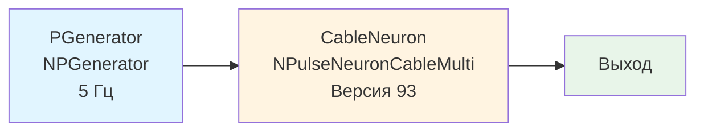

## CableNeuronMulti_Lengths_ver93 — влияние длины дендритов (версия 93)

**Путь:** `Bin/Configs/SpikeSamples/NM-Neurons/CableModel/CableNeuronMulti_Lengths_ver93`
**Статус валидации:** VALID (см. `Reports/SpikeSamples-Validation-Report.md`)

### Назначение конфигурации

Эта конфигурация демонстрирует **влияние длины дендритов на распространение сигнала** в многокомпартментной кабельной модели CSNM (версия 93). Конфигурация является вариантом `CableNeuronMulti_Lengths` с параметрами версии 93 библиотеки NMSDK.

Согласно [2] и `CSNM-Models.md`, длина дендритов влияет на задержку и затухание сигнала при распространении от синапса к соме. Данная конфигурация позволяет количественно изучить эти эффекты с параметрами версии 93.

### Структура модели

Конфигурация содержит кабельный нейрон с параметрами версии 93:

#### Компоненты системы

**Входной генератор:**
- **PGenerator** (`NPGenerator`) — генератор импульсных сигналов
  - `Frequency` = 5 Гц — частота генерации импульсов
  - `Amplitude` = 1 — амплитуда импульсов
  - `PulseLength` = 0.001 с — длительность импульса
  - `AvgInterval` = 5 с — средний интервал между импульсами

**Кабельный нейрон:**
- **CableNeuron** (`NPulseNeuronCableMulti`) — многокомпартментный кабельный нейрон
  - `NumSomaMembraneParts` = 1 — количество частей сомы
  - Версия 93 библиотеки NMSDK

### Эксперимент и моделируемые реакции

#### Цель эксперимента

Изучение влияния длины дендритов на распространение сигнала с параметрами версии 93:
- Задержка распространения сигнала от синапса к соме
- Затухание амплитуды сигнала при распространении
- Влияние длины дендритов на временную обработку паттернов

#### Сценарии экспериментов

1. **Распространение сигнала:**
   - Генератор создаёт импульсные сигналы с частотой 5 Гц
   - Наблюдение распространения сигнала по дендритам
   - Анализ задержки и затухания сигнала

2. **Влияние длины дендритов:**
   - Сравнение нейронов с различной длиной дендритов
   - Наблюдение влияния длины на характеристики распространения
   - Анализ временных характеристик

#### Ожидаемые результаты

- **Задержка:** увеличение длины дендритов должно увеличивать задержку распространения сигнала
- **Затухание:** увеличение длины дендритов должно увеличивать затухание амплитуды сигнала
- **Временная обработка:** длина дендритов влияет на временную обработку паттернов

### Параметры модели

Основные параметры задаются в `Parameters.xml`:

#### Параметры генератора импульсов

- **Frequency:** 5 Гц (частота генерации импульсов)
- **Amplitude:** 1 (амплитуда импульсов)
- **PulseLength:** 0.001 с (длительность импульса)
- **AvgInterval:** 5 с (средний интервал между импульсами)

#### Параметры кабельного нейрона

- **NumSomaMembraneParts:** 1 (количество частей сомы)
- Параметры длины дендритов (задаются в `Parameters.xml`)
- Параметры кабельного уравнения для версии 93

Точные численные значения можно смотреть в `Parameters.xml`.

### Отличия от других версий

Данная конфигурация использует параметры версии 93 библиотеки NMSDK. Отличия от других версий могут включать:
- Изменения в реализации кабельного уравнения
- Изменения в параметрах по умолчанию
- Изменения в структуре компонентов

Для сравнения с другими версиями см.:
- `CableNeuronMulti_Lengths` — базовая версия
- `CableNeuronMulti_Lengths_ver94` — версия 94
- `CableNeuronMulti_Lengths_ver95` — версия 95
- `CableNeuronMulti_Lenghts_ver101` — версия 101

### Результаты экспериментов

Согласно [2] и `CSNM-Models.md`:

#### Влияние длины дендритов

- Увеличение длины дендритов увеличивает задержку распространения сигнала
- Увеличение длины дендритов увеличивает затухание амплитуды сигнала
- Длина дендритов влияет на временную обработку паттернов

### Связанные материалы

- Теория и функциональное описание:
  - [`Bin/Docs/SpikeSamples/CSNM-Models.md`](../../../../../Docs/SpikeSamples/CSNM-Models.md) — модели кабельных нейронов CSNM
- Описание конфигурации:
  - `Description.rtf` — подробное описание конфигурации (в формате RTF)
- Связанные конфигурации:
  - `CableNeuronMulti_Lengths` — базовая версия
  - `CableNeuronMulti_Lengths_ver94` — версия 94
  - `CableNeuronMulti_Lengths_ver95` — версия 95
  - `CableNeuronMulti_Lenghts_ver101` — версия 101
  - `CableNeuronMulti_Diameters_ver93` — влияние диаметра (версия 93)

## Литература

1. Bakhshiev A. V., Demcheva A. A. Compartmental spiking neuron model CSNM // Izvestiya VUZ. Applied Nonlinear Dynamics, 2022, vol. 30, iss. 3, pp. 299-310. [DOI](https://doi.org/10.18500/0869-6632-2022-30-3-299-310)

2. Демчева А.А. Разработка сегментной спайковой модели нейрона на основе кабельной теории для нейроморфных систем: выпускная квалификационная работа магистра. 2023. [онлайн](https://doi.org/10.18720/SPBPU/3/2023/vr/vr23-5657)
