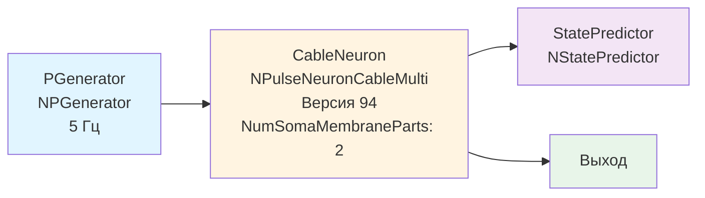

## CableNeuronMulti_Lengths_ver94 — влияние длины дендритов (версия 94)

**Путь:** `Bin/Configs/SpikeSamples/NM-Neurons/CableModel/CableNeuronMulti_Lengths_ver94`
**Статус валидации:** VALID (см. `Reports/SpikeSamples-Validation-Report.md`)

### Назначение конфигурации

Эта конфигурация демонстрирует **влияние длины дендритов на распространение сигнала** в многокомпартментной кабельной модели CSNM (версия 94). Конфигурация является вариантом `CableNeuronMulti_Lengths` с параметрами версии 94 библиотеки NMSDK и включает компонент `NStatePredictor` для предсказания состояния.

Согласно [2] и `CSNM-Models.md`, длина дендритов влияет на задержку и затухание сигнала при распространении от синапса к соме. Данная конфигурация позволяет количественно изучить эти эффекты с параметрами версии 94.

### Структура модели

Конфигурация содержит кабельный нейрон с параметрами версии 94 и компонент предсказания состояния:

#### Компоненты системы

**Входной генератор:**
- **PGenerator** (`NPGenerator`) — генератор импульсных сигналов (5 Гц)

**Кабельный нейрон:**
- **CableNeuron** (`NPulseNeuronCableMulti`) — многокомпартментный кабельный нейрон
  - `NumSomaMembraneParts` = 2 — количество частей сомы
  - Версия 94 библиотеки NMSDK

**Компонент предсказания состояния:**
- **StatePredictor** (`NStatePredictor`) — компонент для предсказания состояния нейрона

### Отличия от других версий

Данная конфигурация использует параметры версии 94 библиотеки NMSDK. Отличия от версии 93:
- Увеличенное количество частей сомы (`NumSomaMembraneParts` = 2 вместо 1)
- Добавлен компонент `NStatePredictor` для предсказания состояния
- Изменения в реализации кабельного уравнения для версии 94

### Связанные материалы

- Теория и функциональное описание:
  - [`Bin/Docs/SpikeSamples/CSNM-Models.md`](../../../../Docs/SpikeSamples/CSNM-Models.md) — модели кабельных нейронов CSNM
- Описание конфигурации:
  - `Description.rtf` — подробное описание конфигурации (в формате RTF)
- Связанные конфигурации:
  - `CableNeuronMulti_Lengths` — базовая версия
  - `CableNeuronMulti_Lengths_ver93` — версия 93
  - `CableNeuronMulti_Lengths_ver95` — версия 95
  - `CableNeuronMulti_Lenghts_ver101` — версия 101

## Литература

1. Bakhshiev A. V., Demcheva A. A. Compartmental spiking neuron model CSNM // Izvestiya VUZ. Applied Nonlinear Dynamics, 2022, vol. 30, iss. 3, pp. 299-310. [DOI](https://doi.org/10.18500/0869-6632-2022-30-3-299-310)

2. Демчева А.А. Разработка сегментной спайковой модели нейрона на основе кабельной теории для нейроморфных систем: выпускная квалификационная работа магистра. 2023. [онлайн](https://doi.org/10.18720/SPBPU/3/2023/vr/vr23-5657)
