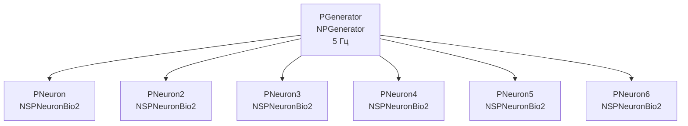

## CableNeuronMulti_NSPNeuronBio2 — сравнение с NSPNeuronBio2

**Путь:** `Bin/Configs/SpikeSamples/NM-Neurons/CableModel/CableNeuronMulti_NSPNeuronBio2`
**Статус валидации:** VALID (см. `Reports/SpikeSamples-Validation-Report.md`)

### Назначение конфигурации

Эта конфигурация демонстрирует **сравнение кабельной модели CSNM с точечной моделью NSPNeuronBio2**. Конфигурация содержит несколько нейронов `NSPNeuronBio2` (биологически реалистичная точечная модель) для сравнения с кабельными моделями.

Согласно [2] и `CSNM-Models.md`, кабельные модели позволяют учитывать пространственную структуру нейрона, в то время как точечные модели упрощают структуру до одной точки. Данная конфигурация позволяет сравнивать поведение этих моделей.

### Структура модели

Конфигурация содержит несколько нейронов `NSPNeuronBio2` для сравнения:

### Эксперимент и моделируемые реакции

#### Цель эксперимента

Сравнение точечной модели NSPNeuronBio2 с кабельными моделями:
- Сравнение реакций на одинаковые входные сигналы
- Анализ различий в обработке сигналов
- Изучение влияния пространственной структуры на поведение нейрона

#### Ожидаемые результаты

- **Упрощение модели:** точечная модель упрощает пространственную структуру нейрона
- **Различия в реакциях:** кабельные модели могут демонстрировать более сложное поведение из-за учета пространственной структуры
- **Применимость:** точечные модели могут быть достаточными для некоторых задач, в то время как кабельные модели необходимы для задач, требующих учета пространственной структуры

### Связанные материалы

- Теория и функциональное описание:
  - [`Bin/Docs/SpikeSamples/CSNM-Models.md`](../../../../../Docs/SpikeSamples/CSNM-Models.md) — модели кабельных нейронов CSNM
- Описание конфигурации:
  - `Description.rtf` — подробное описание конфигурации (в формате RTF)
- Связанные конфигурации:
  - `CableNeuronMulti_NSPNeuronBio2_syns` — сравнение с NSPNeuronBio2 с синапсами
  - `CableNeuronMulti` — базовая кабельная модель для сравнения

## Литература

1. Bakhshiev A. V., Demcheva A. A. Compartmental spiking neuron model CSNM // Izvestiya VUZ. Applied Nonlinear Dynamics, 2022, vol. 30, iss. 3, pp. 299-310. [DOI](https://doi.org/10.18500/0869-6632-2022-30-3-299-310)

2. Демчева А.А. Разработка сегментной спайковой модели нейрона на основе кабельной теории для нейроморфных систем: выпускная квалификационная работа магистра. 2023. [онлайн](https://doi.org/10.18720/SPBPU/3/2023/vr/vr23-5657)
