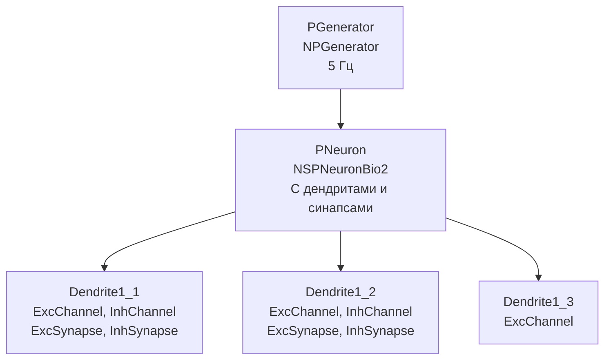

## CableNeuronMulti_NSPNeuronBio2_syns — сравнение с NSPNeuronBio2 (с синапсами)

**Путь:** `Bin/Configs/SpikeSamples/NM-Neurons/CableModel/CableNeuronMulti_NSPNeuronBio2_syns`
**Статус валидации:** VALID (см. `Reports/SpikeSamples-Validation-Report.md`)

### Назначение конфигурации

Эта конфигурация демонстрирует **сравнение кабельной модели CSNM с точечной моделью NSPNeuronBio2 с акцентом на синапсы**. Конфигурация содержит нейрон `NSPNeuronBio2` с дендритами и синапсами для сравнения с кабельными моделями.

Согласно [2] и `CSNM-Models.md`, точечные модели могут включать дендриты и синапсы, но без учета пространственного распространения сигнала. Данная конфигурация позволяет сравнивать поведение точечной модели с синапсами и кабельных моделей.

### Структура модели

Конфигурация содержит нейрон `NSPNeuronBio2` с дендритами и синапсами:

### Эксперимент и моделируемые реакции

#### Цель эксперимента

Сравнение точечной модели NSPNeuronBio2 с синапсами и кабельных моделей:
- Сравнение обработки сигналов через синапсы
- Анализ влияния дендритов на обработку сигналов
- Изучение различий в пространственной обработке сигналов

#### Ожидаемые результаты

- **Обработка синапсов:** точечная модель обрабатывает синапсы без учета пространственного распространения
- **Влияние дендритов:** дендриты в точечной модели могут влиять на обработку сигналов, но без учета пространственного распространения
- **Различия с кабельными моделями:** кабельные модели учитывают пространственное распространение сигнала через дендриты

### Связанные материалы

- Теория и функциональное описание:
  - [`Bin/Docs/SpikeSamples/CSNM-Models.md`](../../../../../Docs/SpikeSamples/CSNM-Models.md) — модели кабельных нейронов CSNM
- Описание конфигурации:
  - `Description.rtf` — подробное описание конфигурации (в формате RTF)
- Связанные конфигурации:
  - `CableNeuronMulti_NSPNeuronBio2` — сравнение с NSPNeuronBio2 без акцента на синапсы
  - `CableNeuronMulti` — базовая кабельная модель для сравнения

## Литература

1. Bakhshiev A. V., Demcheva A. A. Compartmental spiking neuron model CSNM // Izvestiya VUZ. Applied Nonlinear Dynamics, 2022, vol. 30, iss. 3, pp. 299-310. [DOI](https://doi.org/10.18500/0869-6632-2022-30-3-299-310)

2. Демчева А.А. Разработка сегментной спайковой модели нейрона на основе кабельной теории для нейроморфных систем: выпускная квалификационная работа магистра. 2023. [онлайн](https://doi.org/10.18720/SPBPU/3/2023/vr/vr23-5657)
