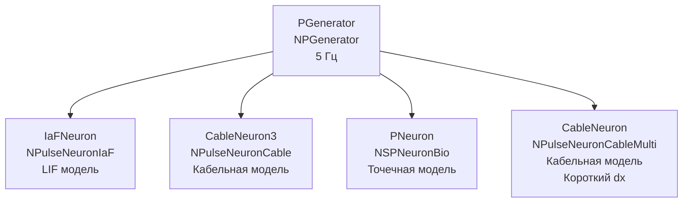

## CableNeuronMulti_short_dx — кабельная модель с коротким шагом дискретизации

**Путь:** `Bin/Configs/SpikeSamples/NM-Neurons/CableModel/CableNeuronMulti_short_dx`
**Статус валидации:** VALID (см. `Reports/SpikeSamples-Validation-Report.md`)

### Назначение конфигурации

Эта конфигурация демонстрирует **кабельную модель CSNM с коротким шагом дискретизации (dx)**. Конфигурация содержит сравнение различных моделей нейронов (LIF, кабельная модель, биологически реалистичная точечная модель) для изучения влияния шага дискретизации на точность решения кабельного уравнения.

Согласно [2] и `CSNM-Models.md`, шаг дискретизации влияет на точность численного решения кабельного уравнения. Уменьшение шага дискретизации увеличивает точность, но также увеличивает вычислительную сложность. Данная конфигурация позволяет изучать влияние короткого шага дискретизации.

### Структура модели

Конфигурация содержит сравнение различных моделей нейронов:

### Эксперимент и моделируемые реакции

#### Цель эксперимента

Изучение влияния короткого шага дискретизации на точность кабельной модели:
- Сравнение точности решения кабельного уравнения с различными шагами дискретизации
- Анализ влияния шага дискретизации на вычислительную сложность
- Изучение компромисса между точностью и производительностью

#### Ожидаемые результаты

- **Точность:** уменьшение шага дискретизации должно увеличивать точность решения кабельного уравнения
- **Вычислительная сложность:** уменьшение шага дискретизации увеличивает количество компартментов и вычислительную сложность
- **Компромисс:** необходимо найти баланс между точностью и производительностью

### Связанные материалы

- Теория и функциональное описание:
  - [`Bin/Docs/SpikeSamples/CSNM-Models.md`](../../../../../Docs/SpikeSamples/CSNM-Models.md) — модели кабельных нейронов CSNM
- Описание конфигурации:
  - `Description.rtf` — подробное описание конфигурации (в формате RTF)
- Связанные конфигурации:
  - `CableNeuronMulti` — базовая кабельная модель для сравнения
  - `CableNeuronParametersTest` — тестирование параметров кабельной модели

## Литература

1. Bakhshiev A. V., Demcheva A. A. Compartmental spiking neuron model CSNM // Izvestiya VUZ. Applied Nonlinear Dynamics, 2022, vol. 30, iss. 3, pp. 299-310. [DOI](https://doi.org/10.18500/0869-6632-2022-30-3-299-310)

2. Демчева А.А. Разработка сегментной спайковой модели нейрона на основе кабельной теории для нейроморфных систем: выпускная квалификационная работа магистра. 2023. [онлайн](https://doi.org/10.18720/SPBPU/3/2023/vr/vr23-5657)
