## CableNeuronMulti_ver101_Nd_matching — влияние количества дендритов с matching (версия 101)

**Путь:** `Bin/Configs/SpikeSamples/NM-Neurons/CableModel/CableNeuronMulti_ver101_Nd_matching`
**Статус валидации:** VALID (см. `Reports/SpikeSamples-Validation-Report.md`)

### Назначение конфигурации

Эта конфигурация демонстрирует **влияние количества дендритов (Nd) с параметром matching на поведение нейрона** в многокомпартментной кабельной модели CSNM (версия 101). Конфигурация содержит множество нейронов (`NPulseNeuronCableMulti`) с различным количеством дендритов для сравнения их поведения.

Согласно [2] и `CSNM-Models.md`, количество дендритов влияет на пространственную структуру нейрона и обработку сигналов. Параметр matching может использоваться для согласования параметров между различными частями нейрона. Данная конфигурация позволяет количественно изучить эти эффекты с параметрами версии 101.

### Структура модели

Конфигурация содержит множество кабельных нейронов с различным количеством дендритов и параметром matching (версия 101):

```mermaid
flowchart TD
    Generator[PGenerator<br/>NPGenerator<br/>5 Гц] --> CableNeuron[CableNeuron<br/>NPulseNeuronCableMulti<br/>Nd=1, matching]
    Generator --> CableNeuron2[CableNeuron2<br/>NPulseNeuronCableMulti<br/>Nd=2, matching]
    Generator --> CableNeuron3[CableNeuron3<br/>NPulseNeuronCableMulti<br/>Nd=3, matching]
    Generator --> CableNeuron4[CableNeuron4<br/>NPulseNeuronCableMulti<br/>Nd=4, matching]
    Generator --> CableNeuron5[CableNeuron5<br/>NPulseNeuronCableMulti<br/>Nd=5, matching]
    Generator --> CableNeuron6[CableNeuron6<br/>NPulseNeuronCableMulti<br/>Nd=6, matching]
    Generator --> CableNeuron7[CableNeuron7<br/>NPulseNeuronCableMulti<br/>Nd=7, matching]
    Generator --> CableNeuron8[CableNeuron8<br/>NPulseNeuronCableMulti<br/>Nd=8, matching]
    Generator --> CableNeuron9[CableNeuron9<br/>NPulseNeuronCableMulti<br/>Nd=9, matching]
    Generator --> CableNeuron10[CableNeuron10<br/>NPulseNeuronCableMulti<br/>Nd=10, matching]
    Generator --> CableNeuron11[CableNeuron11<br/>NPulseNeuronCableMulti<br/>Nd=11, matching]
    Generator --> CableNeuron12[CableNeuron12<br/>NPulseNeuronCableMulti<br/>Nd=12, matching]
    Generator --> CableNeuron13[CableNeuron13<br/>NPulseNeuronCableMulti<br/>Nd=13, matching]
    Generator --> CableNeuron14[CableNeuron14<br/>NPulseNeuronCableMulti<br/>Nd=14, matching]
    Generator --> CableNeuron15[CableNeuron15<br/>NPulseNeuronCableMulti<br/>Nd=15, matching]
    Generator --> CableNeuron16[CableNeuron16<br/>NPulseNeuronCableMulti<br/>Nd=16, matching]
    Generator --> CableNeuron17[CableNeuron17<br/>NPulseNeuronCableMulti<br/>Nd=17, matching]
    Generator --> CableNeuron18[CableNeuron18<br/>NPulseNeuronCableMulti<br/>Nd=18, matching]
    Generator --> CableNeuron19[CableNeuron19<br/>NPulseNeuronCableMulti<br/>Nd=19, matching]
    Generator --> CableNeuron20[CableNeuron20<br/>NPulseNeuronCableMulti<br/>Nd=20, matching]
    Generator --> CableNeuron21[CableNeuron21<br/>NPulseNeuronCableMulti<br/>Nd=21, matching]
    Generator --> CableNeuron22[CableNeuron22<br/>NPulseNeuronCableMulti<br/>Nd=22, matching]
    Generator --> CableNeuron23[CableNeuron23<br/>NPulseNeuronCableMulti<br/>Nd=23, matching]
    Generator --> CableNeuron24[CableNeuron24<br/>NPulseNeuronCableMulti<br/>Nd=24, matching]
    Generator --> CableNeuron25[CableNeuron25<br/>NPulseNeuronCableMulti<br/>Nd=25, matching]
    Generator --> CableNeuron26[CableNeuron26<br/>NPulseNeuronCableMulti<br/>Nd=26, matching]
    Generator --> CableNeuron27[CableNeuron27<br/>NPulseNeuronCableMulti<br/>Nd=27, matching]
    Generator --> CableNeuron28[CableNeuron28<br/>NPulseNeuronCableMulti<br/>Nd=28, matching]
    Generator --> CableNeuron29[CableNeuron29<br/>NPulseNeuronCableMulti<br/>Nd=29, matching]
    Generator --> CableNeuron30[CableNeuron30<br/>NPulseNeuronCableMulti<br/>Nd=30, matching]
```

### Отличия от версии без matching

Данная конфигурация использует параметр matching для согласования параметров между различными частями нейрона. Отличия от версии без matching могут включать:
- Согласование параметров между сомой и дендритами
- Согласование параметров между различными дендритами
- Улучшение согласованности поведения нейрона

### Связанные материалы

- Теория и функциональное описание:
  - [`Bin/Docs/SpikeSamples/CSNM-Models.md`](../../../../Docs/SpikeSamples/CSNM-Models.md) — модели кабельных нейронов CSNM
- Описание конфигурации:
  - `Description.rtf` — подробное описание конфигурации (в формате RTF)
- Связанные конфигурации:
  - `CableNeuronMulti_ver101_Nd` — влияние количества дендритов без matching (версия 101)
  - `CableNeuronMulti_ver101_Nsyn` — влияние количества синапсов (версия 101)

## Литература

1. Bakhshiev A. V., Demcheva A. A. Compartmental spiking neuron model CSNM // Izvestiya VUZ. Applied Nonlinear Dynamics, 2022, vol. 30, iss. 3, pp. 299-310. [DOI](https://doi.org/10.18500/0869-6632-2022-30-3-299-310)

2. Демчева А.А. Разработка сегментной спайковой модели нейрона на основе кабельной теории для нейроморфных систем: выпускная квалификационная работа магистра. 2023. [онлайн](https://doi.org/10.18720/SPBPU/3/2023/vr/vr23-5657)
