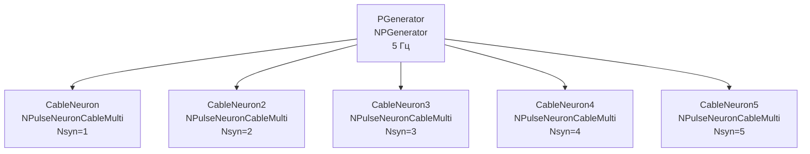

## CableNeuronMulti_ver101_Nsyn — влияние количества синапсов (версия 101)

**Путь:** `Bin/Configs/SpikeSamples/NM-Neurons/CableModel/CableNeuronMulti_ver101_Nsyn`
**Статус валидации:** VALID (см. `Reports/SpikeSamples-Validation-Report.md`)

### Назначение конфигурации

Эта конфигурация демонстрирует **влияние количества синапсов (Nsyn) на поведение нейрона** в многокомпартментной кабельной модели CSNM (версия 101). Конфигурация содержит несколько нейронов (`NPulseNeuronCableMulti`) с различным количеством синапсов для сравнения их поведения.

Согласно [2] и `CSNM-Models.md`, количество синапсов влияет на интеграцию входных сигналов и обработку паттернов. Данная конфигурация позволяет количественно изучить эти эффекты с параметрами версии 101.

### Структура модели

Конфигурация содержит несколько кабельных нейронов с различным количеством синапсов (версия 101):

### Эксперимент и моделируемые реакции

#### Цель эксперимента

Изучение влияния количества синапсов на поведение нейрона:
- Влияние количества синапсов на интеграцию входных сигналов
- Влияние на обработку паттернов
- Влияние на пространственную суммацию сигналов

#### Ожидаемые результаты

- **Интеграция сигналов:** увеличение количества синапсов увеличивает возможности интеграции входных сигналов
- **Обработка паттернов:** большее количество синапсов позволяет обрабатывать более сложные паттерны
- **Пространственная суммация:** количество синапсов влияет на пространственную суммацию сигналов

### Связанные материалы

- Теория и функциональное описание:
  - [`Bin/Docs/SpikeSamples/CSNM-Models.md`](../../../../../Docs/SpikeSamples/CSNM-Models.md) — модели кабельных нейронов CSNM
- Описание конфигурации:
  - `Description.rtf` — подробное описание конфигурации (в формате RTF)
- Связанные конфигурации:
  - `CableNeuronMulti_ver101_Nd` — влияние количества дендритов (версия 101)
  - `CableNeuronMulti_ver101_Nd_matching` — влияние количества дендритов с matching (версия 101)

## Литература

1. Bakhshiev A. V., Demcheva A. A. Compartmental spiking neuron model CSNM // Izvestiya VUZ. Applied Nonlinear Dynamics, 2022, vol. 30, iss. 3, pp. 299-310. [DOI](https://doi.org/10.18500/0869-6632-2022-30-3-299-310)

2. Демчева А.А. Разработка сегментной спайковой модели нейрона на основе кабельной теории для нейроморфных систем: выпускная квалификационная работа магистра. 2023. [онлайн](https://doi.org/10.18720/SPBPU/3/2023/vr/vr23-5657)
