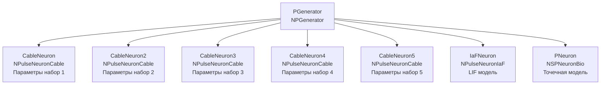

## CableNeuronParametersTest — тестирование параметров кабельной модели

**Путь:** `Bin/Configs/SpikeSamples/NM-Neurons/CableModel/CableNeuronParametersTest`
**Статус валидации:** VALID (см. `Reports/SpikeSamples-Validation-Report.md`)

### Назначение конфигурации

Эта конфигурация предназначена для **тестирования различных параметров кабельной модели нейрона** (`NPulseNeuronCable`). Конфигурация содержит несколько нейронов с различными параметрами кабельного уравнения, что позволяет изучать влияние параметров на поведение модели и проверять корректность реализации кабельной теории.

Согласно [2], параметры кабельного уравнения (R_i, R_m, C_m, D) влияют на распространение сигнала и поведение нейрона. Данная конфигурация позволяет систематически тестировать влияние этих параметров.

  Bakhshiev A., Demcheva A., Stankevich L. (2022)
  International Conference on Neuroinformatics, pp. 327-333

  [2]
  Выпускная квалификационная работа магистра

### Структура модели

Конфигурация содержит несколько нейронов с различными параметрами:

#### Компоненты системы

**Входной генератор:**
- **PGenerator** (`NPGenerator`) — генератор импульсных сигналов
  - `Frequency` = 5 Гц — частота генерации импульсов
  - `Amplitude` = 1 — амплитуда импульсов
  - `PulseLength` = 0.001 с — длительность импульса
  - `AvgInterval` = 5 с — средний интервал между импульсами

**Кабельные нейроны с различными параметрами:**
- **CableNeuron** (`NPulseNeuronCable`) — параметры набор 1
- **CableNeuron2** (`NPulseNeuronCable`) — параметры набор 2
- **CableNeuron3** (`NPulseNeuronCable`) — параметры набор 3
- **CableNeuron4** (`NPulseNeuronCable`) — параметры набор 4
- **CableNeuron5** (`NPulseNeuronCable`) — параметры набор 5

**Точечные нейроны (для сравнения):**
- **IaFNeuron** (`NPulseNeuronIaF`) — модель Leaky Integrate-and-Fire
- **PNeuron** (`NSPNeuronBio`) — биологически реалистичный точечный нейрон

### Кабельная теория и параметры модели

Согласно `CSNM-Models.md`, параметры кабельного уравнения влияют на распространение сигнала следующим образом:

#### Основные параметры кабельного уравнения

- **R_i** — удельное сопротивление аксоплазмы (Ом·м)
  - Влияет на сопротивление аксоплазмы: r_i = (4R_i)/(πD²)
  - Увеличение R_i увеличивает сопротивление аксоплазмы

- **R_m** — удельное сопротивление мембраны (Ом·м²)
  - Влияет на сопротивление мембраны: r_m = R_m/(πD)
  - Увеличение R_m увеличивает сопротивление мембраны

- **C_m** — удельная ёмкость мембраны (Ф/м²)
  - Влияет на мембранную постоянную времени: τ_m = r_m·C_m
  - Увеличение C_m увеличивает постоянную времени

- **D** — диаметр кабеля (м)
  - Влияет на все параметры кабеля через зависимости от диаметра
  - Увеличение D увеличивает постоянную длины (λ ∝ √D)

#### Постоянная длины и постоянная времени

- **Постоянная длины:** λ = √(r_m/r_i) = √(R_m·D/(4R_i))
- **Мембранная постоянная времени:** τ_m = r_m·C_m = (R_m·C_m)/(πD)

Эти параметры определяют затухание и временную динамику сигнала.

### Эксперимент и моделируемые реакции

#### Цель эксперимента

Тестирование влияния различных параметров кабельного уравнения на:
- Постоянную длины кабеля (λ)
- Мембранную постоянную времени (τ_m)
- Затухание амплитуды сигнала с расстоянием
- Временную динамику мембранного потенциала
- Порог активации нейрона

#### Сценарии экспериментов

1. **Тестирование влияния R_i (сопротивление аксоплазмы):**
   - Изменение R_i при фиксированных остальных параметрах
   - Наблюдение влияния на постоянную длины и затухание сигнала

2. **Тестирование влияния R_m (сопротивление мембраны):**
   - Изменение R_m при фиксированных остальных параметрах
   - Наблюдение влияния на постоянную длины и мембранную постоянную времени

3. **Тестирование влияния C_m (ёмкость мембраны):**
   - Изменение C_m при фиксированных остальных параметрах
   - Наблюдение влияния на мембранную постоянную времени и временную динамику

4. **Тестирование влияния D (диаметр):**
   - Изменение D при фиксированных остальных параметрах
   - Наблюдение влияния на все параметры кабеля

5. **Сравнение с точечными моделями:**
   - Кабельные нейроны сравниваются с точечными моделями
   - Проверка соответствия поведения теоретическим предсказаниям

#### Ожидаемые результаты

- **Влияние параметров:** параметры должны влиять на поведение модели в соответствии с кабельной теорией
- **Соответствие теории:** результаты должны соответствовать теоретическим предсказаниям кабельного уравнения
- **Сравнение с точечными моделями:** для точечной конфигурации поведение должно быть сходным с точечными моделями

### Параметры модели

Основные параметры задаются в `Parameters_00.xml`:

#### Параметры NPulseChannelCable

Для каждого нейрона параметры могут различаться:

- `EL` = -70·10⁻³ В — потенциал покоя
- `Ri` = 1·10⁵ Ом·м — удельное сопротивление аксоплазмы (может варьироваться)
- `Rm` = 1·10³ Ом·м² — удельное сопротивление мембраны (может варьироваться)
- `Cm` = 2,5·10⁻¹⁰ Ф — ёмкость мембраны (может варьироваться)
- `D` = 2·10⁻⁵ м — диаметр кабеля (~20 мкм, может варьироваться)
- `ModelMaxLength` = 2·10⁻⁴ м — максимальная длина модели (~200 мкм)
- `dx` = 1·10⁻⁵ м — шаг пространственной дискретизации
- `CalcMode` = true — режим расчёта (расчёт CableMembraneResistance из D)

#### Параметры NPulseMembraneCable

- `ExcChannelClassName` = "NPulseChannelCable" — класс возбуждающего канала
- `SynapseClassName` = "NSynapseCable" — класс синапса
- `FeedbackGain` = 0.7 — коэффициент обратной связи

#### Параметры NPulseLTZoneCable

- `Threshold` = -55·10⁻³ В — порог активации
- `ThresholdOff` = -70·10⁻³ В — порог деактивации

#### Структурные параметры

- `NumSomaMembraneParts` = 1 — количество соматических участков
- `NumDendriteMembranePartsVec` = 0 — без дендритов (точечная конфигурация) или с дендритами

Точные численные значения параметров для каждого нейрона можно смотреть в `Parameters_00.xml`.

### Результаты экспериментов

Согласно [2]:

#### Воспроизведение основных закономерностей

- Реализованная модель воспроизводит основные закономерности распространения сигнала при различных параметрах
- Результаты сравнения модели с классической моделью Integrate-and-Fire подтверждают работоспособность реализованной модели

#### Влияние параметров

- Параметры кабельного уравнения влияют на поведение модели в соответствии с кабельной теорией
- Изменение параметров приводит к предсказуемым изменениям в поведении модели

### Связанные материалы

- Теория и функциональное описание:
  - [`Bin/Docs/SpikeSamples/CSNM-Models.md`](../../../../Docs/SpikeSamples/CSNM-Models.md) — детальное описание CSNM моделей и кабельной теории
  - [`Bin/Docs/SpikeSamples/NeuronReactions.md`](../../../../Docs/SpikeSamples/NeuronReactions.md) — реакции одиночных нейронов
- Компонентная документация:
  - `Libraries/Nmsdk-PulseLib/Docs/Components/NPulseNeuronCable.md` — документация компонента NPulseNeuronCable
  - `Libraries/Nmsdk-PulseLib/Docs/Components/NPulseChannelCable.md` — документация компонента NPulseChannelCable
- Описание конфигурации:
  - `Description.rtf` — подробное описание конфигурации (в формате RTF)
- Связанные конфигурации:
  - `CableNeuronMulti_CSNM` — базовая CSNM модель с кабельным уравнением
  - `CableNeuronMulti_Lengths` — влияние длины дендритов
  - `CableNeuronMulti_Diameters` — влияние диаметра дендритов

## Литература

1. Bakhshiev A. V., Demcheva A. A. Compartmental spiking neuron model CSNM // Izvestiya VUZ. Applied Nonlinear Dynamics, 2022, vol. 30, iss. 3, pp. 299-310. [DOI](https://doi.org/10.18500/0869-6632-2022-30-3-299-310)

2. Демчева А.А. Разработка сегментной спайковой модели нейрона на основе кабельной теории для нейроморфных систем: выпускная квалификационная работа магистра. 2023. [онлайн](https://doi.org/10.18720/SPBPU/3/2023/vr/vr23-5657)
