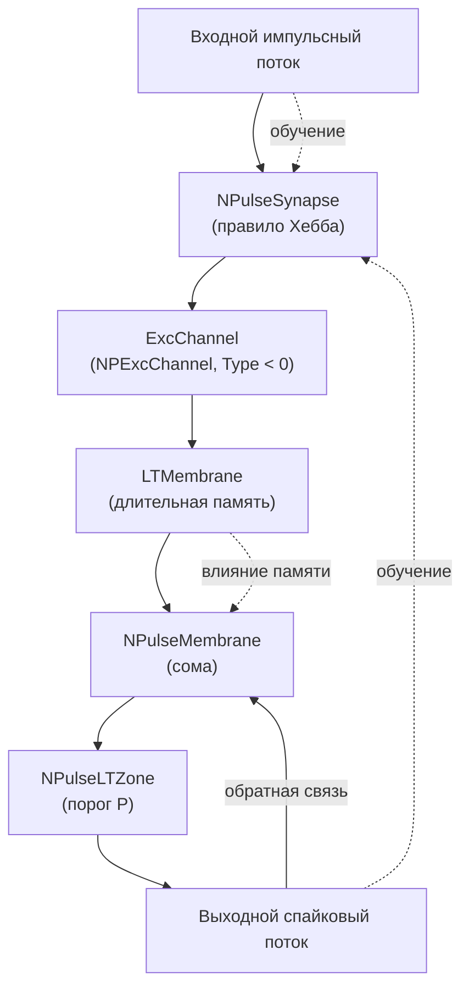

## NM-PN-01-HebbNeuron-1M1St1In1 — нейрон с правилом Хебба

**Путь:** `Bin/Configs/SpikeSamples/NM-Neurons/NM-PN-01-HebbNeuron-1M1St1In1`
**Статус валидации:** VALID (см. `Reports/SpikeSamples-Validation-Report.md`)

### Назначение конфигурации

Эта конфигурация реализует **спайковый нейрон с правилом Хебба** с одним соматическим участком мембраны (1M), одним синапсом (1St) и одним входным каналом (1In1). Она демонстрирует влияние правила Хебба на изменение весов синапсов и реакции нейрона.

Согласно правилу Хебба, синаптические связи усиливаются, когда пресинаптический и постсинаптический нейроны активируются одновременно. Данная конфигурация позволяет изучать влияние этого правила обучения на поведение нейрона и формирование ассоциативных связей.

### Структура модели

- **Нейрон:** `NPHebbNeuron` (специализированный нейрон с правилом Хебба)
  - один соматический участок мембраны (`Soma1`);
  - длительная мембранная память (`LTMembrane`);
  - низкопороговая зона `NPulseLTZone` (генератор спайков);
  - генераторы возбуждающего и тормозного потенциалов `NConstGenerator`.
- **Мембраны:** `NPulseMembrane` / `NPulseMembraneCommon`
  - один соматический участок мембраны с парой ионных каналов;
  - длительная мембранная память с каналами и синапсами;
  - возбуждающие каналы `ExcChannel` (`NPExcChannel`, Type = −1);
  - тормозные каналы `InhChannel` (`NPInhChannel`, Type = +1).
- **Синапсы:** `NPulseSynapse` / `NPulseSynapseCommon`
  - один возбуждающий синапс с правилом Хебба, подключённый к возбуждающему каналу.

Упрощённая схема:

### Структурная и параметрическая адаптация

Согласно [A], модель нейрона со структурной адаптацией позволяет динамически изменять структуру связей между элементами нейрона. В данной конфигурации:

- **Структурная адаптация:** фиксированная структура с одним соматическим участком и длительной мембранной памятью, демонстрирующая влияние правила Хебба на реакции нейрона.
- **Параметрическая адаптация:** параметры мембраны, каналов и синапсов могут настраиваться для изучения различных режимов работы с правилом Хебба.

### Пластичность модели

Пластичность модели нейрона (раздел 2.5 диссертации Бахшиева) обеспечивается возможностью изменения весов синапсов и параметров мембраны. В данной конфигурации пластичность проявляется через:

- изменение эффективности синаптической передачи согласно правилу Хебба;
- адаптацию параметров мембраны к входным сигналам;
- формирование различных паттернов активности в зависимости от истории активации пресинаптического и постсинаптического нейронов.

### Правило Хебба

Правило Хебба реализуется следующим образом:

- Если пресинаптический нейрон активируется непосредственно перед или одновременно с постсинаптическим нейроном, вес синапса увеличивается.
- Если пресинаптический нейрон активируется после постсинаптического нейрона, вес синапса может уменьшаться (в зависимости от варианта реализации правила).
- Изменение веса происходит локально на уровне синапса, что делает правило Хебба локальным правилом обучения.

### Эксперимент и моделируемые реакции

- **Вход:** последовательности импульсов фиксированной амплитуды и длительности на возбуждающем входе.
- **Наблюдаемые величины:**
  - частота выходных спайков;
  - форма мембранного потенциала на входе LT‑зоны;
  - изменение веса синапса в процессе обучения;
  - влияние частоты входной стимуляции на число спайков в пачке;
  - сравнение с конфигурациями без правила Хебба (NM-PN-01-Neuron-1M1St1In1).
- **Ожидаемое поведение:**
  - при умеренных частотах входа нейрон генерирует пачки спайков;
  - правило Хебба приводит к изменению веса синапса в зависимости от корреляции между входными и выходными спайками;
  - возможен эффект формирования ассоциативных связей между входными и выходными паттернами;
  - реакции могут зависеть от истории предыдущих активаций.

### Параметры модели

Основные параметры задаются в `Parameters.xml`:

- **Синапс (`NPulseSynapse` с правилом Хебба):**
  - `PulseAmplitude` — амплитуда входных импульсов;
  - `SecretionTC`, `DissociationTC` — постоянные времени выделения и распада медиатора;
  - параметры правила Хебба (скорость обучения, временное окно корреляции);
  - `InhibitionCoeff`, `Resistance`, `UsePresynapticInhibition` — эффекты пресинаптического торможения.
- **Канал (`NPulseChannel`):**
  - `Capacity`, `Resistance`, `FBResistance`, `RestingResistance`;
  - `Type` = −1 для возбуждающего канала.
- **Мембрана и LT‑зона:**
  - `FeedbackGain` — глубина обратной связи;
  - порог LT‑зоны `P` и временные константы генератора;
  - параметры длительной мембранной памяти (временные константы затухания).

Точные численные значения можно смотреть в `Parameters.xml`; они подобраны в соответствии с примерами из статей.

### Связанные материалы

- Теория и функциональное описание:
- Интегральная документация:
  - `Bin/Docs/SpikeSamples/NeuronReactions.md`
  - `Bin/Docs/SpikeSamples/ImpulseProcessingModel.md`
- Связанные конфигурации:
  - `NM-PN-01-Neuron-1M1St1In1` — базовый нейрон без правила Хебба
  - `STDP/STDP-Simple-01` — демонстрация STDP (спайк-зависимой пластичности)

## Литература

1. Бахшиев А.В. Нейроморфные системы управления на основе модели импульсного нейрона со структурной адаптацией: диссертация на соискание ученой степени кандидата технических наук. [онлайн](https://www.elibrary.ru/item.asp?id=54445157)

2. Бахшиев А.В., Романов С.П. Математическое моделирование процессов преобразования импульсных потоков в естественном нейроне // Нейрокомпьютеры: разработка, применение, №3, 2009. – с.71-80. [онлайн](https://neuromodeler.ru/index.php?option=com_content&view=article&id=24:2012-11-07-16-42-21&catid=67&lang=ru&Itemid=676) | [elibrary](https://www.elibrary.ru/item.asp?id=13070281)

3. Бахшиев А.В., Романов С.П. Воспроизведение реакций естественных нейронов как результат моделирования структурно-функциональных свойств мембраны и организации синаптического аппарата // Нейрокомпьютеры: разработка, применение, №7, 2012. – с.25-35. [онлайн](https://neuromodeler.ru/index.php?option=com_content&view=article&id=20:2012-07-19-04-53-55&catid=67&lang=ru&Itemid=676) | [elibrary](https://www.elibrary.ru/item.asp?id=17997711)
