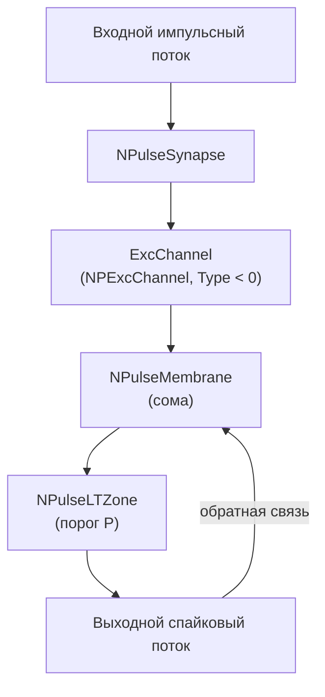

## NM-PN-01-Neuron-1M1St1In1 — базовый спайковый нейрон

**Путь:** `Bin/Configs/SpikeSamples/NM-Neurons/NM-PN-01-Neuron-1M1St1In1`  
**Статус валидации:** VALID (см. `Reports/SpikeSamples-Validation-Report.md`)

### Назначение конфигурации

Эта конфигурация реализует **минимальный спайковый нейрон** с одной соматической областью мембраны (1M), одним синапсом (1St) и одним входным каналом (1In). Она отражает базовую модель, описанную в работах по математическому моделированию процессов преобразования импульсных потоков в биологическом нейроне и воспроизведению реакций естественных нейронов.

Используется как эталон для сравнения с более сложными конфигурациями `NM-PN-*` и для демонстрации базовых частотных характеристик одиночного нейрона.

### Структура модели

- **Нейрон:** `NPulseNeuron` / `NPulseNeuronCommon`
  - одна соматическая мембрана;
  - низкопороговая зона `NPulseLTZone` (генератор спайков);
  - генераторы возбуждающего и тормозного потенциалов `NConstGenerator`.
- **Мембрана:** `NPulseMembrane` / `NPulseMembraneCommon`
  - один участок мембраны, охваченный обратной связью от LT‑зоны;
  - один возбуждающий канал `ExcChannel` (`NPExcChannel`, Type = −1);
  - один тормозный канал `InhChannel` (`NPInhChannel`, Type = +1).
- **Синапсы:** `NPulseSynapse` / `NPulseSynapseCommon`
  - один возбуждающий синапс, подключённый к возбуждающему каналу.

Упрощённая схема:

### Эксперимент и моделируемые реакции

- **Вход:** последовательность импульсов фиксированной амплитуды и длительности на одиночном возбуждающем входе.
- **Наблюдаемые величины:**
  - частота выходных спайков;
  - форма мембранного потенциала на входе LT‑зоны;
  - влияние частоты входной стимуляции на число спайков в пачке.
- **Ожидаемое поведение:**
  - при умеренных частотах входа нейрон генерирует пачки спайков;
  - возможен эффект пресинаптического торможения при чрезмерно высокой частоте, если в параметрах синапса включена соответствующая динамика (см. статьи).

### Параметры модели

Основные параметры задаются в `Parameters.xml`:

- **Синапс (`NPulseSynapse`):**
  - `PulseAmplitude` — амплитуда входных импульсов;
  - `SecretionTC`, `DissociationTC` — постоянные времени выделения и распада медиатора;
  - `InhibitionCoeff`, `Resistance`, `UsePresynapticInhibition` — эффекты пресинаптического торможения.
- **Канал (`NPulseChannel`):**
  - `Capacity`, `Resistance`, `FBResistance`, `RestingResistance`;
  - `Type` = −1 для возбуждающего канала.
- **Мембрана и LT‑зона:**
  - `FeedbackGain` — глубина обратной связи;
  - порог LT‑зоны `P` и временные константы генератора.

Точные численные значения можно смотреть в `Parameters.xml`; они подобраны в соответствии с примерами из статей.

### Связанные материалы

- Теория и функциональное описание:
  - «Математическое моделирование процессов преобразования импульсных потоков в естественном нейроне».
  - «Воспроизведение реакций естественных нейронов как результат моделирования структурно‑функциональных свойств мембраны...».
- Интегральная документация:
  - `Bin/Docs/SpikeSamples/NeuronReactions.md`
  - `Bin/Docs/SpikeSamples/ImpulseProcessingModel.md`

