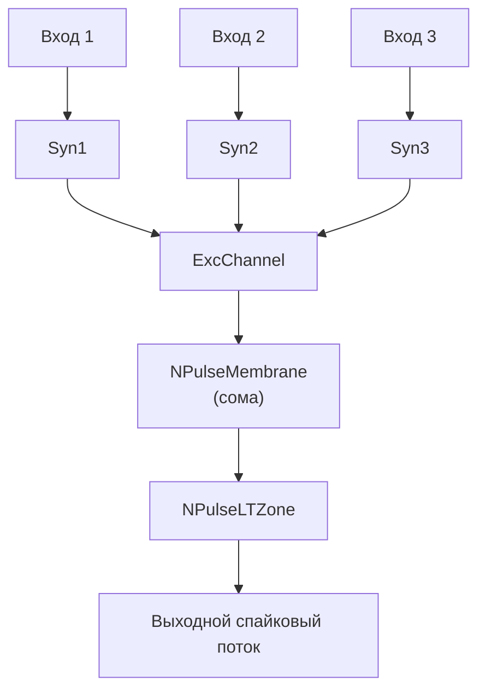

## NM-PN-02-Neuron-1M1St3In3 — нейрон с несколькими входами

**Путь:** `Bin/Configs/SpikeSamples/NM-Neurons/NM-PN-02-Neuron-1M1St3In3`  
**Статус валидации:** VALID (см. `Reports/SpikeSamples-Validation-Report.md`)

### Назначение конфигурации

Эта конфигурация расширяет базовый пример `NM-PN-01` до нейрона с **несколькими входами** (3 In) при сохранении одной соматической области мембраны (1M) и одной основной области синаптического воздействия (1St). Она демонстрирует:

- пространственно‑временную суммацию импульсных потоков с нескольких входов;
- влияние числа активных входов на частоту и структуру выходных спайков;
- эффекты, аналогичные описанным в экспериментах по суммации на дендритах и соме.

### Структура модели

По компонентному составу нейрон аналогичен `NM-PN-01`:

- `NPulseNeuron` с одной соматической мембраной и LT‑зоной `NPulseLTZone`;
- `NPulseMembrane` с возбуждающим и тормозным каналами;
- группа синапсов, подключённых к одному или нескольким участкам мембраны.

Отличие — в конфигурации и связях:

- несколько входных импульсных потоков (3 независимых входа);
- синапсы, соответствующие этим входам, могут сходиться на одну соматическую область.

Схематично:

### Эксперимент и моделируемые реакции

Основные сценарии:

- **Поочерёдная стимуляция**:
  - по одному активируется каждый вход;
  - сравниваются выходные паттерны (вклад каждого входа в возбуждение нейрона).
- **Совместная стимуляция**:
  - синхронная активация 2–3 входов;
  - демонстрация пространственной суммации: увеличение числа спайков и/или частоты при одновременной активации.
- **Смещение по времени**:
  - входы активируются с различными задержками;
  - демонстрируется временная суммация и роль постоянных времени мембраны в интеграции сигналов.

### Параметры модели

Ключевые параметры аналогичны `NM-PN-01` (см. там), но:

- для каждого синапса свои веса (`Resistance`) и, возможно, разные параметры `SecretionTC`/`DissociationTC`;
- распределение синапсов по входам позволяет моделировать различную «значимость» каждого входа.

Точные параметры см. в `Parameters.xml`.

### Связанные материалы

- Базовый пример:
  - `SpikeSamples/NM-Neurons/NM-PN-01-Neuron-1M1St1In1`
- Интегральная документация:
  - `Bin/Docs/SpikeSamples/NeuronReactions.md`
  - `Bin/Docs/SpikeSamples/ImpulseProcessingModel.md`

