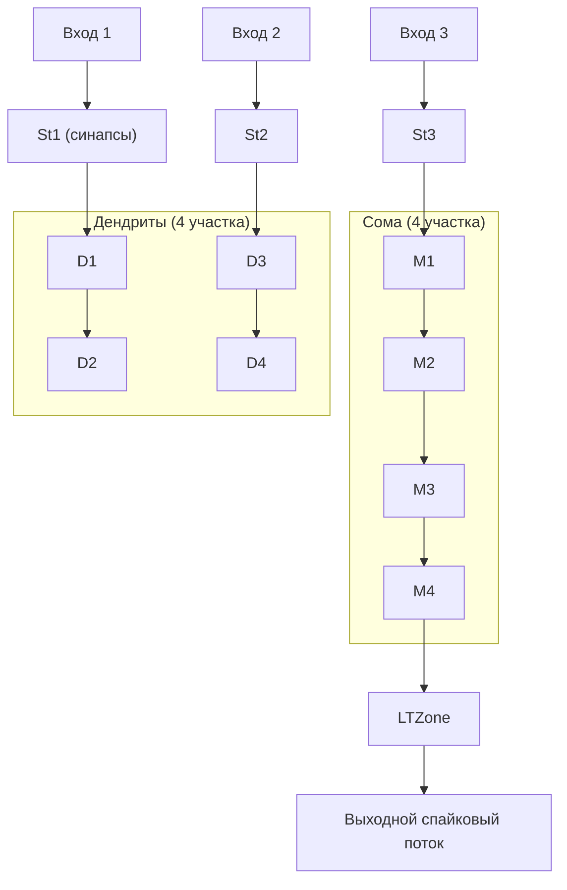

## NM-PN-03-Neuron-4M4D3St3In — нейрон с разветвлённой мембраной

**Путь:** `Bin/Configs/SpikeSamples/NM-Neurons/NM-PN-03-Neuron-4M4D3St3In`  
**Статус валидации:** VALID (см. `Reports/SpikeSamples-Validation-Report.md`)

### Назначение конфигурации

Эта конфигурация моделирует нейрон с **развитой сомой и дендритным деревом**:

- 4 участка сомы (4M), охваченных обратной связью генератора;
- 4 участка дендритов (4D);
- 3 синаптические области (3St);
- 3 входных канала (3In).

Конфигурация предназначена для демонстрации:

- пространственно‑временной суммации на разветвлённой мембране;
- влияния расстояния от синапсов до LT‑зоны на вклад в возбуждение;
- различий в реакциях по сравнению с небольшими нейронами (`NM-PN-01`, `NM-PN-02`).

### Структура модели

Общая структура:

- `NPulseNeuron` с несколькими участками мембраны, образующими:
  - сому (последовательность участков, охваченных обратной связью);
  - дендриты (ветвящиеся цепочки участков);
- на отдельных участках расположены возбуждающие и тормозные каналы и синапсы, аналогично более простым примерам;
- LT‑зона получает суммарный мембранный потенциал от сомы.

Схематично (упрощённо):

Точная топология задаётся в `model.xml`, но общая идея — показать:

- длинные пути от дистальных синапсов до сомы;
- короткие пути от проксимальных синапсов.

### Эксперимент и моделируемые реакции

Основные сценарии:

- **Стимуляция дистальных участков**:
  - активация входов, подключённых к дальним дендритам (например, St1/St2);
  - наблюдение задержки и затухания влияния на суммарный потенциал сомы.
- **Стимуляция проксимальных участков**:
  - активация синапсов, расположенных ближе к соме (например, St3);
  - сравнение эффективности с дистальными входами.
- **Комбинированная стимуляция**:
  - одновременная стимуляция нескольких ветвей;
  - демонстрация зависимости паттерна разрядов от пространственного распределения синаптических входов.

### Сравнение с меньшими нейронами

По сравнению с:

- `NM-PN-01` (1M1St1In1) и
- `NM-PN-02` (1M1St3In3),

данная конфигурация должна демонстрировать:

- меньшую чувствительность к одиночным входным стимулам (за счёт большего «размера» нейрона и ёмкости мембраны);
- более выраженные эффекты задержки и сглаживания;
- изменение числа спайков в пачке и интервалов между ними при одинаковых входных условиях.

### Связанные материалы

- `SpikeSamples/NM-Neurons/NM-PN-01-Neuron-1M1St1In1`
- `SpikeSamples/NM-Neurons/NM-PN-02-Neuron-1M1St3In3`
- `SpikeSamples/NM-Neurons/NM-PN-NeuronSizeActivity`
- Интегральная документация:
  - `Docs/SpikeSamples/NeuronReactions.md`
  - `Docs/SpikeSamples/ImpulseProcessingModel.md`

