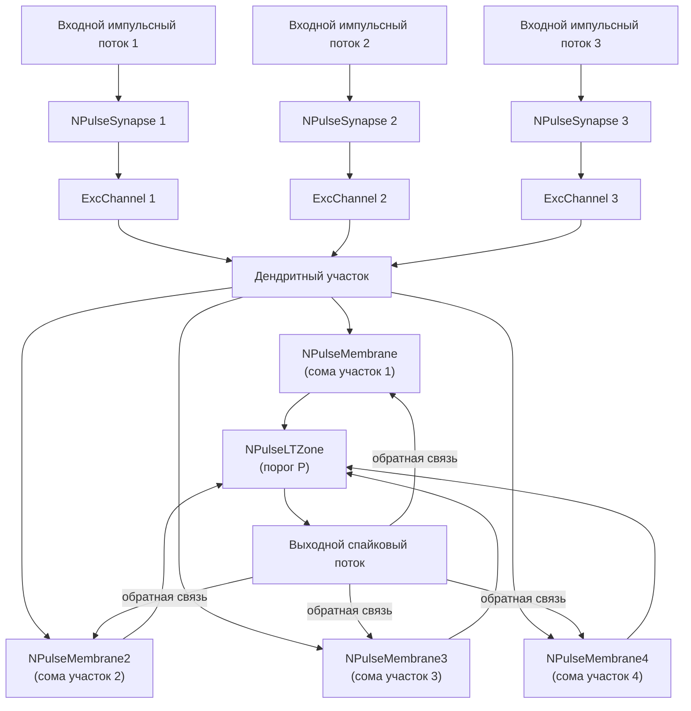

## NM-PN-05-Neuron-4M1D3St3In — нейрон с четырьмя соматическими участками и дендритом

**Путь:** `Bin/Configs/SpikeSamples/NM-Neurons/NM-PN-05-Neuron-4M1D3St3In`
**Статус валидации:** VALID (см. `Reports/SpikeSamples-Validation-Report.md`)

### Назначение конфигурации

Эта конфигурация реализует **спайковый нейрон с четырьмя соматическими участками мембраны** (4M), одним дендритом (1D), тремя синапсами (3St) и тремя входными каналами (3In). Она демонстрирует влияние комбинации соматических участков и дендритной структуры на реакции нейрона.

Согласно исследованиям реакций естественных нейронов, наличие дендритов позволяет реализовать пространственную суммацию сигналов и влияет на временные характеристики обработки входных импульсов. Данная конфигурация позволяет изучать взаимодействие между соматическими и дендритными участками мембраны.

### Структура модели

- **Нейрон:** `NPulseNeuron` / `NPNeuron4x1`
  - четыре соматических участка мембраны (`PNeuronMembrane11`, `PNeuronMembrane12`, `PNeuronMembrane13`, `PNeuronMembrane14`);
  - один дендритный участок;
  - низкопороговая зона `NPulseLTZone` (генератор спайков);
  - генераторы возбуждающего и тормозного потенциалов `NConstGenerator`.
- **Мембраны:** `NPulseMembrane` / `NPulseMembraneCommon`
  - четыре соматических участка мембраны, каждый с парой ионных каналов;
  - один дендритный участок с каналами и синапсами;
  - возбуждающие каналы `ExcChannel` (`NPExcChannel`, Type = −1);
  - тормозные каналы `InhChannel` (`NPInhChannel`, Type = +1).
- **Синапсы:** `NPulseSynapse` / `NPulseSynapseCommon`
  - три возбуждающих синапса, подключённых к возбуждающим каналам.

Упрощённая схема:

### Структурная и параметрическая адаптация

Согласно [A], модель нейрона со структурной адаптацией позволяет динамически изменять структуру связей между элементами нейрона. В данной конфигурации:

- **Структурная адаптация:** фиксированная структура с четырьмя соматическими участками и одним дендритом, демонстрирующая влияние дендритной обработки на реакции нейрона.
- **Параметрическая адаптация:** параметры мембраны, каналов и синапсов могут настраиваться для изучения различных режимов работы.

### Пластичность модели

Пластичность модели нейрона (раздел 2.5 [A]) обеспечивается возможностью изменения весов синапсов и параметров мембраны. В данной конфигурации пластичность проявляется через:

- изменение эффективности синаптической передачи на дендритных участках;
- адаптацию параметров мембраны к входным сигналам;
- формирование различных паттернов активности в зависимости от структуры сомы и дендритов.

### Эксперимент и моделируемые реакции

- **Вход:** последовательности импульсов фиксированной амплитуды и длительности на трёх возбуждающих входах.
- **Наблюдаемые величины:**
  - частота выходных спайков;
  - форма мембранного потенциала на входе LT‑зоны;
  - влияние частоты входной стимуляции на число спайков в пачке;
  - задержка и затухание сигнала при распространении по дендриту;
  - сравнение с конфигурациями без дендритов (NM-PN-04, NM-PN-06).
- **Ожидаемое поведение:**
  - при умеренных частотах входа нейрон генерирует пачки спайков;
  - наличие дендрита влияет на временные характеристики обработки сигналов;
  - увеличение числа соматических участков приводит к снижению частоты генерации;
  - возможен эффект пространственной суммации сигналов от дендритных и соматических участков.

### Параметры модели

Основные параметры задаются в `Parameters.xml`:

- **Синапсы (`NPulseSynapse`):**
  - `PulseAmplitude` — амплитуда входных импульсов;
  - `SecretionTC`, `DissociationTC` — постоянные времени выделения и распада медиатора;
  - `InhibitionCoeff`, `Resistance`, `UsePresynapticInhibition` — эффекты пресинаптического торможения.
- **Каналы (`NPulseChannel`):**
  - `Capacity`, `Resistance`, `FBResistance`, `RestingResistance`;
  - `Type` = −1 для возбуждающих каналов.
- **Мембрана и LT‑зона:**
  - `FeedbackGain` — глубина обратной связи;
  - порог LT‑зоны `P` и временные константы генератора;
  - параметры для каждого из четырёх соматических участков и дендритного участка.

Точные численные значения можно смотреть в `Parameters.xml`; они подобраны в соответствии с примерами из статей.

### Связанные материалы

- Теория и функциональное описание:
  - «Математическое моделирование процессов преобразования импульсных потоков в естественном нейроне».
  - «Воспроизведение реакций естественных нейронов как результат моделирования структурно‑функциональных свойств мембраны...».
- Интегральная документация:
  - `Bin/Docs/SpikeSamples/NeuronReactions.md`
  - `Bin/Docs/SpikeSamples/ImpulseProcessingModel.md`
- Связанные конфигурации:
  - `NM-PN-04-Neuron-3M1St3In3` — нейрон с тремя участками без дендрита
  - `NM-PN-06-Neuron-1M4D3St3In` — нейрон с одним участком и четырьмя дендритами
  - `NM-PN-03-Neuron-4M4D3St3In` — нейрон с четырьмя участками и четырьмя дендритами

## Литература

1. Бахшиев А.В. Нейроморфные системы управления на основе модели импульсного нейрона со структурной адаптацией: диссертация на соискание ученой степени кандидата технических наук. [онлайн](https://www.elibrary.ru/item.asp?id=54445157)

2. Бахшиев А.В., Романов С.П. Математическое моделирование процессов преобразования импульсных потоков в естественном нейроне // Нейрокомпьютеры: разработка, применение, №3, 2009. – с.71-80. [онлайн](https://neuromodeler.ru/index.php?option=com_content&view=article&id=24:2012-11-07-16-42-21&catid=67&lang=ru&Itemid=676) | [elibrary](https://www.elibrary.ru/item.asp?id=13070281)

3. Бахшиев А.В., Романов С.П. Воспроизведение реакций естественных нейронов как результат моделирования структурно-функциональных свойств мембраны и организации синаптического аппарата // Нейрокомпьютеры: разработка, применение, №7, 2012. – с.25-35. [онлайн](https://neuromodeler.ru/index.php?option=com_content&view=article&id=20:2012-07-19-04-53-55&catid=67&lang=ru&Itemid=676) | [elibrary](https://www.elibrary.ru/item.asp?id=17997711)
